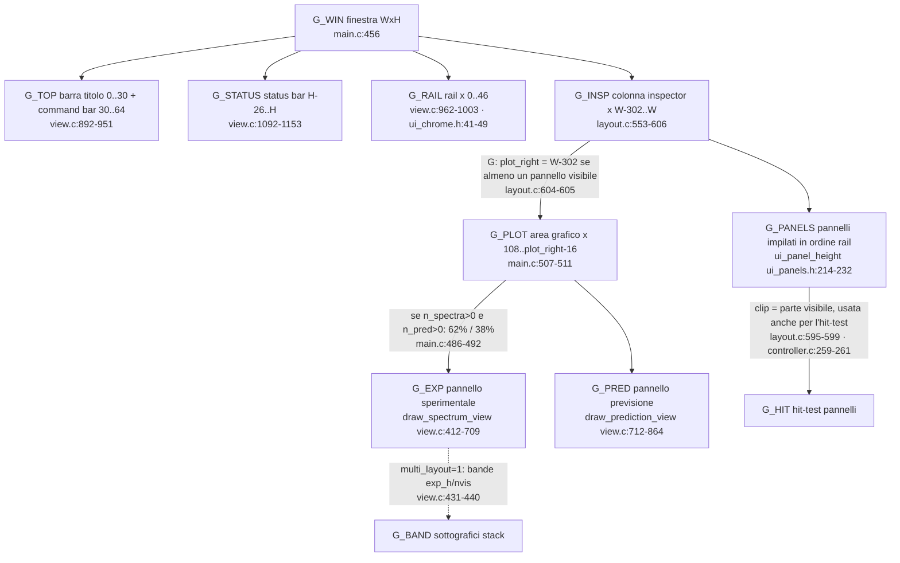

# A3 — Mappa completa di UI, layout, eventi e rendering

Appendice di [README.md](README.md). Ogni riga cita file, funzione e linee; i
link sono relativi alla radice del repository. Etichette usate:
**[FATTO]** verificato leggendo il codice, **[RIPR]** riprodotto con l'harness
di [A4](A4-riproduzioni.md), **[INF]** inferenza tecnica non riprodotta.

Indice: [A3.1 Finestre](#a31-finestre-sdl) · [A3.2 Loop e ordine temporale](#a32-loop-principale-e-ordine-temporale-di-un-frame) ·
[A3.3 Geometria](#a33-geometria-e-layout) · [A3.4 Command bar](#a34-command-bar) ·
[A3.5 Rail](#a35-rail) · [A3.6 Pannelli](#a36-pannelli-dellinspector) ·
[A3.7 Canvas](#a37-canvas-spettro-e-previsione) · [A3.8 Tastiera](#a38-tastiera) ·
[A3.9 Campi di testo](#a39-campi-di-testo) · [A3.10 Advanced](#a310-finestra-predfit-advanced) ·
[A3.11 Settings](#a311-finestra-settings) · [A3.12 Rendering e cache](#a312-pipeline-di-rendering-cache-e-dipendenze-inverse) ·
[A3.13 Difetti UI](#a313-difetti-e-incongruenze-ui-rilevati)

---

## A3.1 Finestre SDL

| ID | Finestra | Creazione | Distruzione | Render (ogni frame) | Eventi | Note |
|---|---|---|---|---|---|---|
| `W_MAIN` | "SpectraVisual" 1400×884, ridimensionabile, min 900×560 | [main.c:407-411](../../main.c#L407-L411) | [main.c:551-553](../../main.c#L551-L553) | `render_app` [view.c:406-409](../../view.c#L406-L409) chiamata in [main.c:534](../../main.c#L534) | `handle_app_events` [controller.c:150-237](../../controller.c#L150-L237) | scala DPI calcolata all'avvio [main.c:417-424](../../main.c#L417-L424) e a ogni frame [main.c:457-468](../../main.c#L457-L468) (riapre i font) |
| `W_ADV` | "Pred&Fit Advanced" 920×640 | `predfit_open_advanced` [predfit.c:1036-1054](../../predfit.c#L1036-L1054) (pulsante *Advanced…*, [controller.c:547](../../controller.c#L547)) | `predfit_close_advanced` [predfit.c:1055-1061](../../predfit.c#L1055-L1061) su `SDL_WINDOWEVENT_CLOSE` [predfit.c:1582-1583](../../predfit.c#L1582-L1583) o `predfit_dispose` [predfit.c:1063-1070](../../predfit.c#L1063-L1070) | `predfit_render_advanced` [predfit.c:1702-2013](../../predfit.c#L1702-L2013), chiamata in [main.c:524](../../main.c#L524) | `predfit_handle_advanced_event` [predfit.c:1579-1700](../../predfit.c#L1579-L1700), **prima** di ogni altro handler [controller.c:154](../../controller.c#L154) | |
| `W_SET` | "Settings" 560×720, min 460×420 | `settings_open` [settings.c:810-822](../../settings.c#L810-L822) (ingranaggio [controller.c:597-601](../../controller.c#L597-L601) o tasto `,` [controller.c:1000](../../controller.c#L1000)) | `settings_close` [settings.c:824-829](../../settings.c#L824-L829) su close/Esc [settings.c:836-837](../../settings.c#L836-L837), [884-885](../../settings.c#L884-L885) | `settings_render` [settings.c:991-1130](../../settings.c#L991-L1130), [main.c:525](../../main.c#L525) | `settings_handle_event` [settings.c:833-979](../../settings.c#L833-L979), secondo in catena [controller.c:155](../../controller.c#L155) | |

**Instradamento degli eventi tra finestre** [FATTO]:
`handle_app_events` passa ogni evento prima a `W_ADV`, poi a `W_SET`, poi al
controller principale. `predfit_handle_advanced_event` consuma solo gli eventi
del proprio `windowID` durante l'editing, rotella, movimento e click
([predfit.c:1584-1618](../../predfit.c#L1584-L1618)); un `SDL_KEYDOWN` della
finestra Advanced **quando nessuna cella è in modifica** ritorna 0
([predfit.c:1618](../../predfit.c#L1618)) e ricade in `handle_keydown` della
finestra principale. Lo stesso per `W_SET` ([settings.c:897](../../settings.c#L897)).
Conseguenza: premere `q`, `a`, `r`… con il focus su Advanced o Settings zooma,
sposta o resetta il grafico principale. Anche `SDL_MOUSEMOTION` e
`SDL_MOUSEBUTTONUP` delle finestre secondarie arrivano ai gestori del grafico
principale con coordinate della finestra secondaria
([controller.c:231-232](../../controller.c#L231-L232)).

**Chiusura**: l'unico evento gestito per uscire è `SDL_QUIT`
([controller.c:153](../../controller.c#L153)). `SDL_WINDOWEVENT_CLOSE` della
finestra principale non è gestito: con Advanced o Settings aperte, SDL non
genera `SDL_QUIT` alla chiusura della sola finestra principale [INF, dipende da
`SDL_HINT_QUIT_ON_LAST_WINDOW_CLOSE`].

---

## A3.2 Loop principale e ordine temporale di un frame

Ordine esatto ([main.c:455-543](../../main.c#L455-L543)) — è l'ordine con cui i
writer dello stesso campo si succedono:

| # | Passo | Funzione / linee | Legge | Scrive / effetti |
|---|---|---|---|---|
| 1 | dimensioni e DPI | [main.c:456-468](../../main.c#L456-L468) | finestra, renderer | `ui_dpi`, font (`ui_fonts_close/init`) |
| 2 | geometria base | [main.c:469-474](../../main.c#L469-L474) | costanti `ui_theme.h` | `Layout.plot_x`, `gap` (mai letto) |
| 3 | **inspector** | `update_sidebars` [layout.c:553-606](../../layout.c#L553-L606) | `win_*.visible`, `sidebar_scroll`, altezze `ui_panel_height` | `win_*.rect/.clip/.anim`, `sidebar_scroll` (clamp), `Layout.plot_right`, `inspector_open` |
| 4 | pannelli grafico | [main.c:479-511](../../main.c#L479-L511) | `n_spectra>0`, `n_pred>0` | `Layout.exp_*`, `pred_*` |
| 5 | **eventi** | `handle_app_events` [controller.c:150-237](../../controller.c#L150-L237) | tutto lo stato | vedi [A3.7-A3.10](#a37-canvas-spettro-e-previsione); mette in coda `pending_*` |
| 6 | sessione trascinata | [main.c:514-517](../../main.c#L514-L517) → `reopen_predfit_session` [main.c:202-222](../../main.c#L202-L222) | `pending_session_load` | **azzera** dataset e assignment, restore completo |
| 7 | caricamenti in coda | [main.c:518-522](../../main.c#L518-L522) | `pending_load`, `pending_pred_path`, `pending_spec_path` | `set_predictions` + `predfit_adopt_generated_catalog`; `add_spectrum` + `predfit_save_session` |
| 8 | vista della sessione | `restore_session_view` [main.c:139-153](../../main.c#L139-L153) | `session_has_view` | `vx*`, `vy*`, `sync_active`, `pvx*` (una volta sola) |
| 9 | render Advanced | `predfit_render_advanced` [predfit.c:1702-2013](../../predfit.c#L1702-L2013) | stato Pred&Fit, `model.fit` (via cache) | `g_report` (I/O su file durante il render) |
| 10 | render Settings | `settings_render` [settings.c:991-1130](../../settings.c#L991-L1130) | `AppSettings` | `settings.scroll` (clamp), `g_content_h` |
| 11 | switch/remove spettro | [main.c:526-527](../../main.c#L526-L527) | `pending_select`, `pending_remove` | `select_spectrum`/`remove_spectrum` + `predfit_save_session` |
| 12 | mirror → spettro | `commit_active` [main.c:104-110](../../main.c#L104-L110) | `current_pts`, `exp_offset`, `rolling_avg_active` | `spectra[active]` |
| 13 | sync asse | [main.c:532](../../main.c#L532) | `sync_active` | `pvxmin/pvxmax = vxmin/vxmax` (sovrascrive ogni frame qualunque zoom della sola previsione) |
| 14 | render principale | `render_app` [view.c:406-409](../../view.c#L406-L409) | tutto | `input_rect`, `input_unit` (scritti da `draw_field` [view.c:1187-1196](../../view.c#L1187-L1196)) |
| 15 | export | [main.c:535-542](../../main.c#L535-L542) | `export_requested` | `spectravisual_export.bmp` nella **CWD** |

Il frame ha quindi **tre punti di mutazione differita** (5→6/7/11): un'azione
che mette in coda un caricamento (Calculate, Fit, restore, drop) viene
applicata *dopo* tutti gli eventi dello stesso frame. Due code nello stesso
frame si sovrascrivono: `pending_pred_path` ha un solo slot (vedi
[README §8, B-14](README.md#b-14)).

---

## A3.3 Geometria e layout

Costanti ([ui_theme.h:54-66](../../ui_theme.h#L54-L66)): barra titolo 30, command
bar 34, `UI_CONTENT_Y` 64, rail 46, inspector 302, status 26, header di pannello 26,
header di sezione 28, gutter 62, asse frequenze 22 (px logici).

| Elemento | Dipende da | Calcolato da | Letto da |
|---|---|---|---|
| `plot_right` | `win_w`, un qualunque `win_*.visible` | `update_sidebars` [layout.c:604-605](../../layout.c#L604-L605) | [main.c:508](../../main.c#L508), `render_app_frame` [view.c:370-372](../../view.c#L370-L372), `draw_panel_headers` [view.c:1026](../../view.c#L1026), rotella [controller.c:737](../../controller.c#L737) |
| `win_*.rect/.clip` | ordine rail, altezza naturale del pannello, `sidebar_scroll`, altezza viewport | [layout.c:584-602](../../layout.c#L584-L602) | render di ogni pannello e `handle_mouse_down` [controller.c:252-261](../../controller.c#L252-L261) |
| altezza Assignments | `n_assignments` (4..12 righe) | `ui_panel_height` [ui_panels.h:216-217](../../ui_panels.h#L216-L217) | `update_sidebars` |
| altezza Spectra | `n_spectra` | [ui_panels.h:225-228](../../ui_panels.h#L225-L228) | idem |
| altezza Broadening | `broaden_mode` | [ui_panels.h:220](../../ui_panels.h#L220) | idem |
| `exp_h/pred_h` | `n_spectra>0`, `n_pred>0`, altezza disponibile | [main.c:486-505](../../main.c#L486-L505) | render, canvas, `handle_keydown` (pan verticale [controller.c:1062](../../controller.c#L1062)) |
| bande stack | `multi_layout`, numero di spettri visibili | [view.c:428-440](../../view.c#L428-L440) | solo render |
| gruppo destro command bar | `win_w > 1060` | `ui_top_right_visible` [ui_chrome.h:99](../../ui_chrome.h#L99) | render [view.c:925](../../view.c#L925) e hit-test [controller.c:571](../../controller.c#L571), [597](../../controller.c#L597), [606](../../controller.c#L606) |

Accoppiamento geometria → logica [FATTO]: l'altezza del pannello Assignments
dipende dal numero di assignment, quindi aggiungere un assignment sposta verso il
basso tutti i pannelli successivi e il bersaglio del click di *Save all*
([ui_panels.h:204-207](../../ui_panels.h#L204-L207)). Il caret dei campi di testo è
posizionato dal controller usando `input_rect`, **scritto dal renderer**
([view.c:1190-1193](../../view.c#L1190-L1193)) nel frame precedente.

---

## A3.4 Command bar

Geometria unica in `ui_top_rect` [ui_chrome.h:72-95](../../ui_chrome.h#L72-L95),
condivisa da render ([view.c:913-950](../../view.c#L913-L950)) e hit-test
([controller.c:571-626](../../controller.c#L571-L626)).

| ID | Controllo | Render | Handler | Stato scritto | Effetti a valle |
|---|---|---|---|---|---|
| `UI_TOP_BAR` | Bar | [view.c:913-914](../../view.c#L913-L914) | [controller.c:579-586](../../controller.c#L579-L586) | `bar_active`, `bar_x`, `pbar_x` | cursore di zoom (E/Q), card "lines near the bar" [view.c:1820-1843](../../view.c#L1820-L1843) |
| `UI_TOP_MEASURE` | Measure | [view.c:915-916](../../view.c#L915-L916) | [controller.c:587-591](../../controller.c#L587-L591) | `measure_active`, `measure_phase` | click nel pannello sperimentale [controller.c:638-651](../../controller.c#L638-L651); il risultato finale va solo su stdout (`/dev/null` senza `--verbose`, [main.c:376](../../main.c#L376)) |
| `UI_TOP_SYNC` | Sync | [view.c:917-918](../../view.c#L917-L918) | [controller.c:592-596](../../controller.c#L592-L596) | `sync_active`, `pvx*` | [main.c:532](../../main.c#L532) sincronizza gli assi a ogni frame |
| `UI_TOP_DELPEAK` | Delete peak | [view.c:922-923](../../view.c#L922-L923) | [controller.c:602-605](../../controller.c#L602-L605) | `n_peaks--` | non tocca gli assignment creati da quel picco |
| `UI_TOP_CAT_TEMP` | campo T cat | [view.c:926-931](../../view.c#L926-L931) | [controller.c:616-620](../../controller.c#L616-L620) → commit [913-921](../../controller.c#L913-L921) | `cat_temp_k` | `rescale_predicted_intensities` **a specie singola** anche su un catalogo generato multi-specie ([README B-11](README.md#b-11)) |
| `UI_TOP_ROT_TEMP` | campo T rot | [view.c:933-938](../../view.c#L933-L938) | [controller.c:621-625](../../controller.c#L621-L625) → commit [922-933](../../controller.c#L922-L933) | `rot_temp_k`, **`predfit.temp_k` e `species[active].temp_k`** (via `predfit_adopt_shared_state`) | come sopra |
| `UI_TOP_OFFSET` | campo Offset | [view.c:940-943](../../view.c#L940-L943) | [controller.c:611-615](../../controller.c#L611-L615) → commit [910-912](../../controller.c#L910-L912) | `exp_offset` (mirror dello spettro attivo) | `commit_active` lo copia nello spettro ([main.c:108](../../main.c#L108)); salvato in sessione |
| `UI_TOP_EXPORT` | Export view | [view.c:945-946](../../view.c#L945-L946) | [controller.c:607-610](../../controller.c#L607-L610) | `export_requested` | `save_screenshot` [main.c:345-364](../../main.c#L345-L364) → `spectravisual_export.bmp` in CWD |
| `UI_TOP_HELP` | Shortcuts | [view.c:947-948](../../view.c#L947-L948) | [controller.c:571-575](../../controller.c#L571-L575) | `show_help` | overlay [view.c:1623-1699](../../view.c#L1623-L1699) |
| `UI_TOP_SETTINGS` | ingranaggio | [view.c:949-950](../../view.c#L949-L950) | [controller.c:597-601](../../controller.c#L597-L601) | apre `W_SET` | |

Barra titolo: nomi dei file mostrati ([view.c:896-906](../../view.c#L896-L906));
`error_message` ha precedenza, `status_message` compare solo senza dati
([view.c:954-958](../../view.c#L954-L958)). Dal passo #1 `set_predictions` mette in
`error_message` anche il numero di righe del catalogo scartate perché hanno NQN 0
o > 6. Nessun messaggio di esito per *Save all*,
*Find peaks*, *Export list*, *Export fit* (quest'ultimo solo in `intfit_message`).

---

## A3.5 Rail

Ordine fisso `UiTool` [ui_chrome.h:17-29](../../ui_chrome.h#L17-L29), separatori
dopo Rolling average, Transition filter e Spectra
([ui_chrome.h:37-39](../../ui_chrome.h#L37-L39)). Click = inverte `visible`
([controller.c:565-570](../../controller.c#L565-L570)); tooltip con titolo e tasto
([view.c:992-1002](../../view.c#L992-L1002), [ui_icons.c:124-153](../../ui_icons.c#L124-L153)).
Il click sulla rail viene sempre consumato ([controller.c:577](../../controller.c#L577)).

| # | Pannello | Campo | Tasto | Icona |
|---|---|---|---|---|
| 0 | Assignments | `win_as` | N | LIST |
| 1 | Peak finder | `win_pf` | P | PEAK |
| 2 | Rolling average | `win_avg` | T | WAVE |
| 3 | Broadening | `win_br` | M | BELL |
| 4 | Intensity analysis | `win_dip` | D | DIPOLE |
| 5 | Intensity range | `win_cut` | C | RANGE |
| 6 | Transition filter | `win_filt` | B | FILTER |
| 7 | Frequency jump | `win_jump` | F | JUMP |
| 8 | Spectra | `win_spec` | — | LAYERS |
| 9 | Pred&Fit | `win_predfit` | — | LIST (stessa icona di Assignments, [ui_icons.c:166](../../ui_icons.c#L166)) |

---

## A3.6 Pannelli dell'inspector

Tutte le geometrie interne sono in [ui_panels.h](../../ui_panels.h); il click
sull'header chiude il pannello solo se cade negli ultimi 30 px
([controller.c:265-268](../../controller.c#L265-L268)). Solo il tasto sinistro
agisce ([controller.c:269](../../controller.c#L269)).

### Assignments (`win_as`)
| Controllo | Geometria | Render | Handler | Effetto |
|---|---|---|---|---|
| righe (4..12) | `ui_as_row` [ui_panels.h:200-203](../../ui_panels.h#L200-L203) | [view.c:1239-1253](../../view.c#L1239-L1253) (`format_pred_qn` usa `n_qn`, fallback 3 [view.c:17-39](../../view.c#L17-L39)) | [controller.c:278-282](../../controller.c#L278-L282) | `selected_assignment` |
| Save all | `ui_as_save` [ui_panels.h:204-207](../../ui_panels.h#L204-L207) | [view.c:1261](../../view.c#L1261) | [controller.c:283-319](../../controller.c#L283-L319) | dedup + scrittura `assignments.txt` (vedi [README §6.2](README.md#62-assignmentstxt)) |
| Delete selected | `ui_as_delete` [ui_panels.h:208-211](../../ui_panels.h#L208-L211) | [view.c:1262](../../view.c#L1262) | `delete_assignment` [controller.c:854-873](../../controller.c#L854-L873) | rimuove in memoria; nessun salvataggio |
| rotella | `win_as.rect` | — | [controller.c:729-733](../../controller.c#L729-L733) | `assignments_scroll ±3` |
| PageUp/PageDown | — | — | [controller.c:1018-1027](../../controller.c#L1018-L1027) | `assignments_scroll ±13` |

Il testo "Written to assignments.txt in the working directory"
([view.c:1265](../../view.c#L1265)) è impreciso: il file va in `data_dir` se
impostata ([settings.c:302-305](../../settings.c#L302-L305)).

### Peak finder (`win_pf`)
Campi *Search width*, *Noise window*, *Threshold* ([ui_panels.h:93-95](../../ui_panels.h#L93-L95), [view.c:1275-1280](../../view.c#L1275-L1280), [controller.c:325-333](../../controller.c#L325-L333));
*Find peaks* → `run_peak_finder(current_pts, …, vxmin, vxmax, …)`
([controller.c:334-336](../../controller.c#L334-L336), [algorithms.c:73-140](../../algorithms.c#L73-L140)): la finestra
di ricerca usa le coordinate **visualizzate** senza sottrarre `exp_offset`, a
differenza del picking manuale ([controller.c:775-776](../../controller.c#L775-L776)).
*Export list* → `linelist.csv` in `data_dir` ([controller.c:337-348](../../controller.c#L337-L348)).
Il peak finder **sovrascrive** `peaks[]` (anche i picchi scelti a mano).

### Rolling average (`win_avg`)
Campo finestra ([controller.c:352-354](../../controller.c#L352-L354)), interruttore
([355-363](../../controller.c#L355-L363)): calcola `smooth_pts` del solo spettro
attivo. Il valore della finestra è globale, il ricalcolo no: gli altri spettri
già livellati restano con la finestra precedente ([controller.c:893-899](../../controller.c#L893-L899)).
L'area del fit delle intensità è integrata su `current_pts`, quindi dipende da
questo interruttore ([intensity_fit.c:90-112](../../intensity_fit.c#L90-L112)).

### Broadening (`win_br`)
Selettore Analytic/Kaiser ([controller.c:367-372](../../controller.c#L367-L372)), campi L/G o
β/ceros/intrinsic ([373-391](../../controller.c#L373-L391)), interruttore
*Simulated profile* ([392-394](../../controller.c#L392-L394)). Solo presentazione:
`broad_config` [view.c:177-199](../../view.c#L177-L199); Shift+Tab usa lo stesso profilo
(`prediction_visible_max` [view.c:248-279](../../view.c#L248-L279)).

### Intensity analysis (`win_dip`)
| Controllo | Handler | Commit | Stato scritto |
|---|---|---|---|
| T cat, T rot | [controller.c:401-410](../../controller.c#L401-L410) | [913-933](../../controller.c#L913-L933) | `cat_temp_k`; `rot_temp_k` + `predfit.temp_k`/specie attiva |
| μcat a/b/c, μred a/b/c | [411-422](../../controller.c#L411-L422) | [934-947](../../controller.c#L934-L947) | `dipole_cat[]`; `dipole_red[]` + `predfit.mu`/specie attiva |
| Area half-window | [423-427](../../controller.c#L423-L427) | [948-951](../../controller.c#L948-L951) | `intfit_half_window_mhz` |
| Fit T rot | [428-431](../../controller.c#L428-L431) | — | `intfit_fit_temperature` |
| pill μ a/b/c | [432-437](../../controller.c#L432-L437) | — | `intfit_fit_dipole[]` |
| Run fit | [438-446](../../controller.c#L438-L446) | — | `intensity_fit_run` + rescale a specie singola |
| Export fit | [447-453](../../controller.c#L447-L453) | — | `intensity_fit.ifit` in **CWD** |

Il riepilogo mostra `rot_temp_k` e i μ correnti ([view.c:1391-1412](../../view.c#L1391-L1412)),
che possono essere stati riscritti da Pred&Fit dopo il fit.

### Intensity range (`win_cut`)
*Min/Max log I* ([controller.c:457-465](../../controller.c#L457-L465)) → `pred_passes_filter`
[layout.c:43-75](../../layout.c#L43-L75). Il taglio usa `lgint` **riscalato**:
cambiare T/μ/concentrazione cambia quali righe sono visibili e selezionabili.

### Frequency jump (`win_jump`)
*Start/End* ([controller.c:467-475](../../controller.c#L467-L475)) → `vxmin/vxmax`
(e `pvx*` con Sync) ([902-909](../../controller.c#L902-L909)).

### Transition filter (`win_filt`)
Interruttore generale, pill μ a/b/c e P/Q/R, range J/Ka/Kc e salti ΔJ/ΔKa/ΔKc
([controller.c:477-511](../../controller.c#L477-L511), [view.c:1451-1502](../../view.c#L1451-L1502)).
Il filtro legge sempre i **primi tre QN** e `mu`/`branch` derivati da essi
([loader.c:17-34](../../loader.c#L17-L34)), qualunque sia `NQN`: per cataloghi non
asimmetrici le etichette non hanno significato. Le righe filtrate non sono
selezionabili ([controller.c:683](../../controller.c#L683)).

### Spectra (`win_spec`)
Overlay/Stack, Shared/Normalised, *individual intensity*
([controller.c:514-517](../../controller.c#L514-L517)); per riga: opacità −/+,
spostamento −/+, visibilità, rimozione (`pending_remove`), selezione
(`pending_select`) ([518-536](../../controller.c#L518-L536)). Rimozione e
selezione sono differite a [main.c:526-527](../../main.c#L526-L527) e azzerano
`n_peaks` e `n_selected` ([main.c:112-119](../../main.c#L112-L119), [331-342](../../main.c#L331-L342)).

### Pred&Fit (`win_predfit`)
| Controllo | Handler | Commit | Stato scritto | Nota |
|---|---|---|---|---|
| A, B, C | [controller.c:541-543](../../controller.c#L541-L543) | [952-960](../../controller.c#L952-L960) | `predfit.a/b/c` | copiati nei parametri della specie **attiva** solo al successivo `write_inputs` (`sync_basic_parameters` [predfit.c:506-513](../../predfit.c#L506-L513)) |
| μ a/b/c, T rot | idem | idem + `predfit_publish_shared_state` | `predfit.mu/temp_k`, specie attiva, `rot_temp_k`, `dipole_red`, intensità del catalogo | |
| Start | idem | idem | `predfit.fmin_ghz` | **nessun effetto**: mai scritto in `.int/.var` (usato solo in snapshot/init, [predfit.c:448](../../predfit.c#L448), [467](../../predfit.c#L467), [485](../../predfit.c#L485)) |
| End | idem | idem | `predfit.fmax_ghz` | diventa FQLIM se `int_settings.fqlim_ghz = 0` ([predfit.c:60-62](../../predfit.c#L60-L62)) |
| Calculate | [controller.c:544](../../controller.c#L544) | — | vedi [README flusso 5](README.md#flusso-5) | |
| Fit / Undo | [545-546](../../controller.c#L545-L546) | — | vedi [README flusso 6](README.md#flusso-6) | anche Cmd/Ctrl+F e Cmd/Ctrl+B |
| Advanced… | [547](../../controller.c#L547) | — | apre `W_ADV` | |

Riga di stato: `Qrot(T)` calcolato nel render ([view.c:1566-1571](../../view.c#L1566-L1571)) con
formula duplicata di `qrot_at` [predfit.c:50-54](../../predfit.c#L50-L54); poi `predfit.status`.

---

## A3.7 Canvas (spettro e previsione)

Dispatch in `handle_mouse_down` dopo pannelli, rail e command bar
([controller.c:631-695](../../controller.c#L631-L695)); richiede `data_loaded`.

| Gesto | Dove | Inizio | Fine | Funzioni di dominio | Stato scritto |
|---|---|---|---|---|---|
| clic sinistro (Measure attivo, senza Alt) | pannello sperimentale | [controller.c:638-651](../../controller.c#L638-L651) | — | — | `measure_x1`, `measure_phase` |
| trascinamento sinistro > 5 px | pannello sperimentale | [controller.c:660-662](../../controller.c#L660-L662) | [752-768](../../controller.c#L752-L768) | — | `vxmin/vxmax` (+`pvx*` con Sync) |
| Alt + trascinamento sinistro | pannello sperimentale | [655-659](../../controller.c#L655-L659) | [745-748](../../controller.c#L745-L748) | — | `exp_offset` ([710-715](../../controller.c#L710-L715)) |
| trascinamento destro | pannello sperimentale | [663-667](../../controller.c#L663-L667) | [771-780](../../controller.c#L771-L780) | `run_right_click_peak_find` [784-834](../../controller.c#L784-L834) → `assign_selected_predictions` [836-852](../../controller.c#L836-L852) → `add_or_update_assignment` [loader.c:549-572](../../loader.c#L549-L572) | `peaks[]`, appunti di sistema, `assignments[]`, `n_selected=0`, `assignments_scroll` |
| clic sinistro | pannello previsione | [669-694](../../controller.c#L669-L694) | — | `pred_passes_filter` | `selected_indices[]`, `n_selected` (Cmd/Ctrl accoda) |
| rotella | lista Assignments / colonna inspector | [722-740](../../controller.c#L722-L740) | — | — | `assignments_scroll` / `sidebar_scroll` |
| movimento | ovunque | [699-720](../../controller.c#L699-L720) | — | — | caret del campo attivo, `exp_offset` in drag, rettangolo di selezione |

Selezione [FATTO]: tolleranza ±5 px convertiti in MHz sull'asse della previsione
([controller.c:676-678](../../controller.c#L676-L678)); vengono selezionate **tutte**
le righe entro la tolleranza (due righe sovrapposte, come la coppia a
392.7959 MHz di `pred.cat`, entrano insieme [RIPR `rtpred.log`]). La selezione è
un **indice** in `pred_lines`, non una copia della transizione.

---

## A3.8 Tastiera

`handle_keydown` [controller.c:986-1217](../../controller.c#L986-L1217); ignorato se un
campo ha il focus ([987](../../controller.c#L987)). Moltiplicatore Caps Lock
([992](../../controller.c#L992)). Salvo dove indicato richiede `data_loaded`
([1009](../../controller.c#L1009)).

| Tasto | Linee | Effetto | Nota |
|---|---|---|---|
| Cmd/Ctrl+F | [997](../../controller.c#L997) | `predfit_fit` | anche senza dati caricati |
| Cmd/Ctrl+B | [998](../../controller.c#L998) | `predfit_undo_last_fit` | idem |
| `,` | [1000](../../controller.c#L1000) | Settings | |
| `h`, `/` | [1001-1004](../../controller.c#L1001-L1004) | overlay scorciatoie | |
| `x` | [1005-1008](../../controller.c#L1005-L1008) | export BMP | |
| Backspace/Delete (Shift = tutti) | [1012-1016](../../controller.c#L1012-L1016) | rimuove picchi | |
| PageUp/PageDown | [1018-1027](../../controller.c#L1018-L1027) | scroll Assignments | solo con pannello aperto |
| `n` `m` `d` `p` `t` `c` `f` `b` | [1030-1034](../../controller.c#L1030-L1034), [1051-1053](../../controller.c#L1051-L1053) | apre/chiude pannelli | |
| `r` | [1035-1050](../../controller.c#L1035-L1050) | reset vista su range dello spettro **attivo** | azzera `pred_scale` |
| Tab / Shift+Tab | [1070-1111](../../controller.c#L1070-L1111) | autoscala Y / normalizza previsione | Shift+Tab usa `pred_global_max` corrente |
| `a` `s` | [1114-1127](../../controller.c#L1114-L1127) | pan (Shift senza Sync = solo previsione) | |
| `e` `q` | [1130-1168](../../controller.c#L1130-L1168) | zoom attorno a centro o barra | |
| `w` `z`, ↑ ↓ | [1175-1192](../../controller.c#L1175-L1192) | intensità / offset verticale; Shift = `pred_scale` | |
| `k` `l` | [1195-1204](../../controller.c#L1195-L1204) | sposta la barra | |
| `g` | [1211-1215](../../controller.c#L1211-L1215) | Measure on/off | |

Modificatori non filtrati [FATTO]: a parte F e B, un tasto premuto con Cmd/Ctrl
esegue l'azione del tasto semplice (Cmd+C apre *Intensity range*, Cmd+A sposta la
vista, Cmd+R la resetta…), perché il ramo con modificatore ([996-999](../../controller.c#L996-L999))
non termina la funzione per le altre lettere. Le finestre secondarie non
consumano i tasti (vedi [A3.1](#a31-finestre-sdl)).

---

## A3.9 Campi di testo

Stato: `input_state` (enum `InputState` [types.h:278-322](../../types.h#L278-L322)),
`text_input_buf[64]`, `input_caret`, `input_anchor`, `input_last`, `input_rect`,
`input_unit` ([types.h:444-445](../../types.h#L444-L445), [489-493](../../types.h#L489-L493)).
Focus: `input_focus` [controller.c:100-111](../../controller.c#L100-L111).
Tasti di editing [controller.c:157-210](../../controller.c#L157-L210) (Cmd+A/C/X/V,
frecce, Home/End, Backspace/Delete, Esc annulla, Enter conferma). Un clic o la
rotella altrove **confermano** il valore ([controller.c:211-214](../../controller.c#L211-L214)).
Commit unico `commit_text_input` [controller.c:882-973](../../controller.c#L882-L973): ogni
campo ha qui la sua regola di validazione e il suo effetto collaterale
(ricalcoli di intensità, pubblicazione verso Pred&Fit, smoothing).

Anomalia [FATTO]: la catena `if` di [885-889](../../controller.c#L885-L889) non usa
`else` per GAMMA/GAUSS/KBETA/KCEROS; è innocua solo perché i valori dell'enum sono
distinti.

---

## A3.10 Finestra Pred&Fit Advanced

Layout ricalcolato da `adv_ui` [predfit.c:1518-1566](../../predfit.c#L1518-L1566) sia
per il render sia per l'hit-test; colonne in frazioni della larghezza (`adv_col`
[1570-1572](../../predfit.c#L1570-L1572)).

| Tab | Controllo | Handler | Effetto |
|---|---|---|---|
| Parameters (0) | riga opzioni `.par` | [predfit.c:1625](../../predfit.c#L1625) → `advanced_begin_hamiltonian_edit` [1096-1104](../../predfit.c#L1096-L1104) → commit [1228-1238](../../predfit.c#L1228-L1238) | **NVIB forzato** a `state_count` ([README B-02](README.md#b-02)) |
| | cella ID / VALUE / FIT ERROR | [1626-1637](../../predfit.c#L1626-L1637) → `advanced_begin_edit` [1072-1084](../../predfit.c#L1072-L1084) → commit [1272-1293](../../predfit.c#L1272-L1293) | `param[]`; `sync_basic_from_parameters` |
| | × riga | `delete_parameter` [1355-1363](../../predfit.c#L1355-L1363) | |
| | + parameter | `add_parameter` [1346-1351](../../predfit.c#L1346-L1351) | nuova riga id 0 in modifica |
| | Calculate | `predfit_calculate_all_species` | SPCAT |
| | .lin uncertainty | [1640-1641](../../predfit.c#L1640-L1641) → commit [1263-1270](../../predfit.c#L1263-L1270) | `line_error_mhz` (qualsiasi valore > 0: vedi [B-09](README.md#b-09)) |
| Lines (1) | riga | [1689-1693](../../predfit.c#L1689-L1693) | inverte `assignments[row].fit_enabled` |
| Fitting (2) | Fit / Undo fit | [1695-1698](../../predfit.c#L1695-L1698) | `predfit_fit` / `predfit_undo_last_fit` |
| | righe | [1689-1693](../../predfit.c#L1689-L1693) | inverte `fit_enabled` |
| Species (3) | 10 celle `.int` | [1646-1653](../../predfit.c#L1646-L1653) → `advanced_begin_int_edit` [1108-1125](../../predfit.c#L1108-L1125) → commit [1203-1227](../../predfit.c#L1203-L1227) | `int_settings` (QROT sola lettura) |
| | USE | `select_species` [585-593](../../predfit.c#L585-L593) | cambia specie attiva, pubblica intensità |
| | PRED | [1666-1667](../../predfit.c#L1666-L1667) | `predict_enabled` (solo `.int` multi-stato) |
| | NAME/TRED/μ/CONC | `advanced_begin_species_edit` [1129-1143](../../predfit.c#L1129-L1143) → commit [1239-1262](../../predfit.c#L1239-L1262) | `intensity_dirty` → `predfit_publish_shared_state` ([1584-1592](../../predfit.c#L1584-L1592)) |
| | × specie | [1658-1663](../../predfit.c#L1658-L1663) | rimuove la riga; **non** rimuove i parametri `…vv` della specie; NVIB ricalcolato |
| | + species | `add_species` [595-627](../../predfit.c#L595-L627) | nuovo stato v, parametri A/B/C con suffisso `11·v`, NVIB forzato |

La tabella *Fitting* associa la riga *i* della lista assignment all'osservazione
*i+1* del `model.fit` ([predfit.c:1954](../../predfit.c#L1954)): la corrispondenza è
per **posizione**, protetta solo dal confronto della frequenza osservata entro
1e-5 MHz (`observation_is_current` [1475-1477](../../predfit.c#L1475-L1477)). Le righe
escluse (scritte come 90000+f) risultano sempre "reassigned — run Fit"
([1992-1993](../../predfit.c#L1992-L1993)) e le righe rifiutate da SPFIT come
"Bad Line" risultano "not fitted yet" [RIPR `pfmix.log`].

---

## A3.11 Finestra Settings

Pagine Plot / Navigation / Analysis / Paths / Shortcuts
([settings.c:396-400](../../settings.c#L396-L400)); controlli generati da
`build_controls` [586-708](../../settings.c#L586-L708), usata sia dal render sia
dall'hit-test. Tipi: stepper interi/decimali con campo digitabile
([912-933](../../settings.c#L912-L933), [747-778](../../settings.c#L747-L778)), interruttori, colori
(`osascript` [333-362](../../settings.c#L333-L362)), percorsi (`osascript` [366-387](../../settings.c#L366-L387)),
*Save as default* (`settings_save` [111-167](../../settings.c#L111-L167) accanto
all'eseguibile), *Restore defaults* (non salva).

| Gruppo | Campi | Quando hanno effetto |
|---|---|---|
| Plot | spessori, opacità, colori, griglia, legenda, sfondo | immediato (render) |
| Navigation | passi di pan/zoom/intensità/barra/rotella | immediato |
| Analysis | valori iniziali di peak finder, smoothing, broadening, range, incertezza `.lin` | **solo all'avvio** (`settings_apply_defaults` [286-300](../../settings.c#L286-L300), chiamata una volta in [main.c:399](../../main.c#L399)) |
| Paths | SPCAT, SPFIT, *Data folder* | immediato: cambia `settings_data_file` e `fit_root`. Gli assignment in memoria non vengono ricaricati dalla nuova cartella; `work_dir` resta la vecchia fino al prossimo `prepare_fit_dir` ([predfit.c:76-86](../../predfit.c#L76-L86)); un `model.cat` della vecchia cartella riaperto a mano viene trattato come catalogo esterno ([predfit.c:28-42](../../predfit.c#L28-L42)) |

---

## A3.12 Pipeline di rendering, cache e dipendenze inverse

`render_app_frame` [view.c:360-404](../../view.c#L360-L404):

```mermaid
flowchart LR
  R0["R0 plotgpu_begin_frame<br/>view.c:361"] --> R1["R1 command bar e titolo<br/>draw_top_chrome view.c:885-959"]
  R1 --> R2["R2 fondo area grafico<br/>view.c:370-372"]
  R2 -->|"data_loaded"| R3["R3 draw_spectrum_view<br/>view.c:412-709"]
  R2 -->|"!data_loaded"| R3b["R3b onboarding<br/>view.c:1578-1620"]
  R3 --> R4["R4 draw_prediction_view<br/>view.c:712-864"]
  R4 --> R5["R5 plotgpu_flush<br/>view.c:386"]
  R3b --> R5
  R5 --> R6["R6 rettangolo selezione<br/>view.c:389-395"]
  R6 --> R7["R7 header pannelli, rail, status<br/>view.c:398-400"]
  R7 --> R8["R8 pannelli inspector<br/>draw_ui_overlays view.c:1216-1576"]
  R8 --> R9["R9 cursore, card selezione e barra<br/>view.c:1739-1844"]
  R9 --> R10["R10 overlay scorciatoie<br/>view.c:1623-1699"]
```

Dati di dominio letti dal render: `linear_int`/`lgint` (già riscalati),
`pred_global_max`, `pred_scale`, `pred_passes_filter`, `selected_indices`
(accesso **senza controllo di limite** in [view.c:1815](../../view.c#L1815)),
`peaks[]`, `lin_data[]` (marcatori verdi "assegnati" presi da `assigned.lin`/ini
nella CWD, **non** dalla lista assignment: [main.c:165-167](../../main.c#L165-L167),
[loader.c:121-152](../../loader.c#L121-L152), [view.c:559-576](../../view.c#L559-L576), [826-842](../../view.c#L826-L842)).

| Cache / stato statico | Dove | Invalidazione | Rischio |
|---|---|---|---|
| `g_plot_buf/g_plot_cap` | [view.c:341-353](../../view.c#L341-L353) | cresce, mai liberato | nessuno funzionale |
| kernel Kaiser `g_kk_*` | [view.c:80-83](../../view.c#L80-L83), [102-132](../../view.c#L102-L132) | se cambiano β o intrinsic/Δν | nessuno |
| `g_report` (parse di `model.fit`) | [predfit.c:1382-1465](../../predfit.c#L1382-L1465) | `mtime` + percorso, `report_invalidate` dopo SPFIT [1008](../../predfit.c#L1008) | mappatura per indice (A3.10) |
| `g_lin_rows` | [predfit.c:812-841](../../predfit.c#L812-L841) | riscritto a ogni `read_lin_rows` | solo restore |
| `used[]` statico in `import_fit_lines` | [predfit.c:889-890](../../predfit.c#L889-L890) | azzerato a ogni chiamata | nessuno |
| font `g_fonts`, `g_scale`, `g_dev_scale` | [layout.c:83-85](../../layout.c#L83-L85), [146-147](../../layout.c#L146-L147) | cambio DPI [main.c:461-467](../../main.c#L461-L467) | nessuno |
| percorso settings `g_path` | [settings.c:18](../../settings.c#L18) | una volta, accanto all'eseguibile | |
| `g_content_h` | [settings.c:444](../../settings.c#L444) | a ogni `build_controls` | scritto anche dall'handler eventi |

Dipendenze inverse render → logica [FATTO]: `draw_field` scrive `input_rect` e
`input_unit` usati dal controller per il caret ([view.c:1187-1196](../../view.c#L1187-L1196),
[controller.c:104-106](../../controller.c#L104-L106), [701-704](../../controller.c#L701-L704));
`update_sidebars` produce i rettangoli usati per l'hit-test;
`settings_render` corregge `settings.scroll`; `predfit_render_advanced` legge il
file `model.fit` durante il render.

---

## A3.13 Difetti e incongruenze UI rilevati

| ID | Difetto | Prova |
|---|---|---|
| U-01 | Con ≥13 assignment l'ultimo (il più recente) non è mai visibile: lo scroll massimo è `n-13` ([controller.c:850](../../controller.c#L850), [876](../../controller.c#L876)) mentre le righe visibili sono al massimo 12 (`UI_AS_ROWS_MAX` [ui_panels.h:190](../../ui_panels.h#L190)); con n=13 si vedono le righe 0..11 | [FATTO] calcolo su [view.c:1234-1237](../../view.c#L1234-L1237) |
| U-02 | Tasti con Cmd/Ctrl eseguono l'azione del tasto semplice | [FATTO] [controller.c:996-1053](../../controller.c#L996-L1053) |
| U-03 | Tasti premuti in Advanced/Settings agiscono sul grafico principale | [FATTO] [predfit.c:1618](../../predfit.c#L1618), [settings.c:897](../../settings.c#L897), [controller.c:217-235](../../controller.c#L217-L235); [RIPR R-38]: con la tastiera su Advanced o su Settings e nessuna cella in modifica, Backspace cancella un picco, D apre *Intensity analysis*, R reimposta la vista principale |
| U-04 | *Find peaks* ignora `exp_offset` | [FATTO] [controller.c:335](../../controller.c#L335) vs [775-776](../../controller.c#L775-L776) |
| U-05 | Campo *Start* di Pred&Fit senza effetto | [FATTO] A3.6 |
| U-06 | *Save all*, *Export list* ed errori di scrittura non danno esito in UI | [FATTO] [controller.c:292-317](../../controller.c#L292-L317), [340-347](../../controller.c#L340-L347); [RIPR] cartella dati inesistente → nessun file, nessun messaggio |
| U-07 | I marcatori verdi "assigned" provengono da `assigned.lin` nella CWD, non dagli assignment correnti | [FATTO] A3.12 |
| U-08 | Righe escluse mostrate come "reassigned — run Fit"; righe "Bad Line" come "not fitted yet" | [FATTO]+[RIPR] A3.10 |
| U-09 | Il risultato di *Measure* non resta a schermo | [FATTO] [controller.c:646-648](../../controller.c#L646-L648) |
| U-10 | Help: tasto `D` descritto come "Dipole moments", il pannello si chiama *Intensity analysis* | [FATTO] [view.c:1649](../../view.c#L1649), [ui_icons.c:130](../../ui_icons.c#L130) |
| U-11 | Il README descrive `N` come lista "exportable" e `C` come "finestra": comportamento attuale diverso | [FATTO] [README.md:86-92](../../README.md#L86-L92) |
| U-12 | Codice UI morto: `draw_draggable_window`, `draw_button`, `ui_field`, `ui_field_u`, `ui_smoothstep`, `draw_text_vertical`, `ui_plot_segments`, `nice_tick`, campo `drag_target`/`drag_offset` mai impostati | [FATTO] indice AST ([A1](A1-funzioni.md)) |
| U-13 | Testo e Invio digitati in Advanced/Settings confermano il campo attivo della finestra principale | [RIPR R-38], [B-49](README.md#b-49) |
| U-14 | All'avvio con catalogo e spettro l'asse Y resta 0…1 e X copre il catalogo | [RIPR R-39], [B-50](README.md#b-50) |
| U-15 | μ = 0 e μ negativo rifiutati in silenzio nel pannello Pred&Fit, accettati altrove | [RIPR R-23], [B-33](README.md#b-33) |
| U-16 | *Restore defaults* svuota i programmi SPCAT/SPFIT e la cartella dati | [RIPR R-25], [B-36](README.md#b-36) |
| U-17 | Drop di più file: resta solo l'ultimo | [RIPR R-24], [B-34](README.md#b-34) |
| U-18 | *Jump* accetta un minimo maggiore del massimo (vista invertita) | [FATTO] [controller.c:902-909](../../controller.c#L902-L909), [M-02](README.md#voci-minori) |
