# Audit forense — assignment, Pred&Fit e fitting delle intensità

Commit analizzato: `1f4df65` (branch `ui/workbench`), 11-09-2026. Audit in sola
lettura: nessun file di produzione è stato modificato. Tutte le prove
sperimentali sono state ottenute con un harness che compila le translation unit
reali dell'app in cartelle temporanee ([A4](A4-riproduzioni.md)).

**Come leggere questo documento**

- Ogni affermazione cita `file:linee (funzione)`; i link sono relativi alla
  radice del repository. I sorgenti di SPFIT/SPCAT citati come `calpgm/…` sono
  quelli installati in `~/Desktop/Programmi_SP/calpgm` (fuori dal repository).
- I riferimenti di riga sono quelli del commit `1f4df65`. Le parti aggiornate
  dopo una correzione (righe **Stato: risolto** delle schede, righe di A1.1/A2.1
  delle funzioni toccate, A1.3/A2.3 rigenerate) citano invece il codice del
  commit indicato nello stato del passo in [PIANO-FIX.md](PIANO-FIX.md).
- Etichette: **[FATTO]** verificato nel codice · **[RIPR]** comportamento
  riprodotto (scenario `R-xx` di [A4](A4-riproduzioni.md)) · **[INF]** inferenza
  tecnica non riprodotta · **[PROP]** proposta progettuale.
- Identificatori: `B-xx` bug (§8), `R-xx` riproduzioni, `T-xx` test di
  regressione, `U-xx` difetti UI ([A3](A3-ui-layout-eventi.md#a313-difetti-e-incongruenze-ui-rilevati)),
  nodi dei diagrammi con prefisso (`F_` funzione, `S_` stato in memoria, `FILE_`
  file, `UI_` controllo, `EV_` evento, `X_` programma esterno, `E_` ramo d'errore,
  `ST_` stato dell'app). Il registro dei nodi è in [§5.10](#510-registro-dei-nodi).
- Legenda delle frecce nei diagrammi: tipo **C** controllo, **D** dati,
  **P** persistenza, **K** cache, **E** errore, **S** effetto collaterale su
  stato condiviso, **U** UI/visivo, **G** geometria, **T** temporale,
  **O** ownership; operazione **R** legge, **CP** copia, **TR** trasforma,
  **INV** invalida, **UPD** aggiorna, **OVW** sovrascrive, **DEL** cancella,
  **APP** accoda. Esempio: `D·OVW import_fit_lines` = passaggio di dati che
  sovrascrive, realizzato da `import_fit_lines`. `↺` marca le frecce che chiudono
  un ciclo; i nodi rossi sono fonti in conflitto o punti con fonte ambigua.

Appendici: [A1 funzioni e call graph](A1-funzioni.md) ·
[A2 campi, writer e reader](A2-campi.md) ·
[A3 UI, layout, eventi, rendering](A3-ui-layout-eventi.md) ·
[A4 riproduzioni e matrice di regressione](A4-riproduzioni.md) ·
[repro/](repro/) harness, fixture e log.

**Indice**: [1 Executive summary](#1-executive-summary) ·
[2 Mappa repository](#2-mappa-del-repository) · [3 Mappa stato](#3-mappa-dello-stato-in-memoria) ·
[4 Mappa flussi](#4-mappa-dei-flussi-end-to-end) · [5 Atlante tecnico](#5-atlante-tecnico) ·
[6 Formati](#6-specifica-dei-formati) · [7 Identità e NQN](#7-identità-delle-transizioni-e-nqn) ·
[8 Bug report](#8-bug-report-dettagliati) · [9 Blast radius](#9-dipendenze-indirette-e-blast-radius) ·
[10 Architettura target](#10-architettura-target) · [11 Piano](#11-piano-ordinato) ·
[12 Domande bloccanti](#12-domande-bloccanti)

---

## 1. Executive summary

**Cause dimostrate** (tutte riprodotte sul codice reale):

1. **NQN letto male da QNFMT — causa di P0.2 e P0.3.** `parse_cat_quantum_numbers`
   legge QNFMT con `sscanf(line + 51, "%4d")` ([loader.c:57](../../loader.c#L57)).
   `sscanf` salta gli spazi *prima* di contare i 4 caratteri: SPCAT scrive QNFMT
   con `%4d` (`calpgm/calcat.c:700-704`), quindi un QNFMT a tre cifre è `" 303"`;
   se il primo QN superiore ha due cifre, il campo letto diventa `"3031"` e NQN
   diventa la cifra delle decine di J (J 10–19 → 1, 20–29 → 2, …, J ≥ 70 → 0).
   Colpisce il 76,5 % delle righe di `pred.cat` e anche i `model.cat` generati
   con una sola specie; non colpisce i QNFMT a quattro cifre (`1404`), ed è per
   questo che con tre specie "funziona" [RIPR R-01, R-17]. Conseguenze a
   catena: `assignments.txt` scritto con 1–2 QN per stato
   ([controller.c:303-313](../../controller.c#L303-L313)); transizioni diverse
   fuse al riavvio ([loader.c:522-547](../../loader.c#L522-L547)) [RIPR R-02..R-07];
   righe `.lin` troncate ([predfit.c:696-705](../../predfit.c#L696-L705)); fit
   bloccato per J ≥ 70 ([predfit.c:636-644](../../predfit.c#L636-L644)).
   **Risolto al passo #1**: il parser legge ogni campo alle sue colonne e NQN è
   QNFMT % 10 su ogni riga (R-01 e R-17 rieseguiti: nessuna riga con NQN errato).
2. **"N riportato a 3" — P0.1 — era NVIB forzato.** Dal passo #5 la riga
   opzioni `.par`/`.var` è proprietà dell'utente: Advanced, specie, sessione e
   writer la conservano byte per byte. Prima di Calculate o Fit,
   `write_inputs` legge solo NVIB e rifiuta, senza creare `.fit` o file Pickett,
   un valore minore del massimo stato incluso. NVIB continua a decidere QNFMT
   (1 → `303`, 3 → `1404`), ma aggiungere o rimuovere una specie non lo cambia
   più [RIPR R-08; `test_nvib_typed_value_kept`,
   `test_nvib_too_small_rejected`, `test_option_line_other_tokens_kept`].
3. **Pred&Fit reinterpreta gli assignment — P1.** Dal passo #6 `write_inputs`
   legge NQN dal `model.cat` prodotto con la riga opzioni corrente. Un Fit con
   assignment inclusi di forma diversa viene rifiutato prima di scrivere
   `model.lin`, con le righe coinvolte nell'errore; il Fit richiede Calculate se
   `model.cat` manca o è precedente alla riga opzioni. Nessuna conversione è
   stata scelta in attesa di D2. `fit_summary` mostra inoltre i conteggi di Bad
   Line, righe rifiutate, righe non usate e divergenze; la tabella Fitting
   distingue esclusa, rifiutata, usata e non letta [RIPR R-11;
   `test_fit_rejects_nqn_mismatch`, `test_fit_status_counts_spfit_diagnostics`,
   `test_fitting_tab_row_states`].
4. **Due fonti di verità per la lista assignment — P1.** `assignments.txt`
   (in `data_dir`) e `.fit/model.lin` ricostruiscono la lista in modi diversi a
   seconda che l'app parta con o senza un `.cat` sulla riga di comando
   ([main.c:401](../../main.c#L401)); `import_fit_lines` legge `assignments.txt`
   dalla CWD ([predfit.c:893](../../predfit.c#L893)); le esclusioni dal fit non
   entrano in `assignments.txt`; al riavvio `exp_int` riceve l'intensità calcolata
   ([loader.c:602-603](../../loader.c#L602-L603), [625](../../loader.c#L625));
   non esiste autosave [RIPR R-13]. **Dal passo #2** il restore legge
   `assignments.txt` da `data_dir`, le righe `.lin` corte non si perdono e ogni
   modifica della lista è salvata subito (file temporaneo, `rename`, copia `.bak`).
   **Dal passo #4** `exp_int` di una riga letta è 0 e il file ha un'intestazione con
   la versione del formato, da cui il lettore lo riconosce.
5. **Esclusione e Undo — risolti al passo #8.** Una riga esclusa non viene
   scritta in `model.lin`, quindi SPFIT non può leggerla qualunque sia
   l'incertezza. Le esclusioni temporanee sono in `.fit/exclusions.txt`, con
   chiave NQN + QN; `assignments.txt` resta la lista completa. Undo ripristina
   il modello e quelle chiavi, non la lista né le sue posizioni [RIPR R-14,
   R-15, R-36].
6. **Il fit delle intensità scrive dentro Pred&Fit — P2.** `intensity_fit_run`
   aggiorna T rot e μ red e li spinge nella specie attiva di Pred&Fit
   ([intensity_fit.c:310-311](../../intensity_fit.c#L310-L311) →
   [predfit.c:413-418](../../predfit.c#L413-L418)); subito dopo il controller
   ricalcola le intensità con la formula a specie singola anche su un catalogo
   multi-specie, cancellando le concentrazioni
   ([controller.c:438-446](../../controller.c#L438-L446)); la stessa T inserita
   in due campi produce due cataloghi diversi [RIPR R-12]. Al riavvio la specie
   attiva riceve TCAT e i dipoli dello stato 0 ([predfit.c:790-796](../../predfit.c#L790-L796),
   [958](../../predfit.c#L958)) [RIPR R-16].

**Come si collegano.** Il numero di specie forza NVIB (2) → NVIB cambia il QNFMT
di `model.cat` (`1404` contro `303` del CAT esterno) → NQN, che fa parte
dell'identità di una transizione ([loader.c:523](../../loader.c#L523)), differisce
tra i due cataloghi → lo stesso livello assegnato su due cataloghi dà due
assignment distinti e nessuna corrispondenza → il `.lin` contiene righe con NQN
diversi che SPFIT legge tutte con il NQN del modello (3). Indipendentemente, il
parser (1) corrompe NQN solo sui QNFMT a tre cifre, cioè proprio sui CAT esterni
e sui modelli a una specie: per questo il sintomo appare "quando il CAT ha un
numero di QN diverso dall'Hamiltoniano", ma la causa del troncamento è nel
parser, non nell'Hamiltoniano. La lista assignment è un unico stato condiviso
da tre route che la ricostruiscono, la deduplicano e ne cambiano i flag (4, 5),
e le grandezze T/μ sono tre copie sincronizzate in entrambe le direzioni tra
Intensity analysis e Pred&Fit (6).

**Secondo e terzo passaggio: altri 24 difetti (B-28…B-51).** Stesso metodo, causa
nel codice e prova sull'app reale ([§8](#8-bug-report-dettagliati), scenari
R-18…R-40 di [A4](A4-riproduzioni.md)). I più gravi:

- **B-40, perdita definitiva di assignment.** Al riavvio da un'altra cartella il
  restore legge la lista dalla CWD e scarta le righe `.lin` troncate da B-01;
  *Save all* riscrive poi `assignments.txt` con la lista ridotta: 2 righe su 3
  perse [RIPR R-29]. **Risolto al passo #2.**
- **B-39, modello Pred&Fit con un `.cat` sulla riga di comando.** Dal passo #7
  la sessione conserva valore e incertezza di ogni parametro; un CAT esterno
  non azzera più il modello e Calculate riscrive gli stessi valori [RIPR R-28;
  `test_launch_with_cat_keeps_model`].
- **B-46, T rot distorta.** Le aree del fit delle intensità includono la baseline:
  con una baseline pari allo 0,5 % della riga più forte T rot passa da 2,05 a 3,3 K
  [RIPR R-35].
- **B-42, spettri decrescenti.** Con un file scritto dalla frequenza più alta il
  trascinamento destro misura il picco più alto dell'intero spettro (3001,0 invece di
  3000,0 MHz) e il fit delle intensità non trova aree [RIPR R-31].
- **B-28, cartella dati con spazi.** SPCAT e SPFIT non partono perché `cd` riceve
  il percorso senza virgolette [RIPR R-18].
- **B-49, tastiera tra finestre.** Testo e Invio digitati in Advanced o Settings
  confermano il campo attivo della finestra principale (Offset = 12 MHz) [RIPR R-38].

Gli altri riguardano il peak finder (B-30, compresa una lettura fuori dal buffer),
gli effetti di un *Run fit* fallito (B-32), la validazione di parametri e dipoli
(B-33, B-38, B-51), la specie o lo spettro attivo dopo una rimozione (B-29, B-43),
impostazioni e persistenza (B-35, B-36, B-44, B-45), esclusioni (B-47), export
(B-41), prestazioni (B-48) e UI (B-31, B-34, B-37, B-50).

**Violazioni dei vincoli non negoziabili**

| # | Vincolo | Stato | Dove |
|---|---|---|---|
| 1 | Qualsiasi `.cat` si apre e si assegna senza Pred&Fit | **violato** | B-37 (`.CAT` maiuscolo aperto come spettro); risolti al passo #1: B-01 (NQN), B-03 (righe senza spazi finali scartate), B-04 (QN ≥ 100 o ≤ −10) |
| 2 | Flusso catalogo → assignment → `assignments.txt` autonomo | **parzialmente rispettato** | `assignments.txt` è la lista completa in entrambi gli avvii; esclusioni Fit sono un sidecar distinto per identità e Undo non ricrea la lista (passo #8). Restano fuori ambito le righe solo-`.lin` e l'avvio automatico da `.fit/model.cat`. |
| 3 | NQN proprietà della riga CAT | rispettato nel modello dati ([types.h:66](../../types.h#L66)), **violato** nel restore da `.lin` ([predfit.c:936](../../predfit.c#L936)); il parser (B-01) è corretto dal passo #1 e il fallback `nq=3` del writer (B-05, [controller.c:304](../../controller.c#L304)) è tolto al passo #4 |
| 4 | Pred&Fit opt-in | **violato** | avvio senza `.cat` + `.fit/model.cat` presente → restore automatico ([main.c:401](../../main.c#L401)); `.fit/spectravisual.state` scritto a ogni caricamento di spettro e all'uscita ([main.c:450](../../main.c#L450), [545](../../main.c#L545)); Pred&Fit pubblica T/μ nell'Intensity analysis; con un `.cat` sulla riga di comando il salvataggio all'avvio riscrive la sessione Pred&Fit con i default (B-39) |
| 5 | Fit intensità indipendente | **violato** | B-11, B-13, B-20, B-21; B-32 (un fit rifiutato modifica comunque intensità e μ red) |
| 6 | `assignments.txt` in ordine `.lin` con NQN | forma rispettata ([controller.c:300-314](../../controller.c#L300-L314)); contenuto corretto dal passo #1 (B-01); dal passo #4 intestazione con versione, nessun NQN inventato e `.lin` rifiutati dal lettore (B-05, B-08) |

---

## 2. Mappa del repository

### 2.1 Sorgenti

| File | Linee | Responsabilità reale | Funzioni principali | Strutture lette / scritte |
|---|---|---|---|---|
| [main.c](../../main.c) | 555 | entry point, ciclo principale, dataset (spettri, catalogo), restore della sessione, screenshot | `main`, `add_spectrum`, `set_predictions`, `ensure_aux_loaded`, `reopen_predfit_session`, `mirror_active`/`commit_active` | tutto `AppState`; `Layout` |
| [controller.c](../../controller.c) | 1217 | eventi della finestra principale, tutti i pannelli, campi di testo, creazione/salvataggio/cancellazione assignment, commit dei campi con effetti su intensità e Pred&Fit | `handle_app_events`, `handle_mouse_down/up/motion/wheel`, `handle_keydown`, `commit_text_input`, `run_right_click_peak_find`, `assign_selected_predictions`, `current_assignment_prediction` | `AppState`, `PredFitState` (campi rapidi) |
| [loader.c](../../loader.c) | 667 | parser CAT e spettri, riscalamento intensità (a specie singola e per specie), identità e deduplicazione degli assignment, parser `assignments.txt`, marcatori da `assigned.lin` | `read_pred_cat_alloc`, `parse_cat_quantum_numbers`, `rescale_predicted_intensities(_by_species)`, `add_or_update_assignment`, `deduplicate_assignments`, `load_existing_assignments` | `PredLine`, `Assignment`, `PickettSpecies` |
| [predfit.c](../../predfit.c) | 2013 | modello Pred&Fit, file di sessione, writer `.par/.var/.int/.lin`, esecuzione SPCAT/SPFIT, restore da `.fit`, storia di Undo, finestra Advanced (UI, eventi, render), cache del report | `write_inputs`, `predfit_fit`, `predfit_calculate_all_species`, `predfit_restore_latest`, `import_fit_lines`, `predfit_load/save_session`, `set_hamiltonian_nstates` | `PredFitState`, `AppState` (lista assignment, catalogo, T/μ) |
| [intensity_fit.c](../../intensity_fit.c) | 364 | fit relativo delle intensità (scala, T rot, rapporti dei dipoli) ed export | `intensity_fit_run`, `intensity_fit_export` | `AppState` (spettro attivo, lista, catalogo, T/μ, `intfit_*`) |
| [view.c](../../view.c) | 1844 | render della finestra principale, profili di allargamento (Voigt, Kaiser-FFT), normalizzazione | `render_app_frame`, `draw_spectrum_view`, `draw_prediction_view`, `draw_ui_overlays`, `prediction_visible_max` | sola lettura, salvo `input_rect/input_unit` |
| [layout.c](../../layout.c) | 635 | font, primitive grafiche, controlli, **filtro delle righe previste**, impilamento dell'inspector | `pred_passes_filter`, `update_sidebars`, `ui_button`, `ui_field_ex` | `AppState` (filtri, pannelli), `Layout` |
| [settings.c](../../settings.c) | 1130 | impostazioni accanto all'eseguibile, default, ricerca di SPCAT/SPFIT, `data_dir`, finestra Settings | `settings_init`, `settings_data_file`, `settings_handle_event`, `settings_render` | `AppSettings` |
| [algorithms.c](../../algorithms.c) | 139 | ricerche binarie, media mobile, peak finder | `binary_search_*`, `apply_rolling_average`, `run_peak_finder` | `Point`, `PredLine`, `Peak` |
| [ui_icons.c](../../ui_icons.c) | 169 | icone, titoli e tasti dei pannelli | `ui_draw_icon`, `ui_tool_title/key/icon` | — |
| [plotgpu.cpp](../../plotgpu.cpp) | 157 | disegno delle linee con la draw list di Dear ImGui | `plotgpu_*` | — |
| [types.h](../../types.h) | 511 | tutte le strutture dati | — | — |
| [ui_panels.h](../../ui_panels.h), [ui_chrome.h](../../ui_chrome.h), [ui_theme.h](../../ui_theme.h) | 234 / 118 / 68 | geometria di pannelli, rail e command bar; tema | funzioni `static inline` `ui_*` | `AppState` (per le altezze) |
| header di modulo | — | API | — | — |

### 2.2 Build, test, dipendenze

- [makefile](../../makefile): `SRCS` esplicito ([makefile:6](../../makefile#L6)), ImGui/ImPlot
  ([10-19](../../makefile#L10-L19)), dipendenza da tutti gli header
  ([22-28](../../makefile#L22-L28), [70-74](../../makefile#L70-L74)), firma ad-hoc
  ([65](../../makefile#L65)); target `test` della suite di regressione
  ([76-89](../../makefile#L76-L89)). Il target `deploy`, che copiava il binario in
  `../`, è stato rimosso al passo #0 di [PIANO-FIX.md](PIANO-FIX.md): il binario nel
  PATH è `./spectravisual`, già firmato dalla regola di link.
  `clean` non rimuove gli oggetti C++ ([92-94](../../makefile#L92-L94)).
- Librerie: SDL2, SDL2_ttf, Dear ImGui (solo backend renderer), ImPlot (compilato, non usato per i pannelli).
- Programmi esterni: SPCAT e SPFIT, lanciati con `system("cd <work_dir> && <prog> model")`
  ([predfit.c:717-721](../../predfit.c#L717-L721), [985](../../predfit.c#L985), [1006](../../predfit.c#L1006), [1010](../../predfit.c#L1010)); percorsi da Settings o ricerca automatica ([settings.c:248-284](../../settings.c#L248-L284)); `osascript` per colori e percorsi ([settings.c:333-387](../../settings.c#L333-L387)).
- Test: al commit `1f4df65` c'era solo `tests/test_core`, un binario senza
  sorgente (`tests/test_core.c` e le fixture `tests/fixtures/{spectrum_basic.csv,prediction_basic.cat}`
  citate nei simboli di debug non erano nel repository) e quindi non ricompilabile.
  Dal passo #0 è stato rimosso; la suite è [tests/test_audit.c](../../tests/test_audit.c),
  eseguita con `make test` ([A4.1](A4-riproduzioni.md#a41-come-è-costruito-lharness)).

### 2.3 File di dati e di stato nella radice del repository

| File | Chi lo scrive | Chi lo legge | Stato |
|---|---|---|---|
| `pred.cat`, `pred.par/.var/.int/.lin/.fit/.out/.bak` | l'utente con SPCAT/SPFIT, fuori dall'app | l'app legge solo `pred.cat` | `.gitignore` li esclude (`pred.*`) ma `pred.fit/.par/.var` compaiono nel commit `1f4df65` |
| `assignments.txt` | *Save all* e, dal passo #2, ogni modifica della lista (copia precedente in `assignments.txt.bak`) | `ensure_aux_loaded`, `import_fit_lines` (dal passo #2 da `data_dir`, prima dalla CWD) | contiene una riga `11 10 … 1`: **prodotto di B-01** (è `pred.cat:755`); dal passo #4 è letta e marcata da riassegnare |
| `assignments_backup.txt`, `assignment.txt`, `assigned.lin` | l'utente | `assigned.lin` è letto per i marcatori verdi (`find_assigned_frequency_file` [loader.c:121-152](../../loader.c#L121-L152)) | formati `.lin` (con e senza NQN) |
| `.fit/` | Pred&Fit e `predfit_save_session` | restore | `model.*` (3 specie, `s 1 3 0`, QNFMT 1404), `species_XX.*` (in parte da versioni precedenti), `spectravisual.state` |
| `.predfit/` | versione precedente (cartella di lavoro storica) | nessuno | orfana |
| `spectravisual.settings` | *Save as default* | `settings_load` | l'app lo cerca accanto all'**eseguibile** ([settings.c:23-44](../../settings.c#L23-L44)) |
| `linelist.csv`, `intensity_fit.ifit`, `spectravisual_export.bmp` | export | — | `data_dir` per `linelist.csv`, CWD per gli altri due |
| `spettro.txt` (27 MB), binari `spectravisual`/`last_spectravisual`, `*.html` di design, archivio `versioni_0_0-0_8_pre_git.tar.gz` | — | — | locali |

### 2.4 Codice duplicato che confronta, interpreta, riscala o serializza

| Tema | Copie | Differenze |
|---|---|---|
| identità di una transizione | `same_assignment_transition` [loader.c:522-528](../../loader.c#L522-L528); `current_assignment_prediction` [controller.c:42-47](../../controller.c#L42-L47); `same_qn` [intensity_fit.c:46-52](../../intensity_fit.c#L46-L52); confronto in `import_fit_lines` [predfit.c:906-913](../../predfit.c#L906-L913) | le prime tre includono NQN e 12 QN; la quarta confronta frequenza ± 1e-4 e un numero variabile di QN, e alla seconda passata **solo la frequenza** |
| formattazione dei QN | `format_pred_qn` [view.c:17-39](../../view.c#L17-L39) ≡ `format_assignment_qn` [predfit.c:854-876](../../predfit.c#L854-L876); cicli di scrittura in [controller.c:305-310](../../controller.c#L305-L310) e [predfit.c:696-705](../../predfit.c#L696-L705); `intensity_fit_export` scrive sempre 6 QN ([intensity_fit.c:355-360](../../intensity_fit.c#L355-L360)) | fallback 3 nei primi due |
| ramo e tipo di dipolo | `branch_from_qn`/`mu_from_qn` [loader.c:17-34](../../loader.c#L17-L34) ≡ `set_branch_and_dipole` [predfit.c:844-850](../../predfit.c#L844-L850); `dipole_index` [loader.c:67-72](../../loader.c#L67-L72) ≡ `dipole_component` [intensity_fit.c:23-28](../../intensity_fit.c#L23-L28) | nessuna |
| riscalamento di popolazione | `rescale_predicted_intensities` [loader.c:336-388](../../loader.c#L336-L388), `rescale_predicted_intensities_by_species` [390-427](../../loader.c#L390-L427), `line_model` [intensity_fit.c:114-131](../../intensity_fit.c#L114-L131) | la prima e la terza ignorano concentrazione e specie; la seconda ignora i dipoli |
| Q rotazionale | `qrot_at` [predfit.c:50-54](../../predfit.c#L50-L54) e [view.c:1566-1569](../../view.c#L1566-L1569) | nessuna |
| lettori | `read_pred_cat` (morta) e `read_pred_cat_alloc`; `read_data` (morta) e `read_data_alloc` | — |
| editing di testo | `input_*` in controller, `advanced_edit_*` in predfit, `edit_*` in settings | tre implementazioni |
| scrittura QN su file | writer di `assignments.txt` e writer di `model.lin` | stesse colonne, significato diverso degli ultimi campi |

---

## 3. Mappa dello stato in memoria

Tutto lo stato vive in un'unica `AppState` sullo stack di `main`
([main.c:368](../../main.c#L368), [types.h:325-500](../../types.h#L325-L500)), con
`PredFitState` incorporato ([types.h:129-167](../../types.h#L129-L167)).
"Proprietario logico" è il flusso che dovrebbe possedere il dato; "memoria
fisica" è dove sta. La matrice completa writer/reader generata dall'AST è in
[A2](A2-campi.md).

| Campo / struttura | Proprietario logico | Memoria fisica | Writer | Reader | Durata | Rischio |
|---|---|---|---|---|---|---|
| `pred_lines`, `n_pred` | catalogo caricato | `AppState` | `set_predictions` [main.c:297-299](../../main.c#L297-L299), `free_dataset` [183-191](../../main.c#L183-L191); intensità in-place: `rescale_*` | render, selezione [controller.c:681-693](../../controller.c#L681-L693), assegnazione [842-844](../../controller.c#L842-L844), *Save all*, fit intensità, Shift+Tab | fino al prossimo caricamento | condiviso da tre route; due formule d'intensità (B-11); dal passo #3 la sostituzione azzera la selezione (B-10 risolto) |
| `pred_path` | catalogo | `AppState` | `set_predictions` [313](../../main.c#L313) | barra titolo, export fit | processo | il percorso di un CAT esterno **non è salvato** in sessione |
| `pending_pred_path`, `pending_load`, `pending_spec_path`, `pending_session_load` | coda di caricamento | `AppState` | drop [controller.c:218-226](../../controller.c#L218-L226), Calculate [predfit.c:987-988](../../predfit.c#L987-L988), Fit [1013-1014](../../predfit.c#L1013-L1014), restore [961-962](../../predfit.c#L961-L962), `reopen_predfit_session` | ciclo [main.c:514-522](../../main.c#L514-L522) | un frame | slot unico (B-14) |
| `pred_global_max`, `pred_scale` | presentazione | `AppState` | ogni `rescale_*`; `R`, Shift+Tab, Shift+W/Z/↑↓ | render | processo | il massimo cambia a ogni ricalcolo |
| `cat_temp_k` (Tcat) | provenienza del catalogo | `AppState` | init, `set_predictions` (=0), campo T cat, `predfit_publish_shared_state`, `predfit_adopt_generated_catalog` | `rescale_*`, fit intensità | processo, non salvato | 5 writer non coordinati |
| `rot_temp_k` (Trot) | Trot della specie attiva | `AppState` (copia di `predfit.temp_k`) | init, campo T rot, `predfit_publish_shared_state`, `predfit_adopt_generated_catalog`, `intensity_fit_run` | `rescale_*`, fit intensità, `predfit_adopt_shared_state` | processo | sincronizzato in due direzioni (B-13) |
| `dipole_cat[3]` | provenienza del catalogo | `AppState` | `set_predictions` (=0), campi μ cat, `predfit_adopt_generated_catalog` (= μ della specie attiva) | `rescale_*`, fit intensità | processo | un solo set di dipoli per un catalogo multi-specie (B-21) |
| `dipole_red[3]` | μ della specie attiva | `AppState` | campi μ red, `predfit_publish_shared_state`, `intensity_fit_run` | `rescale_*`, fit intensità, `predfit_adopt_shared_state` | processo | il fit delle intensità lo modifica (B-13) |
| `pred_min/max_log_int`, filtri `filt_*` | presentazione | `AppState` | init, default, campi | `pred_passes_filter` | processo | il filtro decide la selezionabilità |
| `assignments[]`, `n_assignments` | route assignment | `AppState`, array fisso di 5000 | `add_or_update_assignment`, `deduplicate_assignments`, `delete_assignment`, `import_fit_lines`, `free_dataset`; × Advanced usa `delete_assignment` | pannello, *Save all*, `write_inputs`, fit intensità, Advanced, status bar | memoria; `assignments.txt` a ogni modifica | la lista rimane completa; Delete la rimuove ovunque, Exclude la conserva (passo #8) |
| `Assignment.pred` | copia della riga CAT al momento dell'assegnazione | `Assignment` | `add_or_update_assignment` (copia per valore), lettori di file | tabella, `write_inputs`, *Save all* (fallback), fit intensità (chiave di ricerca) | come l'assignment | frequenza e intensità diventano stantie dopo ricalcoli e fit |
| `Assignment.exp_freq` | osservazione | `Assignment` | `add_or_update_assignment`, lettori, `import_fit_lines` | tutti | salvato in entrambi i file | — |
| `Assignment.exp_int` | altezza del picco osservato | `Assignment` | `add_or_update_assignment` (altezza **o** CalcInt al riavvio) | nessuno | non salvato | significato scambiato (B-07) |
| `Assignment.fit_enabled` | Pred&Fit | `Assignment` | Advanced Lines/Fitting, `predfit_load_exclusions`, `restore_fit_snapshot`; la riassegnazione lo conserva | `write_inputs` filtra le righe, Advanced | `.fit/exclusions.txt` atomico, NQN + 12 QN | un'esclusione non cancella l'assignment e sopravvive ai due avvii (passo #8) |
| `selected_indices[]`, `n_selected` | selezione grafica | `AppState` | clic [controller.c:674-690](../../controller.c#L674-L690), assegnazione (=0), cambio spettro, `free_dataset` | render, assegnazione | memoria | indici in `pred_lines`: dal passo #3 `set_predictions` li azzera (B-10 risolto) |
| `selected_assignment`, `assignments_scroll` | UI | `AppState` | pannello, rotella, PageUp/Down, assegnazione | pannello | memoria | ultima riga invisibile (U-01) |
| `PredLine.n_qn` | riga CAT (QNFMT % 10) | `PredLine` | `parse_cat_quantum_numbers`, `parse_assignment_lin_order`, lettore legacy, `import_fit_lines` (`slot/2`) | identità ×3, writer ×2, mappatura delle specie, display | per caricamento | corrotto (B-01); dedotto dal `.lin` (B-16) |
| `PredLine` QN `Ju…M3l` | riga CAT | `PredLine` | come sopra | identità, filtro, writer, display | per caricamento | codici lettera persi (B-04) |
| `lin_data`, `n_lin_data` | marcatori "assegnati" | `AppState` | `ensure_aux_loaded` (da `assigned.lin`/ini nella CWD) | render | una volta per processo | non collegati alla lista (U-07) |
| `predfit.param[]`, `n_param` | modello Pred&Fit | `PredFitState` | init, `add_species`, add/delete, Advanced, `import_fitted_parameters`, `sync_basic_parameters`, `predfit_load_session`, Undo | `write_inputs`, Advanced | valore e incertezza in sessione v3; `model.var` dopo un Fit | CAT esterno conserva i parametri (B-39 risolto) |
| `predfit.a/b/c` | vista rapida della specie attiva | `PredFitState` | init, pannello, `sync_basic_from_parameters`, Undo | `sync_basic_parameters`, Q rot, render | — | copia dei parametri |
| `predfit.mu`, `predfit.temp_k` | vista rapida di `species[active]` | `PredFitState` | pannello, `load_active_species`, `predfit_adopt_shared_state`, Undo, init | `store_active_species`, `predfit_publish_shared_state` | via righe `molecule2` | il restore mantiene la specie della sessione (B-18 risolto) |
| `predfit.hamiltonian_line` | riga opzioni `.par/.var` | `PredFitState` | init `s 1 1 0`, sessione, Advanced, Undo | `write_inputs` (sola validazione), sessione, render | sessione | NVIB resta quello digitato; Calculate/Fit rifiutati se < massimo stato incluso (B-02 risolto) |
| `predfit.species[]`, `n_species`, `active_species` | Pred&Fit (specie = stati vibrazionali) | `PredFitState` | init, `add_species`, rimozione, sessione, Undo, `store_active_species`, Advanced | `write_inputs`, `rescale_by_species`, `state_count`, sessione | sessione | specie trattate come stati v di un unico Hamiltoniano |
| `predfit.int_settings` | scheda `.int` | `PredFitState` | init, sessione (`int2`), `import_int_settings`, Advanced, Undo | `write_int_header`, Q rot, render | sessione + `model.int` (fallback) | al restore moderno vince `int2` (B-18 risolto) |
| `predfit.line_error_mhz` | Pred&Fit | `PredFitState` | init, default di Settings, Advanced, Undo | writer `.lin` | **non salvato** in sessione | soglia della sentinella (B-09) |
| `predfit.generated_catalog_pending/active` | provenienza del catalogo | `PredFitState` | Calculate, Fit, restore, `adopt`, `set_predictions` | `adopt`, `publish` | memoria | ignorati da `commit_text_input` (B-11) |
| `predfit.history`, `history_count` | Undo | heap | `push_fit_snapshot`, Undo, dispose | Undo | solo RAM | snapshot di modello e identità escluse; non ripristina la lista (passo #8) |
| `predfit.work_dir` | cartella di lavoro | `PredFitState` | `predfit_init`, `predfit_refresh_work_dir`, `prepare_fit_dir`, restore | `work_file`, `system()` | memoria | dopo Settings iniziale coincide con `data_dir/.fit` (B-35 risolto) |
| `predfit.status` | messaggi | `PredFitState` | molti | render | memoria | dal passo #6 include NQN incompatibili e quattro diagnostiche SPFIT (B-12/B-22 risolti) |
| `g_report` (static) | cache di `model.fit` | predfit.c | `report_refresh`/`report_invalidate` | Advanced | per `mtime` | osservazioni associate ai QN di `model.lin`, non alla posizione corrente |
| `g_lin_rows` (static) | righe di `model.lin` | predfit.c | `read_lin_rows` | `import_fit_lines` | transitorio | — |
| `intfit_*`, `intfit_lines[]` | fit intensità | `AppState` | `intensity_fit_run`, `fit_relative_dipoles`, init, campi | pannello, export | memoria | indicizzati per posizione dell'assignment |
| `PickettSpecies.concentration` | specie | `PredFitState` | `add_species` (1), Advanced, sessione | `rescale_by_species`, sessione | sessione | usata solo dal percorso per specie |
| `session_*` | ripristino una tantum | `AppState` | `predfit_load_session` | `main`, `restore_session_view` | avvio | — |
| `settings.data_dir` | configurazione | `AppSettings` | `settings_load`, Settings | `settings_data_file`, `fit_root`, `session_path` | file accanto all'eseguibile | CWD usata in altri punti (B-15) |
| spettri: `spectra[]`, mirror `raw_pts/current_pts/exp_offset/…` | spettro attivo | `AppState` | `add_spectrum`, `remove_spectrum`, `select_spectrum`, `mirror_active`, `commit_active`, pannelli | tutti i tool, fit intensità | processo; parametri in sessione | due copie sincronizzate a fine frame |
| cache e statici di rendering | presentazione | file statici | vedi [A3.12](A3-ui-layout-eventi.md#a312-pipeline-di-rendering-cache-e-dipendenze-inverse) | | | |

---

## 4. Mappa dei flussi end-to-end

Forma usata: azione utente → handler evento → funzione di dominio → campi
modificati → file → rendering/cache/conseguenze. Ogni flusso chiude con i
**rami** (condizioni che cambiano il percorso) e con i punti dove il flusso
viola i vincoli.

<a id="flusso-1"></a>
### Flusso 1 — Avvio senza Pred&Fit → spettro → CAT esterno → selezione → picco → *Save all*

```text
avvio `spectravisual` (nessun argomento)
  → main [main.c:366-401]
      init_app_defaults [21-81] → predfit_init [predfit.c:481-504]      (modello di default, NVIB 1)
      settings_init [settings.c:278-284]                                  (legge spectravisual.settings accanto all'eseguibile; cerca spcat/spfit)
      settings_apply_defaults [settings.c:286-300]                        (tool; predfit.line_error_mhz)
      predfit_refresh_work_dir → data_dir/.fit (passo #7)
      predfit_load_session (se data_dir/.fit/spectravisual.state esiste: parametri completi, specie, riga opzioni, int2, vista, spettri)
      predfit_restore_latest [predfit.c:946-968]  ← SOLO se non c'è un .cat e se .fit/model.cat esiste (altrimenti ritorna 0 a 951)
  → nessuno spettro sulla riga di comando: spettri della sessione [main.c:433-442] → add_spectrum → ensure_aux_loaded [155-168]
      → assignments[] ← data_dir/assignments.txt (load_existing_assignments [loader.c:609-667])
      → lin_data ← assigned.lin / *.ini nella CWD [loader.c:121-218]
  → nessun salvataggio Pred&Fit: file da riga di comando non modifica una sessione esistente (passo #7)

drop di uno spettro
  → SDL_DROPFILE [controller.c:218-226] → pending_spec_path, pending_load
  → ciclo [main.c:518-522] → add_spectrum [225-285] → read_data_alloc [loader.c:462-520]
      spectra[n], active_spec, n_peaks=0, n_selected=0, mirror_active, data_loaded=1, vista iniziale
  → predfit_save_session → FILE .fit/spectravisual.state riscritto
  → render: draw_spectrum_view [view.c:412-709]

drop del CAT esterno
  → SDL_DROPFILE → path_looks_like_cat [controller.c:980-983] → pending_pred_path, pending_load
  → ciclo → set_predictions [main.c:288-329]
      read_pred_cat_alloc_counted [loader.c:296-349] (dal passo #1): ogni riga passa da parse_cat_record [68-104]:
        campi a colonne fisse, righe da 55 caratteri, QN come readqn, NQN = QNFMT % 10; NQN 0 o > 6 scartate e contate (D6);
        qsort per frequenza
      predfit_is_generated_catalog [predfit.c:28-42] = falso → generated_catalog_pending = active = 0
      cat_temp_k = 0; dipole_cat = 0; rescale_predicted_intensities (Tcat non valida → intensità del catalogo) [loader.c:348-360]
      dal passo #3 n_selected = 0: la selezione vale solo per il catalogo in cui è stata fatta
      pred_path; ensure_aux_loaded (già eseguita: nessun effetto)
  → predfit_adopt_generated_catalog [predfit.c:420-431]: pending = 0 → ritorna
  → render: draw_prediction_view [view.c:712-864]; header "N lines in view" [1055-1070]

selezione di una transizione
  → SDL_MOUSEBUTTONDOWN nel pannello previsione [controller.c:669-694]
      tolleranza ±5 px; salta le righe filtrate (pred_passes_filter [layout.c:43-75])
      selected_indices[] ← indici in pred_lines (Cmd/Ctrl accoda)
  → render: stick evidenziato [view.c:1157-1163]; card "N lines selected" [1808-1817]

trascinamento destro su un picco
  → mouse down [controller.c:663-667] → mouse up [771-780]: finestra convertita in frequenza vera (− exp_offset)
  → run_right_click_peak_find [784-834]: massimo in current_pts, interpolazione parabolica, peaks[n_peaks++], appunti
  → assign_selected_predictions [836-852] → per ogni indice: add_or_update_assignment [loader.c:549-572]
      deduplicate_assignments; confronto same_assignment_transition (NQN + 12 QN)
      aggiorna (pred, exp_freq, exp_int=altezza, fit_enabled=1) oppure accoda
  → n_selected = 0; assignments_scroll = n − 13; dal passo #2 save_assignments (salvataggio automatico)
  → render: pannello Assignments [view.c:1222-1267] (QN formattati con n_qn, fallback 3)

Save all
  → handle_mouse_down UI_TOOL_ASSIGN [controller.c:283-319]
      deduplicate_assignments → settings_data_file("assignments.txt") [settings.c:302-305]
      per ogni assignment: current_assignment_prediction [37-50] (riga del catalogo corrente con stesso NQN e QN, altrimenti la copia)
      scrive nq = n_qn QN superiori e inferiori (dal passo #4 una riga con n_qn fuori da 1..6 non è scritta ed è contata
      nel messaggio; prima fallback 3), riempie fino a 36 colonne; l'intestazione porta la versione del formato,
      poi ObsFreq, CalcFreq, CalcIntensity (= linear_int corrente), NQN
  → FILE data_dir/assignments.txt: dal passo #2 save_assignments [controller.c:93-122] scrive assignments.txt.tmp,
      copia la versione precedente in assignments.txt.bak e fa rename; errori in error_message;
      lo stesso salvataggio segue ogni assegnazione e cancellazione; exp_int e fit_enabled non salvati
```

Rami: se `.fit/model.cat` esiste l'avvio "senza Pred&Fit" non è possibile
(Pred&Fit ripristina catalogo e lista, [flusso 8](#flusso-8)); se il CAT ha
QNFMT a tre cifre e J ≥ 10 il writer troncava i QN (B-01, risolto al passo #1; B-05); se `data_dir`
non esiste il salvataggio fallisce, dal passo #2 con un errore nella barra del titolo; se si carica un altro
catalogo tra selezione e picco la selezione viene azzerata (dal passo #3; prima veniva
assegnata la riga sbagliata, B-10).
Violazione del vincolo 4: la cartella `.fit/` e il file di sessione Pred&Fit
vengono scritti durante un normale caricamento di spettro.

<a id="flusso-2"></a>
### Flusso 2 — CAT esterno con 3 QN → assignment → riavvio → restore

```text
(dopo il flusso 1 con pred.cat, QNFMT 303)
riavvio A: `spectravisual spettro.txt pred.cat`
  → main: pred_arg ≠ NULL → predfit_restore_latest NON chiamata [main.c:401]
  → set_predictions(pred.cat) [429] → ensure_aux_loaded → load_existing_assignments(data_dir/assignments.txt)
      dal passo #4 load_assignments_file [loader.c:710-748]: il formato si riconosce dall'intestazione
        "... (SPFIT .lin order) ..." (con versione, o senza come la scriveva 1f4df65); senza intestazione solo i
        layout legacy a 14 e a 15/16 campi; ogni altra riga (un .lin) è ignorata e contata
      riga del formato nuovo: QN ← primi 2·NQN valori; exp_freq ← ObsFreq; freq_mhz ← CalcFreq;
        linear_int ← CalcIntensity; n_qn ← NQN; exp_int = 0 (prima CalcIntensity, B-07)
      transizione ripetuta: contata, vince l'ultima (B-06); NQN sconosciuto o troncato da B-01 → marcata da riassegnare
      resoconto nella barra del titolo (assignment_file_message); fit_enabled = 1 per tutte
  → add_spectrum(spettro.txt) [430] (ensure_aux_loaded già fatto)
  → sessione non usata per gli spettri perché ce n'è uno sulla riga di comando [443-447]

riavvio B: `spectravisual` (nessun argomento) con .fit/model.cat presente
  → predfit_restore_latest → import_fit_lines: lista ← data_dir/assignments.txt (dal passo #2; prima quello della CWD) + righe di model.lin   (flusso 8)
  → la previsione ripristinata è model.cat: il CAT esterno non è in sessione e non viene riaperto
```

Esito [RIPR R-02, R-07]: le transizioni con J < 10 tornano identiche; quelle
con J ≥ 10 tornano con 1–2 QN per stato e, se due di esse hanno lo stesso J,
come **un solo** assignment. **Dal passo #1** tornano tutte identiche: R-02..R-07
rieseguiti al passo #4 danno 0 differenze.

<a id="flusso-3"></a>
### Flusso 3 — Stesso flusso con 4, 5 e 6 QN per stato

Stesse funzioni del flusso 2. Il risultato dipende solo dal numero di cifre di
QNFMT, non da NQN [RIPR R-01..R-06]:

| Catalogo | QNFMT | NQN letto, primo QN < 10 | NQN letto, primo QN ≥ 10 | Round-trip |
|---|---|---|---|---|
| asimmetrico + 1 spin (N Ka Kc F) | `304` | 4 | 1..6 o 0 (decine di N) | perso per N ≥ 10 |
| stato vibrazionale (J Ka Kc v) | `1404` | 4 | 4 | identico |
| 2 spin (N Ka Kc F1 F) | `305` | 5 | decine di N | perso per N ≥ 10 |
| 6 QN | `306` | 6 | decine di N | perso per N ≥ 10 |

Nel repository non ci sono cataloghi reali a 5 o 6 QN: questi casi sono
verificati con fixture sintetiche scritte nel formato di `calpgm/calcat.c:700-709`
e sono quindi **non verificati su dati reali**. Due transizioni uguali nei primi
tre QN e diverse nel quarto (F o v) restano distinte solo se NQN è letto giusto
(QN < 10 oppure QNFMT a quattro cifre).

**Dal passo #1** NQN è letto correttamente con ogni QNFMT: la colonna "primo QN
≥ 10" è uguale a quella accanto [RIPR R-01 rieseguito], e il round-trip è identico
per ogni QNFMT (passo #4, `test_roundtrip_every_qnfmt`, R-02..R-07 rieseguiti).

<a id="flusso-4"></a>
### Flusso 4 — CAT esterno aperto dopo un Pred&Fit nello stesso processo

```text
(stato: Calculate/Fit eseguiti, model.cat mostrato, generated_catalog_active = 1)
drop di pred.cat
  → pending_pred_path = pred.cat (una eventuale richiesta di model.cat dello stesso frame è sovrascritta, B-14)
  → set_predictions: generated_catalog_pending = active = 0 [main.c:303-306]; cat_temp_k = 0; dipole_cat = 0
      rot_temp_k e dipole_red NON azzerati: restano i valori pubblicati da Pred&Fit [predfit.c:366-367]
      rescale_predicted_intensities: Tcat non valida → intensità grezze del CAT
      selected_indices azzerati dal passo #3 (prima puntavano a righe di pred.cat, B-10)
  → predfit_adopt_generated_catalog: pending = 0 → ritorna
effetti residui:
  - Intensity analysis mostra T rot e μ red di Pred&Fit con T cat vuota; appena si digita T cat, il riscalamento
    usa quei valori residui (loader.c:348-386)
  - la lista assignment è la stessa: righe da model.cat (NQN 4 se NVIB>1) e righe nuove da pred.cat (NQN 3 o corrotto)
  - il prossimo Calculate/Fit riscrive rot_temp_k/dipole_red (predfit_publish_shared_state) e riscala pred.cat con
    la formula a specie singola (generated_catalog_active = 0)
  - Advanced > Lines elenca la lista mista; il prossimo Fit la invia tutta a SPFIT (flusso 5, B-12)
```

<a id="flusso-5"></a>
### Flusso 5 — Pred&Fit: modello → Hamiltoniano/numero di stati → Calculate → `model.cat` → assignment → Fit → SPCAT

```text
pannello Pred&Fit [controller.c:539-549] → campi A B C μa μb μc T Start End → commit [952-960]
  (μ e T: predfit_publish_shared_state; A B C: solo campi rapidi, entrano nei parametri al prossimo write_inputs)
Advanced > Parameters
  riga opzioni: advanced_commit_edit [predfit.c] → hamiltonian_line = testo valido digitato (CHR, SPIND, NVIB e token successivi invariati)
  tabella: advanced_commit_edit [1272-1293] → param[]; sync_basic_from_parameters
Advanced > Species
  + species: add_species [predfit.c] → nuovo stato v, parametri 10000+11v, 20000+11v, 30000+11v; la riga opzioni non cambia, publish
  celle .int: [1203-1227]; campi specie: [1239-1262] → intensity_dirty → publish [1584-1592]

Calculate (pannello [controller.c:544], Advanced [1639]/[1685], Undo [1029])
  → predfit_calculate [971] → predfit_calculate_all_species [974-992]
      predfit_publish_shared_state [363-378]: store_active_species; rot_temp_k, dipole_red ← Pred&Fit;
        riscalamento del catalogo MOSTRATO (per specie se generato, altrimenti a specie singola)
      write_inputs(for_fit=0) [629-710]
        legge NVIB dalla riga opzioni e richiede NVIB ≥ massimo stato PRED; se fallisce: stato esplicito, nessuna `.fit`/file Pickett (B-02 risolto)
        prepare_fit_dir (mkdir data_dir/.fit); store_active_species; sync_basic_parameters; predfit_save_session
        model.var: titolo, "NPAR NLINE=0 NITR=0 ...", riga opzioni, parametri [667-675]
        model.par: stessa cosa con NITR=50
        model.int: write_multi_state_int [393-411] (solo specie PRED; ID 110·v + 1..3; TEMP/FQLIM/MAXV risolti)
        species_XX.int per tutte le specie [681-687] (nessuno li legge)
      have_program(spcat) → system("cd work_dir && spcat model") [985-986]   ← UI bloccata
      pending_pred_path = model.cat; pending_load = 1; generated_catalog_pending = 1; status
  → ciclo [main.c:520]: set_predictions(model.cat) (cat_temp_k=0, riscalamento temporaneo a specie singola)
      → predfit_adopt_generated_catalog: active = 1; cat_temp_k = TCAT; dipole_cat = μ della specie attiva;
        rot_temp_k = temp_k; rescale_predicted_intensities_by_species (stato = M1u se n_qn ≥ 4; Tred e concentrazione)
  → render: model.cat (QNFMT 303 con 1 specie, 1404 con 2+ specie)

assignment su model.cat: come flusso 1 (NQN 4 con NVIB>1; NQN corrotto per J ≥ 10 con NVIB=1)

Fit (pannello [controller.c:545], Advanced Fitting [1696], Cmd/Ctrl+F [997])
  → predfit_fit [994-1019]
      n_assignments > 0 [996] (conta anche le righe escluse)
      predfit_publish_shared_state; push_fit_snapshot (modello + identità delle righe escluse)
      write_inputs(for_fit=1): deduplicate_assignments sulla lista in memoria;
        legge NQN dal `model.cat` associato alla riga opzioni corrente: se manca o è vecchio richiede Calculate;
        ogni assignment PRED incluso con NQN diverso blocca il Fit, elencando le righe, prima di `model.lin` (B-12 risolto; conversione rinviata a D2)
        model.lin: solo gli assignment inclusi, nq = n_qn QN superiori e inferiori,
          riempimento a 36 colonne, ObsFreq, incertezza line_error_mhz, peso 1.0
        NLINE = numero di righe incluse; `.fit/exclusions.txt` conserva le escluse
          con chiave NQN + QN e viene scritto atomically
      system spfit [1006-1007] → model.fit/.par/.var/.bak; report_invalidate [1008]
      import_fitted_parameters [1009] ← model.var (valori; gli errori a priori restano quelli dell'utente)
      system spcat [1010-1011] → model.cat; pending_pred_path; generated_catalog_pending; status = fit_summary [743-764]
  → ciclo: set_predictions(model.cat) + adopt (come sopra); selezione azzerata (dal passo #3)
  → Advanced > Fitting: report_refresh rilegge model.fit per mtime; osservazioni
    associate ai QN del `model.lin`, anche dopo una cancellazione o un riordino
```

Rami ed errori: SPCAT/SPFIT mancanti → messaggio in `status` e storia
ripristinata ([1001-1005](../../predfit.c#L1001-L1005)); SPFIT fallito →
`history_count--`; SPCAT dopo il fit fallito → parametri già aggiornati ma
catalogo non ricaricato ([1011](../../predfit.c#L1011)); Bad Line, righe
rifiutate, righe non usate e Fit Diverging vengono contati nello stato; la
tabella Fitting mostra separatamente esclusa, rifiutata da SPFIT, usata e non
letta (B-22 risolto).

<a id="flusso-6"></a>
### Flusso 6 — Più specie/stati, specie incluse/escluse, Undo e restore `.fit`

```text
specie incluse/escluse: colonna PRED [predfit.c:1666-1667] → predict_enabled
  → write_multi_state_int scrive solo le specie PRED [397-409]; species_XX.int scritti per tutte
  → included_state_count (solo PRED) stabilisce il minimo NVIB per Calculate/Fit; MAXV automatico = state_count − 1 [predfit.c]
cambio della specie attiva: USE → select_species [585-593] → store/load_active_species, sync_basic_from_parameters, publish
rimozione: × → specie compattate, riga opzioni invariata, parametri della specie rimossa lasciati nella tabella
riscalamento: rescale_predicted_intensities_by_species [loader.c:390-427]
  stato di ogni riga = M1u se n_qn ≥ 4, altrimenti 0 → specie con quello state_index → Tred e concentrazione

Undo (pannello [controller.c:546], Advanced [1697], Cmd/Ctrl+B [998])
  → predfit_undo_last_fit [1021-1032]
      restore_fit_snapshot: parametri, riga opzioni, specie, `.int`, incertezza
        applica le identità escluse alle righe ancora presenti; non ricrea né riordina assignment
      predfit_calculate (solo SPCAT, nessun SPFIT) → model.cat ricaricato
  storia solo in RAM [types.h:110-111]: chiudere l'app la cancella

restore `.fit`: `int2` e `molecule2` della sessione sono autorevoli; `model.int`
è soltanto il fallback per impostazioni INT assenti e non può alterare la specie
attiva. Dettaglio nel flusso 8.
```

<a id="flusso-7"></a>
### Flusso 7 — Fit delle intensità con CAT esterno e con `model.cat`, prima e dopo modifiche a Tcat/Tred/dipoli/concentrazione

```text
Intensity analysis (rail 4, tasto D)
  T cat [controller.c:913-921]      → cat_temp_k; rescale_predicted_intensities (specie singola)
  T rot [922-933]                   → rot_temp_k; predfit_adopt_shared_state (predfit.temp_k, species[active].temp_k); rescale specie singola
  μ cat a/b/c [934-947]             → dipole_cat[]; rescale specie singola
  μ red a/b/c [934-947]             → dipole_red[]; predfit_adopt_shared_state (predfit.mu, species[active].mu); rescale specie singola
  (con model.cat multi-specie: la formula a specie singola sostituisce quella per specie → concentrazioni e Tred delle altre specie persi, B-11)
Pred&Fit / Advanced
  T, μ del pannello [952-960] e campi specie [predfit.c:1239-1262] → predfit_publish_shared_state → percorso per specie

Run fit [controller.c:438-446]
  → intensity_fit_run [intensity_fit.c:254-327]
      precondizioni: spettro, catalogo, ≥ 2 assignment; half-window > 0; Tcat > 0 se Fit T rot
      μ red vuoti dei componenti da correggere ← μ cat [270-272]
      collect_work [133-144]: per assignment current_pred_line [56-76] (ricerca per frequenza della copia ±3 posizioni, QN
        con NQN; ripiego: stessa frequenza entro 1e-5 MHz) e area trapezoidale ±half-window su current_pts dello
        spettro ATTIVO [90-112]
      fitted_temperature [195-215] (griglia su log T + sezione aurea) usando evaluate_temperature [148-193]
        (log del rapporto area/modello, mediana, taglio MAD, media → scala)
      line_model [114-131]: 10^cat_lgint · (μred/μcat)² · popolazioni(T)/popolazioni(Tcat); NIENTE concentrazione né specie
      fit_relative_dipoles [217-252] (5 passate alternate con T): dipole_red[c] *= fattore
      intfit_* ← risultato; rot_temp_k ← T se Fit T rot [310]; predfit_adopt_shared_state [311]
  → controller: rescale_predicted_intensities specie singola [440-444] → pred_lines, pred_global_max
  → render: pannello con esito [view.c:1391-1418]
Export fit [447-453] → intensity_fit_export [intensity_fit.c:329-364] → CWD/intensity_fit.ifit (QN sempre 6 per stato)
```

Differenze tra CAT esterno e `model.cat` [FATTO]: con un CAT esterno Tcat e μ
cat devono essere digitati (partono da 0); con `model.cat` sono impostati da
`predfit_adopt_generated_catalog` e `dipole_cat` vale per **tutte** le righe con
i μ della sola specie attiva. Dopo un Fit Pred&Fit le frequenze delle copie
negli assignment sono quelle vecchie: `current_pred_line` può non ritrovare la
riga e la esclude in silenzio (B-20). Le righe ricostruite solo da `model.lin`
hanno frequenza 0 e sono sempre escluse [RIPR R-13].

<a id="flusso-8"></a>
### Flusso 8 — Salvataggio e riapertura completa

Che cosa viene salvato, e quando:

| Dato | File | Writer | Momento |
|---|---|---|---|
| lista assignment (QN, NQN, ObsFreq, CalcFreq, CalcInt) | `data_dir/assignments.txt` (+ `assignments.txt.bak`) | `save_assignments` | *Save all* e, dal passo #2, ogni aggiunta, riassegnazione e cancellazione |
| input assignment per SPFIT (solo righe incluse: QN, frequenza, incertezza) | `data_dir/.fit/model.lin` | `write_inputs(1)` | a ogni Fit |
| esclusioni temporanee dal Fit (NQN + 12 QN) | `data_dir/.fit/exclusions.txt` | `predfit_save_exclusions` | cambio include/escludi, Delete, Fit, Undo |
| modello (parametri, riga opzioni, `.int`) | `.fit/model.var/.par/.int` | `write_inputs` | a ogni Calculate/Fit |
| parametri adattati | `.fit/model.var/.par/.bak/.fit` | SPFIT | a ogni Fit |
| sessione v3 (errori dei parametri, riga opzioni, `int2`, specie, vista, spettri) | `.fit/spectravisual.state` | `predfit_save_session` | caricamento/selezione/rimozione di spettri, Calculate/Fit, uscita |
| impostazioni | `spectravisual.settings` accanto all'eseguibile | *Save as default* | su richiesta |

Mai salvati: percorso del CAT esterno, Tcat/μ cat dell'Intensity analysis,
impostazioni e risultati del fit intensità, allargamento, filtri, picchi,
selezione, incertezza `.lin`, storia Undo. Le esclusioni sono invece salvate nel
sidecar del Fit e non cambiano la lista assignment.

```text
riapertura senza argomenti, .fit/model.cat presente
  → main: predfit_load_session [400] → predfit_restore_latest [401]
      import_fitted_parameters [954] ← model.var (valori; nuovi ID aggiunti)
      predfit_load_session [955] (seconda volta: azzera e rilegge specie, riga opzioni con NVIB forzato, int2, errori)
      sync_basic_from_parameters [956]
      import_int_settings ← model.int solo se manca `int2`: inizializza i soli campi INT
      `int2` presente → impostazioni e specie della sessione restano autorevoli
      `int2` assente → `model.int` inizializza soltanto i campi INT mancanti
      nessun `store_active_species` dopo l'import: T e dipoli della specie non cambiano (B-18 risolto)
      import_fit_lines [959] → lista = data_dir/assignments.txt (dal passo #2; prima CWD) + righe solo-.lin (freq 0, n_qn = slot/2;
        dal passo #2 anche quelle con meno di 3 QN per stato, marcate da riassegnare), flag dalla sentinella
      pending_pred_path = model.cat; generated_catalog_pending = active = 1
  → spettri della sessione [433-442]; predfit_save_session [450]
  → primo frame: set_predictions(model.cat) + adopt; restore_session_view [523]
riapertura con .cat: nessun restore Pred&Fit; lista da data_dir/assignments.txt; flag di fit tutti 1
drop di spectravisual.state durante l'uso → reopen_predfit_session [main.c:202-222]:
  free_dataset (lista, catalogo e spettri azzerati) → predfit_load_session → predfit_restore_latest → spettri
```

Precedenze in caso di disaccordo [FATTO + RIPR R-13]:

| Dato | Avvio con `.cat` | Avvio senza `.cat` (restore) | Chi risolve il conflitto |
|---|---|---|---|
| lista assignment | `data_dir/assignments.txt` | `data_dir/assignments.txt` ∪ `model.lin` (dal passo #2; prima `assignments.txt` **della CWD**) | `import_fit_lines` [predfit.c:886-944] |
| esclusione dal fit | persa (tutte 1) | da `model.lin` (sentinella) | `import_fit_lines` (passata QN, poi sola frequenza) |
| CalcFreq/CalcInt | da `assignments.txt` | solo per le righe presenti in `assignments.txt` (di `data_dir` dal passo #2) | — |
| catalogo | quello passato | `model.cat` | `main` [401], [429] |
| parametri | `predfit_init` + errori di sessione | `model.var` + errori di sessione | `import_fitted_parameters`, poi `predfit_load_session` |
| riga opzioni | sessione, NVIB forzato | idem | `update_hamiltonian_nstates` |
| `.int` | sessione (`int2`) | `model.int` (vince) | `import_int_settings` |
| T/μ della specie attiva | sessione | `model.int` (TCAT e dipoli dello stato 0) | `store_active_species` |

---

## 5. Atlante tecnico

Diagrammi Mermaid (renderizzati da GitHub e dagli editor Markdown comuni).
Ogni nodo porta il proprio identificatore; [§5.10](#510-registro-dei-nodi) lo
collega a file, funzione e linee, [§5.11](#511-relazioni-critiche) spiega le
frecce principali. Legenda di tipi e operazioni in testa al documento.
L'atlante di UI, layout, eventi e rendering nel dettaglio di ogni controllo è in
[A3](A3-ui-layout-eventi.md); il call graph completo e bidirezionale in
[A1](A1-funzioni.md); la matrice writer/reader in [A2](A2-campi.md).

### 5.1 D1 — Architettura: moduli, stato, file e programmi esterni

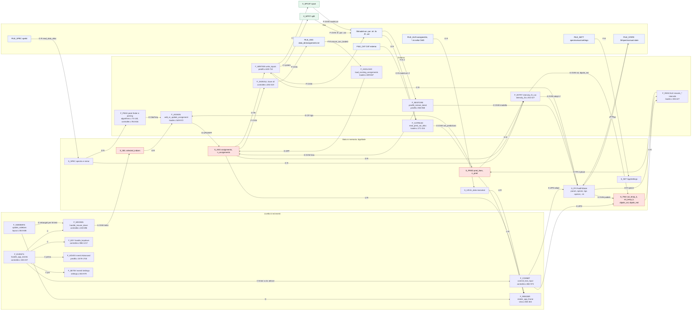

### 5.2 D2 — Macchina a stati dell'applicazione

Lo stato reale è il prodotto di flag indipendenti (`n_spectra`, `n_pred`,
`n_selected`, `n_assignments`, `generated_catalog_active`, finestre aperte);
il diagramma mostra le combinazioni che cambiano il comportamento. SPCAT e
SPFIT sono eseguiti con `system()` nel thread dell'interfaccia: gli stati
"in corso" bloccano gli eventi.

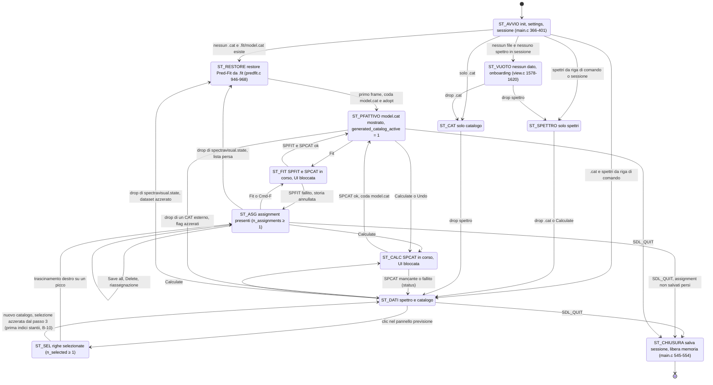

### 5.3 D3 — Mappa della UI e dei layout

```mermaid
flowchart TB
  subgraph W_MAIN["W_MAIN finestra principale"]
    UI_TITLE["UI_TITLE barra titolo: file e errori<br/>view.c:892-906, 953-958"]
    UI_TOPBAR["UI_TOPBAR command bar: Bar, Measure, Sync, Delete peak,<br/>T cat, T rot, Offset, Export, Shortcuts, Settings<br/>ui_chrome.h:72-95"]
    UI_RAIL["UI_RAIL rail: 10 pannelli<br/>ui_chrome.h:17-49"]
    UI_EXP["UI_EXP pannello sperimentale<br/>view.c:412-709"]
    UI_PRED["UI_PRED pannello previsione<br/>view.c:712-864"]
    UI_INSP["UI_INSP colonna inspector<br/>layout.c:553-606"]
    UI_STATUS["UI_STATUS status bar<br/>view.c:1092-1153"]
    UI_OVER["UI_OVER cursore, card selezione, help<br/>view.c:1623-1844"]
  end
  subgraph W_PANELS["Pannelli dell'inspector"]
    UI_P_AS["UI_P_AS Assignments: righe, Save all, Delete<br/>controller.c:272-322"]
    UI_P_PF["UI_P_PF Peak finder<br/>324-349"]
    UI_P_AVG["UI_P_AVG Rolling average<br/>351-364"]
    UI_P_BR["UI_P_BR Broadening<br/>366-396"]
    UI_P_DIP["UI_P_DIP Intensity analysis: T, μ, fit, export<br/>398-455"]
    UI_P_CUT["UI_P_CUT Intensity range<br/>457-465"]
    UI_P_FILT["UI_P_FILT Transition filter<br/>477-511"]
    UI_P_JUMP["UI_P_JUMP Frequency jump<br/>467-475"]
    UI_P_SPEC["UI_P_SPEC Spectra<br/>513-538"]
    UI_P_PFQ["UI_P_PFQ Pred-Fit: A B C μ T Start End,<br/>Calculate Fit Undo Advanced · 539-549"]
  end
  subgraph W_ADV["W_ADV Pred-Fit Advanced"]
    UI_A_PAR["UI_A_PAR Parameters: riga opzioni, tabella, Calculate<br/>predfit.c:1624-1643"]
    UI_A_LIN["UI_A_LIN Lines: flag di fit<br/>1689-1693"]
    UI_A_FIT["UI_A_FIT Fitting: report, Fit, Undo<br/>1689-1698"]
    UI_A_SPE["UI_A_SPE Species: .int, specie, Calculate<br/>1645-1687"]
  end
  subgraph W_SET["W_SET Settings"]
    UI_S_ALL["UI_S_ALL Plot, Navigation, Analysis, Paths, Shortcuts<br/>settings.c:586-708"]
  end
  L_MAINLAYOUT["G_LAYOUT calcolo pannelli<br/>main.c:469-511"]

  UI_RAIL -->|"C visible"| W_PANELS
  UI_INSP -->|"G impilamento"| W_PANELS
  L_MAINLAYOUT -->|"G exp_h, pred_h"| UI_EXP
  L_MAINLAYOUT -->|"G"| UI_PRED
  UI_INSP -->|"G plot_right"| L_MAINLAYOUT
  UI_TOPBAR -->|"C F_MDOWN, F_COMMIT"| F_TOPHANDLERS["F_MDOWN rami command bar<br/>controller.c:571-626"]
  UI_PRED -->|"C clic"| F_SELECT["F_SELECT selezione<br/>controller.c:669-694"]
  UI_EXP -->|"C trascinamento destro"| F_PEAKPICK["F_PEAKPICK run_right_click_peak_find<br/>controller.c:784-834"]
  UI_EXP -->|"C trascinamento sinistro, Alt"| F_ZOOMOFF["zoom e offset<br/>controller.c:752-768, 710-715"]
  UI_P_AS -->|"C"| F_SAVEALL2["F_SAVEALL<br/>controller.c:283-319"]
  UI_P_DIP -->|"C Run fit"| F_INTFIT2["F_INTFIT<br/>intensity_fit.c:254-327"]
  UI_P_DIP -->|"C campi"| F_COMMIT2["F_COMMIT<br/>controller.c:913-951"]
  UI_P_PFQ -->|"C"| F_PFBTN["F_CALC, F_FIT, F_UNDO<br/>predfit.c:970-1032"]
  UI_A_PAR -->|"C riga opzioni"| F_ADVCOMMIT["F_ADVCOMMIT advanced_commit_edit<br/>predfit.c:1202-1294"]
  UI_A_SPE -->|"C + species"| F_ADDSP["F_ADDSP add_species<br/>predfit.c:595-627"]
  UI_A_LIN -->|"S·UPD fit_enabled"| S_ASG2["S_ASG"]
  UI_A_FIT -->|"C"| F_PFBTN
  S_ASG2 -->|"G altezza pannello"| UI_INSP

  classDef bad fill:#fde2e1,stroke:#c0392b,color:#111
  class S_ASG2 bad
```

Chi disegna che cosa e da quali dati dipende ogni geometria: [A3.3](A3-ui-layout-eventi.md#a33-geometria-e-layout) e [A3.12](A3-ui-layout-eventi.md#a312-pipeline-di-rendering-cache-e-dipendenze-inverse).

### 5.4 D4 — Evento → effetto per ogni classe di input

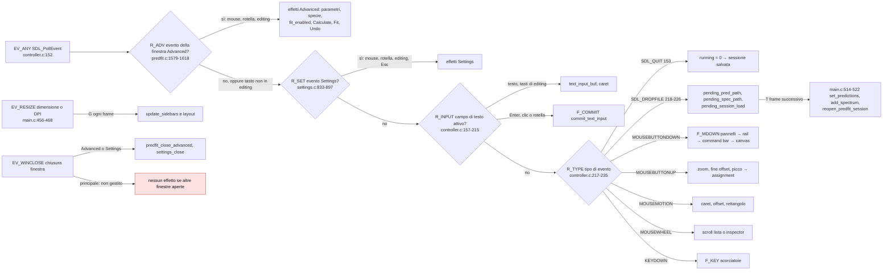

La tabella completa tasto per tasto e controllo per controllo è in
[A3.4–A3.10](A3-ui-layout-eventi.md#a34-command-bar).

### 5.5 D5 — Data-flow: dati sperimentali, cataloghi, assignment, Pred&Fit, intensità

```mermaid
flowchart LR
  FILE_SPEC["FILE_SPEC spettro"] -->|"D·R read_data_alloc"| S_SPEC["S_SPEC current_pts attivo"]
  S_SPEC -->|"D·R"| F_PEAKPICK["F_PEAKPICK picco parabolico"]
  FILE_CAT["FILE_CAT CAT esterno QNFMT 303"] -->|"D·R"| F_CATREAD["F_CATREAD + F_QNFMT<br/>loader.c:54-65"]
  FILE_MODELCAT["FILE_MODELCAT .fit/model.cat"] -->|"D·R ↺"| F_CATREAD
  F_CATREAD -->|"D·TR NQN, 12 QN"| S_PRED["S_PRED pred_lines"]
  S_PRED -->|"D·R indice"| S_SEL["S_SEL selected_indices"]
  S_SEL -->|"D·CP riga"| F_ASSIGN["F_ASSIGN add_or_update_assignment"]
  F_PEAKPICK -->|"D ObsFreq, altezza"| F_ASSIGN
  F_ASSIGN -->|"D·UPD/APP"| S_ASG["S_ASG lista assignment"]
  S_ASG -->|"P·OVW Save all"| FILE_ASG["FILE_ASG assignments.txt"]
  FILE_ASG -->|"P·R avvio"| S_ASG
  S_ASG -->|"D·TR NQN dell'assignment"| F_LINW["F_LINW writer .lin<br/>predfit.c:688-707"]
  F_LINW -->|"P·OVW"| FILE_LIN["FILE_LIN model.lin"]
  FILE_LIN -->|"D·R con NQN del .par"| X_SPFIT["X_SPFIT"]
  S_PARAM["S_PARAM param, riga opzioni, specie"] -->|"D·TR"| F_PARW["F_PARW writer .par .var .int<br/>predfit.c:667-687"]
  F_PARW -->|"P·OVW"| FILE_PAR["FILE_PAR model.par .var .int"]
  FILE_PAR -->|"D·R"| X_SPFIT
  X_SPFIT -->|"P·OVW"| FILE_FITOUT["FILE_FITOUT model.fit .var .par .bak"]
  FILE_FITOUT -->|"D·R import_fitted_parameters"| S_PARAM
  FILE_PAR -->|"D·R"| X_SPCAT["X_SPCAT"]
  X_SPCAT -->|"P·OVW ↺"| FILE_MODELCAT
  FILE_LIN -->|"P·R restore ↺"| S_ASG
  S_TMU["S_TMU Tcat, Trot, μcat, μred"] -->|"D·R"| F_RESCALE["F_RESCALE"]
  S_PARAM -->|"D·R Tred, concentrazione"| F_RESCALE
  F_RESCALE -->|"D·TR linear_int, lgint"| S_PRED
  S_SPEC -->|"D·R aree"| F_INTFIT["F_INTFIT"]
  S_ASG -->|"D·R ObsFreq, copia riga"| F_INTFIT
  S_PRED -->|"D·R cat_lgint"| F_INTFIT
  S_TMU -->|"D·R"| F_INTFIT
  F_INTFIT -->|"S·OVW Trot, μred"| S_TMU
  S_TMU -->|"S·OVW adopt ↺"| S_PARAM
  S_PARAM -->|"S·OVW publish ↺"| S_TMU
  S_PRED -->|"U·R"| F_RENDER["F_RENDER"]
  S_ASG -->|"U·R"| F_RENDER
  S_SPEC -->|"U·R"| F_RENDER

  classDef bad fill:#fde2e1,stroke:#c0392b,color:#111
  class F_CATREAD,S_ASG,S_TMU,F_LINW bad
```

Tre cicli chiusi: catalogo → assignment → `.lin` → SPFIT → parametri → SPCAT →
catalogo; lista → `model.lin` → restore → lista; T/μ ↔ specie di Pred&Fit
(publish/adopt) passando anche dal fit delle intensità.

### 5.6 D6 — Call graph operativo per route

Frecce piene = chiamata (controllo); frecce tratteggiate = scrittura di un campo
condiviso. Il grafo completo, con i chiamanti inversi di ogni funzione, è in
[A1.3](A1-funzioni.md#a13-indice-completo-generato-tutte-le-funzioni).

```mermaid
flowchart TB
  subgraph R1["R1 assegnazione"]
    a1["handle_mouse_down selezione"] -.->|"W"| s_sel["S_SEL"]
    a2["handle_mouse_up"] --> a3["run_right_click_peak_find"]
    a3 --> a4["assign_selected_predictions"]
    a4 --> a5["add_or_update_assignment"]
    a5 --> a6["deduplicate_assignments"]
    a6 --> a7["same_assignment_transition"]
    a5 -.->|"W"| s_asg["S_ASG"]
    a4 -.->|"W n_selected = 0"| s_sel
  end
  subgraph R2["R2 salvataggio e caricamento assignment"]
    b1["Save all"] --> a6
    b1 --> b2["current_assignment_prediction"]
    b1 -.->|"P"| f_asg["FILE_ASG"]
    b3["set_predictions / add_spectrum"] --> b4["ensure_aux_loaded"]
    b4 --> b5["load_existing_assignments"]
    b5 --> b6["parse_assignment_lin_order"]
    b5 --> a5
  end
  subgraph R3["R3 Calculate"]
    c1["predfit_calculate_all_species"] --> c2["predfit_publish_shared_state"]
    c2 --> c3["store_active_species"]
    c2 --> c4["rescale_*"]
    c1 --> c5["write_inputs"]
    c5 --> c6["update_hamiltonian_nstates"]
    c6 --> c7["set_hamiltonian_nstates"]
    c5 --> c8["predfit_save_session"]
    c5 --> c9["write_multi_state_int"]
    c1 --> c10["run spcat"]
    c6 -.->|"W NVIB"| s_ham["S_HAM hamiltonian_line"]
  end
  subgraph R4["R4 Fit e Undo"]
    d1["predfit_fit"] --> c2
    d1 --> d2["push_fit_snapshot"]
    d1 --> c5
    c5 --> a6
    d1 --> d3["run spfit"]
    d1 --> d4["import_fitted_parameters"]
    d1 --> c10
    d5["predfit_undo_last_fit"] --> d6["restore_fit_snapshot"]
    d5 --> c1
    d6 -.->|"W fit_enabled per identità; lista invariata"| s_asg
  end
  subgraph R5["R5 intensità"]
    e1["commit_text_input T, μ"] --> e2["predfit_adopt_shared_state"]
    e1 --> c4
    e3["Run fit"] --> e4["intensity_fit_run"]
    e4 --> e5["current_pred_line"]
    e4 --> e6["fitted_temperature"]
    e4 --> e7["fit_relative_dipoles"]
    e4 --> e2
    e3 --> c4
    e2 -.->|"W specie attiva"| s_sp["S_SPECIES"]
    e7 -.->|"W dipole_red"| s_tmu["S_TMU"]
  end
  subgraph R6["R6 restore all'avvio"]
    g1["main"] --> g2["predfit_load_session"]
    g2 --> c6
    g1 --> g3["predfit_restore_latest"]
    g3 --> d4
    g3 --> g2
    g3 --> g4["import_int_settings"]
    g3 --> c3
    g3 --> g5["import_fit_lines"]
    g5 --> b5
    g5 --> g6["read_lin_rows"]
    g5 -.->|"W azzera e ricostruisce"| s_asg
    c3 -.->|"W"| s_sp
  end

  classDef bad fill:#fde2e1,stroke:#c0392b,color:#111
  class s_asg,s_tmu,s_sp,s_ham bad
```

Punti in cui uno stesso campo è letto e scritto da route diverse: `S_ASG`
(R1, R2, R4, R6), `S_SPECIES` (R3, R5, R6), `S_TMU` (R3 via publish, R5),
`S_HAM` (R3, R6, editing Advanced).

### 5.7 D7 — Persistenza

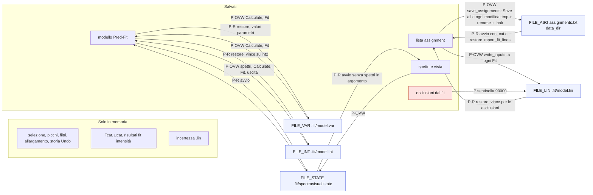

Tabella delle precedenze: [flusso 8](#flusso-8). Tutti i writer di file
sovrascrivono; usano file temporaneo e rename solo `predfit_save_session`
([predfit.c:190-237](../../predfit.c#L190-L237)) e, dal passo #2, `save_assignments`
([controller.c:93-122](../../controller.c#L93-L122)), che tiene anche la copia
`assignments.txt.bak`.

### 5.8 D8 — Errori, fallback, sentinelle e rami anomali

```mermaid
flowchart TB
  E_CAT80{"E_CAT80 record lungo almeno 55 caratteri, FREQ ERR LGINT QNFMT numerici?<br/>parse_cat_record loader.c:68-104, dal passo 1"} -->|"no"| E_CAT80N["riga ignorata: non è un record"]
  E_CAT80 -->|"sì"| E_QN{"E_QN NQN = QNFMT % 10<br/>colonne 52-55"}
  E_QN -->|"NQN 0 o maggiore di 6, D6"| E_QN0["riga scartata e contata<br/>messaggio di set_predictions"]
  E_QN -->|"NQN 1..6"| E_QNOK["riga caricata"]
  E_NQNBAD["E_NQNBAD n_qn non valido<br/>righe legacy di assignments.txt"] -->|"Save all"| E_NQ3["riga non scritta, contata nel messaggio<br/>dal passo 4"]
  E_NQNBAD -->|"Fit"| E_FITBLOCK["fit bloccato, messaggio<br/>predfit.c:636-644"]
  E_ASGP{"E_ASGP intestazione SPFIT .lin order presente?<br/>loader.c:690-699, dal passo 4"} -->|"sì"| E_ASGNEW["riga del formato nuovo, 2 NQN + 4 campi,<br/>altrimenti ignorata e contata"]
  E_ASGP -->|"no"| E_ASGOLD["solo legacy a 14 o 15-16 campi,<br/>il resto ignorato e contato, per esempio un .lin"]
  E_PROG{"E_PROG spcat/spfit eseguibili?<br/>predfit.c:978-981, 1001-1005"} -->|"no"| E_PROGN["status: Set the SPCAT/SPFIT program"]
  E_RC{"E_RC exit code ≠ 0?<br/>predfit.c:717-721"} -->|"sì"| E_RCN["status ... failed; history_count--"]
  E_SPFITBAD{"E_SPFITBAD Bad Line, rifiutate, non usate o divergenza?"} -->|"sì"| E_SILENT["conteggi nello status; Bad Line marcate nella tabella Fitting (B-22 risolto)"]
  E_EXCL{"E_EXCL Assignment escluso?"} -->|"sì"| E_EXCLOK["omesso da model.lin; chiave NQN+QN in exclusions.txt"]
  E_EXCL -->|"no"| E_LINOK["riga normale in model.lin"]
  E_FOPEN{"E_FOPEN fopen fallita"} -->|"assignments.txt, linelist.csv"| E_FOPENS["errore in error_message, file precedente intatto, dal passo 2"]
  E_FOPEN -->|"file Pred-Fit"| E_FOPENPF["status Cannot write Pickett working files"]
  E_SESS{"E_SESS riga di sessione non riconosciuta"} -->|"ignorata"| E_SESSN["valori di default; specie assenti → Species 1<br/>predfit.c:350-353"]
  E_SESSF{"E_SESSF spectravisual.state trattato come spettro?"} -->|"controllo realpath"| E_SESSG["rifiutato come spettro<br/>main.c:226-230, predfit.c:176-183"]
  E_RESTORE{"E_RESTORE .fit/model.cat esiste?"} -->|"no"| E_RESTN["restore saltato"]
  E_RESTORE -->|"sì"| E_RESTY["Pred-Fit ripristinato senza richiesta (vincolo 4)"]
  E_SEL{"E_SEL indice selezionato ≥ n_pred?"} -->|"assegnazione"| E_SELA["ignorato<br/>controller.c:842"]
  E_SEL -->|"render"| E_SELR["ignorato, dal passo 3<br/>view.c:1817-1818"]

  classDef bad fill:#fde2e1,stroke:#c0392b,color:#111
  class E_SILENT,E_RESTY bad
```

Altri rami rilevanti: `read_data_alloc` riconosce il separatore dalla prima riga
numerica e scarta le righe che non lo rispettano ([loader.c:471-508](../../loader.c#L471-L508));
`import_int_settings` converte un FEND frazionario (vecchio bug) in 40
([predfit.c:782-785](../../predfit.c#L782-L785)); `parse_observation` scarta le righe
con incertezza ≤ 0 ([predfit.c:1413](../../predfit.c#L1413)); `settings_load` riporta
nei limiti i valori fuori scala ([settings.c:229-242](../../settings.c#L229-L242));
`predfit_is_generated_catalog` ricade sul confronto testuale se `realpath`
fallisce ([predfit.c:38-41](../../predfit.c#L38-L41)).

### 5.9 D9 — Nodi condivisi, precedenze e sovrascritture

#### D9a — `assignments.txt` ↔ lista in memoria ↔ `model.lin`

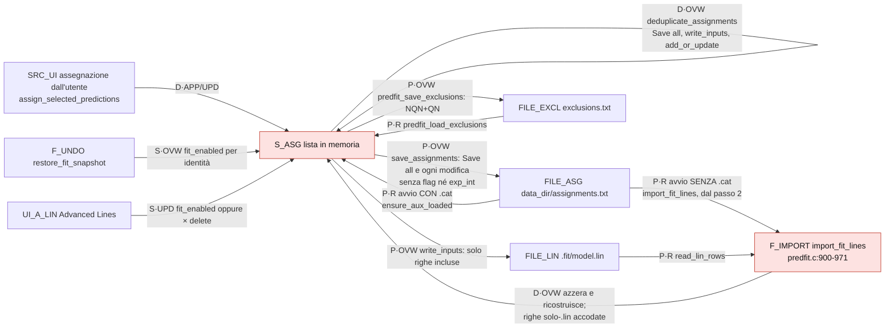

Fonte di verità per scenario [FATTO]: avvio normale con `.cat` →
`data_dir/assignments.txt`; avvio senza `.cat` con `.fit/model.cat` →
`import_fit_lines` (unione, `model.lin` vince sulle esclusioni,
`data_dir/assignments.txt` - la CWD prima del passo #2 - sulle frequenze calcolate); Calculate → nessuna lettura; Fit → la lista in memoria
(deduplicata) sovrascrive `model.lin`; Undo → i flag dello snapshot per
posizione; CAT esterno aperto → la lista non cambia (ma cambia l'identità delle
nuove righe); chiusura → nulla da salvare, perché dal passo #2 la lista è già su disco; drop della sessione → lista
azzerata e ricostruita da `import_fit_lines`.

#### D9b — CAT esterno / `model.cat` ↔ `PredLine` ↔ selezione ↔ assignment

```mermaid
flowchart LR
  FILE_CAT["FILE_CAT CAT esterno"] -->|"D·R"| F_CATREAD["F_CATREAD read_pred_cat_alloc"]
  FILE_MODELCAT["FILE_MODELCAT model.cat"] -->|"D·R"| F_CATREAD
  F_CATREAD -->|"D·TR NQN da QNFMT (B-01), QN, ordinamento"| S_PRED["S_PRED pred_lines"]
  F_CATREAD -->|"C set_predictions: flag generato"| S_GEN["S_GEN generated_catalog_*"]
  S_PRED -->|"D·R indice ± 5 px, filtro"| S_SEL["S_SEL selected_indices"]
  F_CATREAD -.->|"INV set_predictions azzera la selezione, dal passo 3"| S_SEL
  S_SEL -->|"D·CP riga intera"| S_ASGP["S_ASGP Assignment.pred"]
  S_ASGP -->|"D·R identità NQN + 12 QN"| F_DEDUP["F_DEDUP deduplicate_assignments"]
  S_PRED -->|"D·R stesso NQN e QN"| F_CURRENT["F_CURRENT current_assignment_prediction"]
  S_ASGP -->|"D·R"| F_CURRENT
  F_CURRENT -->|"D CalcFreq, CalcInt"| FILE_ASG["FILE_ASG assignments.txt"]
  S_GEN -->|"C by-species o specie singola"| F_RESCALE["F_RESCALE"]
  F_RESCALE -->|"D·TR intensità"| S_PRED

  classDef bad fill:#fde2e1,stroke:#c0392b,color:#111
  class F_CATREAD bad
```

#### D9c — assignment + parametri + Hamiltoniano + `.int` → SPFIT/SPCAT → stato

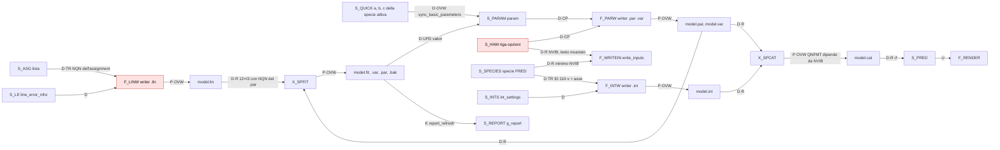

#### D9d — parametri nella UI ↔ `.par/.var` ↔ Pred&Fit ↔ catalogo

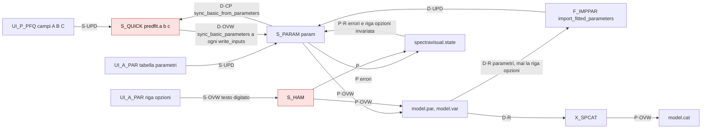

Una modifica fatta a mano in `model.par` viene ancora sovrascritta al
Calculate/Fit successivo e non viene mai letta ([RIPR R-08]): la fonte
autorevole della riga opzioni è la memoria, ma dal passo #5 coincide esattamente
con il testo digitato o ripristinato dalla sessione. `write_inputs` ne legge
NVIB soltanto per rifiutare un valore minore del massimo stato PRED.

#### D9e — fit delle intensità ↔ spettro ↔ assignment ↔ catalogo ↔ dipoli, temperature, concentrazioni

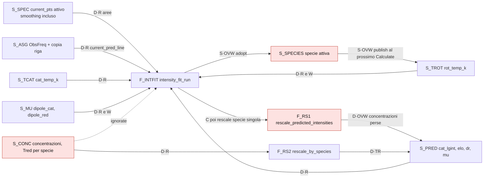

#### D9f — caricamento, salvataggio manuale, autosave, restore, cache

- **Autosave**: dal passo #2 la lista è salvata in `assignments.txt` a ogni
  aggiunta, riassegnazione e cancellazione (`save_assignments`
  [controller.c:93-122](../../controller.c#L93-L122)). Prima esisteva solo per la
  sessione (`predfit_save_session` a eventi) e, implicitamente, per la lista quando
  si fa Fit (`model.lin`); la lista non era mai salvata all'uscita
  ([main.c:545](../../main.c#L545)).
- **File che prevalgono sulla memoria**: al restore `model.int` è un fallback
  soltanto se manca `int2` nella sessione; `model.lin` prevale sui flag
  (B-16); la sessione prevale su `model.par` per la riga opzioni.
- **Memoria che prevale sui file**: a ogni Calculate/Fit tutti i file
  Pred&Fit sono riscritti dalla memoria (modifiche manuali perse); *Save all*
  sovrascrive `assignments.txt` senza unire (dal passo #2 con la copia `.bak`).
- **Cache**: `g_report` (`model.fit`, invalidata per `mtime` e dopo SPFIT);
  `ensure_aux_loaded` (una volta per processo); `lin_data` (mai ricaricato).

### 5.10 Registro dei nodi

Nodi usati in più diagrammi (lo stesso ID indica lo stesso oggetto). Le
funzioni non elencate hanno la loro riga in [A1](A1-funzioni.md).

| ID | Tipo | Oggetto | Codice |
|---|---|---|---|
| `F_EVENTS` | funzione | `handle_app_events` | [controller.c:150-237](../../controller.c#L150-L237) |
| `F_MDOWN` | funzione | `handle_mouse_down` | [controller.c:240-696](../../controller.c#L240-L696) |
| `F_KEY` | funzione | `handle_keydown` | [controller.c:986-1217](../../controller.c#L986-L1217) |
| `F_COMMIT` | funzione | `commit_text_input` | [controller.c:882-973](../../controller.c#L882-L973) |
| `F_ADVEV` | funzione | `predfit_handle_advanced_event` | [predfit.c:1579-1700](../../predfit.c#L1579-L1700) |
| `F_ADVCOMMIT` | funzione | `advanced_commit_edit` | [predfit.c:1202-1294](../../predfit.c#L1202-L1294) |
| `F_SETEV` | funzione | `settings_handle_event` | [settings.c:833-979](../../settings.c#L833-L979) |
| `F_SIDEBARS` | funzione | `update_sidebars` | [layout.c:553-606](../../layout.c#L553-L606) |
| `F_RENDER` | funzione | `render_app_frame` | [view.c:360-404](../../view.c#L360-L404) |
| `F_CATREAD` / `F_QNFMT` | funzione | `read_pred_cat_alloc` / `parse_cat_quantum_numbers` | [loader.c:271-334](../../loader.c#L271-L334) / [54-65](../../loader.c#L54-L65) |
| `F_SELECT` | ramo | selezione nel pannello previsione | [controller.c:669-694](../../controller.c#L669-L694) |
| `F_PEAK`, `F_PEAKPICK` | funzione | `run_peak_finder`, `run_right_click_peak_find` | [algorithms.c:73-140](../../algorithms.c#L73-L140), [controller.c:784-834](../../controller.c#L784-L834) |
| `F_ASSIGN` | funzione | `add_or_update_assignment` | [loader.c:549-572](../../loader.c#L549-L572) |
| `F_DEDUP` | funzione | `deduplicate_assignments` | [loader.c:530-547](../../loader.c#L530-L547) |
| `F_CURRENT` | funzione | `current_assignment_prediction` | [controller.c:37-50](../../controller.c#L37-L50) |
| `F_SAVEALL` | ramo | *Save all* | [controller.c:283-319](../../controller.c#L283-L319) |
| `F_ASGLOAD` | funzione | `load_existing_assignments` | [loader.c:609-667](../../loader.c#L609-L667) |
| `F_RESCALE`, `F_RS1`, `F_RS2` | funzione | `rescale_predicted_intensities`, `..._by_species` | [loader.c:336-388](../../loader.c#L336-L388), [390-427](../../loader.c#L390-L427) |
| `F_WRITEIN`, `F_LINW`, `F_PARW`, `F_INTW` | funzione | `write_inputs` e sue parti | [predfit.c:629-710](../../predfit.c#L629-L710) (`.lin` [688-707](../../predfit.c#L688-L707), `.par/.var` [667-675](../../predfit.c#L667-L675), `.int` [393-411](../../predfit.c#L393-L411), [676-687](../../predfit.c#L676-L687)) |
| `F_RESTORE` | funzione | `predfit_restore_latest` | [predfit.c:946-968](../../predfit.c#L946-L968) |
| `F_IMPORT` | funzione | `import_fit_lines` | [predfit.c:886-944](../../predfit.c#L886-L944) |
| `F_IMPPAR` | funzione | `import_fitted_parameters` | [predfit.c:723-741](../../predfit.c#L723-L741) |
| `F_UNDO` | funzione | `restore_fit_snapshot` | [predfit.c:463-479](../../predfit.c#L463-L479) |
| `F_ADDSP` | funzione | `add_species` | [predfit.c:595-627](../../predfit.c#L595-L627) |
| `F_PFBTN` (`F_CALC`, `F_FIT`, `F_UNDO`) | funzione | `predfit_calculate_all_species`, `predfit_fit`, `predfit_undo_last_fit` | [predfit.c:970-1032](../../predfit.c#L970-L1032) |
| `F_INTFIT` | funzione | `intensity_fit_run` | [intensity_fit.c:254-327](../../intensity_fit.c#L254-L327) |
| `S_PRED` | stato | `pred_lines`, `n_pred` | [types.h:355-357](../../types.h#L355-L357) |
| `S_SEL` | stato | `selected_indices`, `n_selected` | [types.h:418-419](../../types.h#L418-L419) |
| `S_ASG`, `S_ASGP` | stato | `assignments`, `n_assignments`, `Assignment.pred` | [types.h:73-78](../../types.h#L73-L78), [420-421](../../types.h#L420-L421) |
| `S_TMU`, `S_TCAT`, `S_TROT`, `S_MU` | stato | `cat_temp_k`, `rot_temp_k`, `dipole_cat`, `dipole_red` | [types.h:371-374](../../types.h#L371-L374) |
| `S_PF`, `S_PARAM`, `S_QUICK`, `S_HAM`, `S_SPECIES`, `S_INTS`, `S_LE`, `S_CONC` | stato | `PredFitState` e sue parti | [types.h:129-167](../../types.h#L129-L167), [87-108](../../types.h#L87-L108) |
| `S_GEN` | stato | `generated_catalog_pending/active` | [types.h:161-162](../../types.h#L161-L162) |
| `S_SPEC` | stato | `spectra[]` e mirror | [types.h:27-42](../../types.h#L27-L42), [341-344](../../types.h#L341-L344) |
| `S_LIN` | stato | `lin_data` | [types.h:360-361](../../types.h#L360-L361) |
| `S_REPORT` | cache | `g_report` | [predfit.c:1373-1382](../../predfit.c#L1373-L1382) |
| `FILE_CAT`, `FILE_MODELCAT` | file | CAT esterno, `.fit/model.cat` | §6.1 |
| `FILE_ASG`, `FILE_ASG_CWD` | file | `assignments.txt` in `data_dir` e nella CWD | §6.2 |
| `FILE_LIN` | file | `.fit/model.lin` | §6.3 |
| `FILE_PAR`, `FILE_PARVAR`, `FILE_VAR` | file | `.fit/model.par`, `.var` | §6.4 |
| `FILE_INT` | file | `.fit/model.int`, `species_XX.int` | §6.5 |
| `FILE_FIT`, `FILE_FITOUT` | file | `.fit/model.fit/.bak/.out` | §6.6 |
| `FILE_STATE` | file | `.fit/spectravisual.state` | §6.7 |
| `FILE_SETT`, `FILE_ALIN`, `FILE_SPEC` | file | impostazioni, marcatori, spettri | §6.8 |
| `X_SPCAT`, `X_SPFIT` | programma | SPCAT, SPFIT | [predfit.c:717-721](../../predfit.c#L717-L721) |
| `UI_*`, `EV_*`, `R_*`, `G_*` | UI/eventi | controlli, eventi, instradamento, geometria | [A3](A3-ui-layout-eventi.md) |
| `E_*` | errore | rami di D8 | righe citate nel nodo |
| `ST_*` | stato app | D2 | righe citate nel nodo |

### 5.11 Relazioni critiche

| # | Da → A | Tipo·Op | Realizzata da | Perché esiste | Quando è attiva | Che cosa modifica | Che cosa innesca |
|---|---|---|---|---|---|---|---|
| K-01 | `FILE_CAT` → `S_PRED` | D·TR | `read_pred_cat_alloc`, `parse_cat_quantum_numbers` | caricare il catalogo | ogni `set_predictions` | NQN, QN, intensità di tutte le righe | selezione, identità, writer (B-01) |
| K-02 | `S_SPECIES` → `S_HAM` | D·OVW | `update_hamiltonian_nstates` | usare le specie come stati v | add/rimozione specie, editing riga opzioni, Calculate/Fit, avvio | NVIB | QNFMT di `model.cat` (K-08), identità delle nuove righe |
| K-03 | `S_SEL` → `S_ASG` | D·CP | `assign_selected_predictions` | creare l'assignment dalla riga scelta | trascinamento destro con selezione | nuovo/aggiornato assignment | dedup, `.lin`, `assignments.txt` |
| K-04 | `S_ASG` → `FILE_ASG` | P·OVW | *Save all* | persistenza della lista | su richiesta | intero file | letto all'avvio con `.cat` |
| K-05 | `FILE_ASG_CWD` + `FILE_LIN` → `S_ASG` | P·OVW | `import_fit_lines` | ripristinare lista e flag dopo un fit | avvio senza `.cat` con `model.cat`, drop della sessione | intera lista | Save all successivo, Fit (B-15, B-16) |
| K-06 | `S_ASG` → `FILE_LIN` | D·TR | `write_inputs(1)` | input di SPFIT | ogni Fit | `model.lin` | lettura SPFIT con NQN del modello (B-12), restore |
| K-07 | `FILE_LIN` → `X_SPFIT` | D·R | SPFIT `getlin` | fit | ogni Fit | — | righe "Bad Line"/rifiutate silenziose (B-22) |
| K-08 | `X_SPCAT` → `FILE_MODELCAT` → `S_PRED` | P·OVW, D·R | SPCAT, coda di caricamento | aggiornare la previsione | Calculate, Fit, Undo, restore | tutto il catalogo, flag generato | selezione azzerata (dal passo #3; prima indici stantii, B-10), riscalamento per specie |
| K-09 | `S_PF` → `S_TMU` | S·OVW | `predfit_publish_shared_state` | mostrare nell'Intensity analysis T e μ della specie attiva | Calculate, Fit, campi Pred&Fit, specie | Trot, μ red, Tcat (se generato), intensità | riscalamento del catalogo mostrato |
| K-10 | `S_TMU` → `S_PF` | S·OVW | `predfit_adopt_shared_state` | idem, direzione opposta | T rot, μ red, Run fit | `predfit.temp_k/mu`, specie attiva | `.int` del prossimo Calculate (B-13) |
| K-11 | `F_INTFIT` → `S_TMU` | S·OVW | `intensity_fit_run`, `fit_relative_dipoles` | applicare il risultato | Run fit | Trot, μ red | K-10, poi riscalamento a specie singola (B-11) |
| K-12 | `S_TMU` → `S_PRED` | D·TR | `rescale_predicted_intensities` | T e dipoli richiesti | campi T/μ, Run fit, caricamento | intensità di tutte le righe | filtro di intensità, normalizzazione, CalcInt salvata |
| K-13 | `FILE_INT` → `S_INT` | P·INIT | `import_int_settings` | restore di sessione vecchia | avvio senza `.cat`, `int2` assente | soli campi INT non salvati | `.int` non modifica specie o dipoli (B-18 risolto) |
| K-14 | `S_PRED` ⇢ `S_SEL` | INV | `set_predictions` (dal passo #3) | la selezione è fatta di indici del catalogo corrente | ogni cambio di catalogo | `n_selected = 0` | prima del passo #3 mancava: assegnazione della transizione sbagliata (B-10) |
| K-15 | `F_UNDO` → `S_ASG` | S·OVW | `restore_fit_snapshot` | annullare il fit | Undo | `fit_enabled` per identità; lista invariata | B-17 risolto al passo #8 |

---

## 6. Specifica dei formati

Per ogni formato: layout, unità, writer e reader nell'app, riferimento
SPCAT/SPFIT, QN usati, perdite di informazione, compatibilità e divergenze.

<a id="61-cat-esterno-e-modelcat"></a>
### 6.1 CAT esterno e `model.cat`

Record a larghezza fissa scritto da SPCAT (`calpgm/calcat.c:700-709`:
`"%13.4f%8.4f%8.4f%2d%10.4f%s%7ld%4d"` + stringa dei QN):

**Dal passo #1** l'app legge il record con `parse_cat_record`
([loader.c:46-104](../../loader.c#L46-L104)): ogni campo è tagliato alle colonne
di questa tabella e convertito da solo; il record deve arrivare almeno alla
colonna 55 (QNFMT) e i QN mancanti valgono come vuoti; i QN sono decodificati
come `readqn` ([loader.c:11-25](../../loader.c#L11-L25)); le righe con NQN 0 o > 6
sono scartate e contate (D6). La colonna *Lettura nell'app* descrive il commit
`1f4df65`.

| Colonne | Campo | Formato SPCAT | Lettura nell'app | Note |
|---|---|---|---|---|
| 1–13 | FREQ (MHz) | F13.4 (F13.6 con PRIR, F13.3 oltre 99 999 999) | `sscanf("%lf %lf %lf")` in formato libero [loader.c:293](../../loader.c#L293) | se FREQ ed ERR si toccano le cifre di ERR finiscono in FREQ: ultima riga di `.fit/model.cat`, `6348.1049158.2229` → 6348.1049158 [FATTO] |
| 14–21 | ERR (MHz) | F8.4 | idem, poi scartato | — |
| 22–29 | LGINT (log10 nm² MHz a TEMP del `.int`) | F8.4 | idem → `lgint`, `cat_lgint` [loader.c:45](../../loader.c#L45) | — |
| 30–31 | DR (gradi di libertà) | I2 | `%2d` a offset 29 [loader.c:41](../../loader.c#L41) | — |
| 32–41 | ELO (cm⁻¹) | F10.4 | `%10lf` | se GUP ha tre cifre e ELO spazi iniziali, le cifre di GUP diventano decimali di ELO (errore < 1e-4 cm⁻¹) |
| 42–44 | GUP | codice `gupfmt` (lettere oltre 999) | non letto | — |
| 45–51 | TAG | I7 | non letto | — |
| 52–55 | QNFMT = Q·100 + H·10 + NQN | **I4**: `303` è scritto `" 303"` | `sscanf(line + 51, "%4d")` [loader.c:57](../../loader.c#L57) → **B-01** | NQN = QNFMT % 10, e 0 significa 10 (`calpgm/ulib.c:778`); l'app tratta 0 come non valido e limita NQN a 6 |
| 56–67 | QN superiori, 6 × 2 caratteri | `qnfmt()` `calpgm/calcat.c:778-820`: ≥ 100 → lettera `A`–`Z` + cifra; −1…−9 → `-d`; ≤ −10 → lettera `a`–`z` + cifra; slot inutilizzati vuoti | `parse_qn2` = `atoi` su 2 caratteri [loader.c:11-15](../../loader.c#L11-L15) → **B-04** | decodifica canonica: `readqn` `calpgm/catutil.c:10-60` |
| 68–79 | QN inferiori | idem | offset 55+12 [loader.c:63-64](../../loader.c#L63-L64) | — |

Altre regole del lettore: al commit `1f4df65` riga scartata se `strlen < 80` ([loader.c:291](../../loader.c#L291))
→ un CAT senza spazi finali non si carica (**B-03**) [RIPR R-01], dal passo #1 basta
che il record arrivi alla colonna 55; ramo e tipo di
dipolo derivati sempre dai primi tre QN ([loader.c:17-34](../../loader.c#L17-L34),
[312-313](../../loader.c#L312-L313)); righe riordinate per frequenza
([328-330](../../loader.c#L328-L330)). Informazioni perse: ERR, GUP, TAG, cifre Q e H
di QNFMT (quindi la posizione del numero vibrazionale, `calpgm/calcat.c:291-292`),
QN in codice lettera (letti dal passo #1).

`model.cat`: stesso formato, prodotto da SPCAT sui file dell'app. Il suo QNFMT
dipende da NVIB: `.fit/model.out` riporta `IQNFMT = 1404` con `s 1 3 0`
[FATTO]; con una specie (`s 1 1 0`) è `303` e ha lo stesso difetto di B-01
[RIPR R-17], corretto al passo #1. Con NVIB > 1 il quarto QN è lo stato v (`iposv = (1404/100)%5 − 1 = 3`).

<a id="62-assignmentstxt"></a>
### 6.2 `assignments.txt`

**Formato nuovo** (writer [controller.c:300-314](../../controller.c#L300-L314)):

```text
# Upper QNs, lower QNs (SPFIT .lin order), ObsFreq(MHz) CalcFreq(MHz) CalcIntensity NQN
<NQN × %3d superiori><NQN × %3d inferiori><riempimento a 12 campi da 3 car.> %15.6f %15.6f %15.6E %d
```

| Campo | Significato | Sorgente al salvataggio |
|---|---|---|
| QN | NQN superiori, NQN inferiori, poi spazi fino a 36 colonne | riga CAT corrente con stesso NQN e QN, altrimenti copia nell'assignment |
| ObsFreq (MHz) | frequenza sperimentale assegnata | `Assignment.exp_freq` |
| CalcFreq (MHz) | frequenza calcolata | `freq_mhz` della riga trovata |
| CalcIntensity | intensità lineare **visualizzata** (dopo Tcat/Trot/μ/concentrazione) | `linear_int` della riga trovata (B-27) |
| NQN | QN per stato | `n_qn`; dal passo #4 una riga con NQN non valido non è scritta (prima **3**, [controller.c:304](../../controller.c#L304)) |

**Dal passo #2** il writer è `save_assignments`
([controller.c:93-122](../../controller.c#L93-L122)): scrive `assignments.txt.tmp`,
copia la versione precedente in `assignments.txt.bak` e sostituisce il file con
`rename`; se `fopen`, `fclose`, la copia o `rename` falliscono lo dice in
`error_message` e il file resta com'era. È chiamato da *Save all* e dopo ogni
aggiunta, riassegnazione e cancellazione. Il formato delle righe non cambia.

**Lettura** ([loader.c:609-667](../../loader.c#L609-L667)): righe con `#` o più
corte di 10 caratteri ignorate; `|` trattato come spazio; `parse_assignment_lin_order`
([579-607](../../loader.c#L579-L607)) raccoglie tutti i numeri, prende l'ultimo come NQN e
accetta la riga se il conteggio è `2·NQN + 4`. In memoria: `exp_freq` ← ObsFreq,
`pred.freq_mhz` ← CalcFreq, `linear_int` ← CalcIntensity, `n_qn` ← NQN,
**`exp_int` ← CalcIntensity** (B-07), `fit_enabled` = 1.

**Dal passo #4** l'intestazione scritta è `# SpectraVisual assignments, format 1: upper
QNs, lower QNs (SPFIT .lin order), ObsFreq(MHz) CalcFreq(MHz) CalcIntensity NQN` e la
lettura è `load_assignments_file` ([loader.c:598-773](../../loader.c#L598-L773)): il
formato nuovo si riconosce dall'intestazione (quella senza versione di `1f4df65` vale
come formato 1; una versione maggiore fa ignorare il file con un messaggio); senza
intestazione si provano il layout legacy a 14 campi (12 QN, ExpFreq, ExpInt) e poi
quello a 15/16 (PredFreq, 12 QN, ExpFreq, ExpInt, NQN facoltativo); ogni altra riga,
per esempio di un `.lin`, è ignorata e contata. `exp_int` delle righe del formato
nuovo è 0 (quelle legacy tengono ExpInt); una transizione ripetuta è contata e vince
l'ultima occorrenza; le righe con NQN sconosciuto o troncate da B-01 (NQN 1 con J
10–19, NQN 2 con J 20–29) sono marcate da riassegnare. Il resoconto
(`assignment_file_message`) va nella barra del titolo. Il writer non scrive le righe
senza NQN valido e ne riporta il numero.

**Formati precedenti** accettati da `sscanf` a 16 campi
([631-635](../../loader.c#L631-L635)): `PredFreq 12QN ExpFreq ExpInt [NQN]`, cioè il
formato scritto prima di `1f4df65` (`"%12.4f %3d×12 %12.4f %12.4e"`, visibile nel
diff di quel commit); `n_qn` = 0 per le righe senza NQN, che il Fit rifiuta
([predfit.c:636-644](../../predfit.c#L636-L644)). Il ramo "legacy 0.9" a 14 valori
([637-654](../../loader.c#L637-L654)) non viene mai raggiunto: il `sscanf` a 16 campi
spezza la frequenza in `"2511"` e `".3375"` e restituisce 15 [RIPR R-09].

**Ambiguità** [RIPR R-09] (B-08): un `.lin` con colonna NQN
(`assignments_backup.txt`) ha anch'esso `2·NQN + 4` valori ed è letto come
assignment con CalcFreq = incertezza e CalcIntensity = peso; la sentinella
`9xxxx` non è decodificata; una riga legacy a 16 campi con NQN = 6 e una a 14
campi con ExpInt ≈ 5 soddisfano il test del formato nuovo e vengono scambiate.
**Risolta al passo #4**: la lettura è guidata dall'intestazione.

**Vincolo 6**: ordine dei campi conforme; contenuto dei QN corretto dal passo #1 (B-01);
esclusione dal fit, intensità osservata, QNFMT completo e catalogo d'origine
non sono rappresentati.

### 6.3 `.lin` (`model.lin`)

| | Writer dell'app [predfit.c:688-707](../../predfit.c#L688-L707) | Reader SPFIT `calpgm/ulib.c:793-846` (`getlin`) | Reader dell'app `read_lin_rows` [predfit.c:814-841](../../predfit.c#L814-L841) |
|---|---|---|---|
| QN | NQN **dell'assignment** × `%3d` sup., × `%3d` inf., spazi fino a 12 campi | 12 × I3 (36 colonne) se NQN ≤ 6; superiori = campi 1..NQN, inferiori = NQN+1..2·NQN, con **NQN del `.par`** (`deflin`, `calpgm/ulib.c:772-791`; `setfmt`, `calpgm/calfit.c:147-153`) | 12 × 3 colonne; `slot` = ultimo campo non vuoto; NQN = slot/2; righe con < 6 slot scartate |
| FREQ | `%15.6f`: sempre ObsFreq delle sole righe incluse | formato libero | `atof(line+36)`; la sentinella storica ≥ 90000 è letta solo per migrare un workspace precedente |
| ERR | `%10.6f` = `line_error_mhz` | |ERR| < 1e-7 → 1e-7 | ignorato |
| WT | `1.0` | < 1e-30 → 1e-30 | ignorato |

Semantica SPFIT rilevante: righe consecutive con la stessa frequenza formano un
blend (`calpgm/calfit.c:941-951`); una riga è usata solo se
|(obs − calc)/err| < ERRTST (`calpgm/calfit.c:448`). L'ordine delle righe è
l'ordine della lista assignment: due transizioni assegnate allo stesso picco in
momenti diversi non sono consecutive e non vengono trattate come blend [INF].
`NLINE` nel `.par` conta solo le righe incluse. Dal passo #8 una riga esclusa
non esiste nel `.lin`, quindi ERRTST × ERR non può reinserirla nel Fit (B-09
risolto). Dal passo #6 un NQN dell'assignment diverso da quello del modello
corrente blocca il Fit prima di `.lin` (B-12 risolto).
`pred.lin`, `assigned.lin`, `assignment.txt` nella radice sono `.lin` dell'utente
in varianti diverse (3 o 4 QN, spaziature diverse) e non sono scritti dall'app.

### 6.3.1 `.fit/exclusions.txt`

File opzionale e versionato, scritto con file temporaneo e `rename`. Ogni riga
non-commento è `NQN` seguito dai 12 QN (superiori poi inferiori). È l'unica
persistenza della scelta temporanea *Exclude from Fit*: una riga assente dal
file resta inclusa. Righe malformate vengono ignorate; non eliminano né
modificano `assignments.txt`. Delete rigenera il file dalla lista residua, così
non lascia chiavi stale. Un vecchio `model.lin` con sentinella è migrato al primo
restore senza cambiare la lista.

### 6.4 `.par` e `.var`

| Riga | Writer [predfit.c:667-675](../../predfit.c#L667-L675) | Reader SPFIT `calpgm/calfit.c:104-156` | Reader dell'app |
|---|---|---|---|
| 1 | titolo `SpectraVisual Pred&Fit quick model` | titolo | — |
| 2 | `%4d%5d%5d%5d %15.4E %15.4E %15.4E %.10f`: NPAR, NLINE (solo assignment inclusi per il Fit, 0 per Calculate), NITR (50 in `.par`, 0 in `.var`), NXPAR 0, MARQP 0, ERRTST 1e6, PARFAC 1, FQFAC 1 | NPAR, NLINE (negativo → formato QN esteso), NITR, NXPAR, MARQP, ERRTST (se ~0 → 1e6, `calfit.c:218-219`), PARFAC, FQFAC | — |
| 3 | `hamiltonian_line`, invariata (B-02 risolto) | riga opzioni: CHR SPIND **NVIB** KNMIN … (`calpgm/spinv.c:2244-2400`; NVIB ≤ 0 → 1) | per Fit `current_model_nqn` confronta questa riga con `hamiltonian_line` prima di fidarsi di `model.cat`; l'app valida NVIB ≥ massimo stato PRED prima di scrivere |
| 4… | `%12d % .15E % .8E /label/` | ID BCD, valore, errore a priori | `import_fitted_parameters` [723-741](../../predfit.c#L723-L741): solo righe con `/`, solo **valore** da `model.var` |

ID dei parametri per stato: suffisso `11·v` ([predfit.c:97-100](../../predfit.c#L97-L100),
[612](../../predfit.c#L612)), coerente con la convenzione `vv'` di Pickett per NVIB ≤ 9.
Il campo "N" della terza riga è **NVIB**, il numero di stati vibrazionali del
modello: non è NQN, non è il numero di QN del catalogo e non è letto dal
rendering. È collegato a NQN solo indirettamente: SPCAT aggiunge il numero di
stato ai QN quando NVIB > 1 (QNFMT `1404`). `model.bak` è il backup scritto da
SPFIT; l'app non lo legge.

### 6.5 `.int` e `species_XX.int`

Riga 2 (writer `write_int_header` [predfit.c:68-74](../../predfit.c#L68-L74), reader SPCAT
`calpgm/calcat.c:118-144`, stesso ordine): FLAGS, TAG, QROT, FBGN, FEND, STR0,
STR1, FQLIM (GHz), TEMP (K), MAXV. L'app scrive QROT calcolato con A/B/C della
**specie attiva** ([50-54](../../predfit.c#L50-L54)), STR0 = STR1, FQLIM =
`fqlim_ghz` o `fmax_ghz`, TEMP = `int_settings.temp_k` o T della specie attiva,
MAXV = `maxv` o `state_count − 1` ([56-66](../../predfit.c#L56-L66)).
Dipoli: `model.int` contiene per ogni specie inclusa gli ID `110·v + 1..3`
([393-411](../../predfit.c#L393-L411)); `species_XX.int` ([380-386](../../predfit.c#L380-L386),
[681-687](../../predfit.c#L681-L687)) contiene `001/002/003` della singola specie e non
è letto da nessuno (SPCAT è lanciato su `model`).
Reader dell'app (`import_int_settings`): `int2` della sessione moderna è autorevole.
Solo se quella riga manca (sessione vecchia) i 10 campi di `model.int` inizializzano
`int_settings`; TEMP e gli ID dipolo del file non vengono mai copiati nella specie
attiva, né FQLIM/MAXV automatici vengono risolti in valori fissi (B-18 risolto).
[INF] un solo QROT per tutti gli stati significa che le intensità relative tra
specie diverse (molecole con A/B/C diversi) sono scalate con la funzione di
partizione della specie attiva; la concentrazione per specie compensa solo in
parte.

### 6.6 `.fit`, `.out`, `.bak`, `.str`, `.egy`

- `model.fit` (SPFIT): l'app legge il blocco `NEW PARAMETER (EST. ERROR)`, le
  righe osservazione `  N:` e `Bad Line(n)` nella cache
  (`report_refresh`/`parse_observation` [predfit.c:1539-1589](../../predfit.c#L1539-L1589)).
  `fit_summary` ([predfit.c:802-832](../../predfit.c#L802-L832)) legge anche
  `END OF ITERATION`, `MICROWAVE RMS`, `Bad Line`, `Lines rejected`,
  `NEXT LINE NOT USED IN FIT` e `Fit Diverging` (B-22 risolto).
- `model.out`, `model.str`, `model.egy` (SPCAT) e `model.bak` (SPFIT): non letti.
- `species_XX.cat/.out/.var` presenti in `.fit/`: residui del codice che eseguiva
  SPCAT per specie, rimosso in `1f4df65` (diff di `predfit.c`, blocco
  `one_state_hamiltonian`); nessun writer attuale.

### 6.7 Sessione `.fit/spectravisual.state` (v3)

Writer `predfit_save_session` [predfit.c:185-238](../../predfit.c#L185-L238) (file
temporaneo + rename); reader `predfit_load_session` [240-357](../../predfit.c#L240-L357).

```text
# SpectraVisual session v3
# Pickett parameter ID and user-selected fit uncertainty
<id> <errore>                                        (una riga per parametro)
hamiltonian <riga opzioni>
int2 <flags> <tag> <fbgn> <fend> <cutoff> <fqlim> <temp> <maxv> <sigma>
molecule2 <stato> <pred> <T> <mu_a> <mu_b> <mu_c> <conc> <nome>
active_molecule <i>
view <vxmin> <vxmax> <vymin> <vymax> <pvxmin> <pvxmax> <sync> <finestra_media>
spectrum2 <visibile> <smoothing> <opacità> <vscale> <offset> <voffset> <percorso assoluto>
active <i>
```

Compatibilità: righe `molecule` (v2, senza PRED) e `spectrum <percorso>` (v1)
accettate; righe sconosciute ignorate; le righe `<id> <errore>` sono applicate
solo ai parametri già presenti: all'avvio normale (solo parametri di default) gli
errori dei parametri aggiuntivi vanno persi, al restore no (perché
`import_fitted_parameters` viene prima). Assenti: valori dei parametri, lista
assignment, esclusioni, percorso del CAT esterno, incertezza `.lin`, Intensity
analysis, allargamento, filtri.

### 6.8 Altri file

| File | Writer | Reader | Formato e note |
|---|---|---|---|
| `spectravisual.settings` | `settings_save` [settings.c:111-167](../../settings.c#L111-L167) | `settings_load` [169-244](../../settings.c#L169-L244) | `chiave valore`, accanto all'eseguibile |
| `assigned.lin`, `spectravisual.ini`, `liveplot.ini`, `assignments.ini`, `config.ini` (CWD) | — | `find_assigned_frequency_file` [loader.c:121-152](../../loader.c#L121-L152), `parse_assigned_frequency_line` [154-199](../../loader.c#L154-L199) | euristica: un valore → frequenza; con 6–12 QN il valore dopo i QN se > 1000; altrimenti l'ultimo > 1000. La sentinella 9xxxx non è decodificata |
| `linelist.csv` | [controller.c:337-348](../../controller.c#L337-L348) | — | `Freq,Int` |
| `intensity_fit.ifit` (CWD) | `intensity_fit_export` [intensity_fit.c:329-364](../../intensity_fit.c#L329-L364) | — | intestazione, tabella per componente, righe con 6 QN per stato |
| `spectravisual_export.bmp` (CWD) | `save_screenshot` [main.c:345-364](../../main.c#L345-L364) | — | — |
| spettri sperimentali | — | `read_data_alloc` [loader.c:462-520](../../loader.c#L462-L520) | 2 colonne; separatore (virgola, tab, spazio) dedotto dalla prima riga numerica |

---

## 7. Identità delle transizioni e NQN

### 7.1 Che cosa rende "la stessa" una transizione

| Contesto | Chiave | Codice | NQN? | QN oltre il 3°? | Frequenza? | Problemi |
|---|---|---|---|---|---|---|
| selezione grafica | **indice** in `pred_lines` + distanza < 5 px | [controller.c:676-693](../../controller.c#L676-L693) | no | no | sì (pixel) | indice non stabile tra cataloghi: dal passo #3 la selezione è azzerata a ogni cambio di catalogo (B-10); righe sovrapposte selezionate insieme |
| deduplicazione e riassegnazione | NQN + 12 QN | [loader.c:522-528](../../loader.c#L522-L528) | sì | sì, zeri fittizi inclusi | no | NQN corrotto → identità corrotta; stessa transizione da cataloghi con NQN diverso = due assignment |
| assignment ↔ CAT corrente (*Save all*) | NQN + 12 QN | [controller.c:37-50](../../controller.c#L37-L50) | sì | sì | no | con NQN diverso ricade sulla copia |
| assignment ↔ `.lin` al restore | passata 0: Δf < 1e-4 + primi 3 QN + QN 4..6 fino a NQN della riga; passata 1: **solo** Δf < 1e-4 | [predfit.c:899-924](../../predfit.c#L899-L924) | no | parziale | sì | blend allo stesso picco: la seconda passata sposta il flag su un'altra transizione; NQN dedotto dagli slot |
| righe del `.fit` ↔ righe mostrate | NQN + 12 QN del `model.lin`, poi frequenza osservata per verificarne l'attualità | `report_line_for_assignment`, `observation_is_current` | sì | sì | sì | Delete, dedup o esclusioni non spostano più il residuo su un'altra riga |
| fit intensità | ricerca binaria sulla frequenza della copia, ±3 posizioni con NQN + 12 QN, poi Δf < 1e-5 | [intensity_fit.c:56-76](../../intensity_fit.c#L56-L76) | sì | sì | sì | dopo un fit o un restore la frequenza della copia è vecchia → riga persa (B-20) |
| riga → specie | stato = `M1u` se NQN ≥ 4, altrimenti 0 | [loader.c:403](../../loader.c#L403) | sì | sì | no | con QN di spin (QNFMT 304) `M1u` è F (B-19) |
| SPFIT | QN letti con il NQN del `.par` | `calpgm/ulib.c:793-846` | NQN del modello | sì | no | l'app blocca prima del Fit gli assignment inclusi con NQN diverso (B-12 risolto) |
| marcatori "assegnati" | frequenza letta da `assigned.lin` | [loader.c:154-218](../../loader.c#L154-L218) | — | — | sì | non legati alla lista |

### 7.2 NQN: definizione e uso

- **Definizione (Pickett)**: NQN = QNFMT % 10, numero di QN stampati per stato;
  0 significa 10 (`calpgm/ulib.c:778`). È una proprietà di ogni riga del catalogo:
  un file SPCAT con più stati può in principio avere QNFMT diversi per stato
  (`calpgm/calcat.c:477-478`, `iqnfmt = iqnfmtv[iv]`).
- **Nell'app**: `PredLine.n_qn` ([types.h:66](../../types.h#L66)) è la scelta giusta,
  ma è scritto da quattro sorgenti con regole diverse — parser CAT (B-01), file
  `assignments.txt` (dal campo NQN), formato legacy (0 se assente),
  `import_fit_lines` (dal numero di campi del `.lin`, [predfit.c:936](../../predfit.c#L936))
  — e letto da identità, writer, mappatura delle specie e display, con fallback a
  3 in tre punti ([controller.c:304](../../controller.c#L304), [view.c:19](../../view.c#L19),
  [predfit.c:856](../../predfit.c#L856)).
- **Dal passo #1** il parser CAT (`parse_cat_record`) legge NQN correttamente
  (colonne 52–55, QNFMT % 10) e scarta, contandole, le righe con NQN 0 o > 6 (D6);
  le altre tre sorgenti di `n_qn` sono trattate ai passi #4 e #8.
- Il campo `PredLine.n_qn` degli assignment non è riscritto dal modello
  Pred&Fit. Dal passo #6 `current_model_nqn` legge invece il NQN del
  `model.cat` corrente e `write_inputs(1)` lo confronta prima di scrivere
  `.lin` [FATTO, indice [A2](A2-campi.md)]. Il legame reale è: NVIB → QNFMT di
  `model.cat` → eventuale NQN diverso dai CAT esterni → rifiuto esplicito
  finché D2 non definisce una conversione.

### 7.3 Collisioni e duplicati possibili

1. Stessa transizione assegnata su `pred.cat` (NQN 3) e su `model.cat` con NVIB=3
   (NQN 4, v=0): due assignment; se entrambi sono inclusi, il Fit è rifiutato
   prima di `.lin` [RIPR R-11; B-12 risolto].
2. Due transizioni con lo stesso J ≥ 10 e Ka/Kc diversi in un CAT con QNFMT a tre
   cifre: dopo save/reopen diventano una sola [RIPR R-02]. La causa (B-01) è
   risolta al passo #1; il round-trip è verificato al passo #4.
3. Due transizioni che differiscono solo nel quarto QN (F o v) con primo QN ≥ 10
   e QNFMT a tre cifre: scritte con 1 QN, fuse [RIPR R-03]. Causa risolta al
   passo #1; round-trip verificato al passo #4.
4. Tutte le righe con J ≥ 100 in codice lettera hanno J = 0 e collidono tra loro
   [RIPR R-01]. Risolto al passo #1.
5. Blend allo stesso picco: le identità basate sulla sola frequenza (restore
   passata 1, report del fit, ripiego del fit intensità) confondono le due
   transizioni.
6. Ordine: gli indici di selezione dipendono dall'ordinamento per frequenza del
   catalogo corrente; dopo un restore l'ordine della lista (prima
   `assignments.txt`, poi le righe solo-`.lin`) non corrisponde più all'ordine
   delle osservazioni in `model.fit`.

---

## 8. Bug report dettagliati

Formato: gravità · problema del report (P0/P1/P2) · dove · causa · condizioni ·
prova · effetti · origine nella storia git · correzione minima [PROP]. La
riproduzione completa di ogni prova è in [A4](A4-riproduzioni.md).

<a id="b-01"></a>
### B-01 — NQN letto dalle colonne sbagliate (`%4d` su QNFMT)

- **Stato: risolto** in `fbdc645` — nuova logica: `parse_cat_record`
  ([loader.c:68-104](../../loader.c#L68-L104)) taglia ogni campo alle sue colonne e
  converte QNFMT (colonne 52–55) da solo con `cat_number`
  ([loader.c:56-66](../../loader.c#L56-L66)); NQN = QNFMT % 10 su ogni riga, anche con
  J ≥ 10. Le righe con NQN 0 o > 6 non vengono caricate (D6) e `set_predictions`
  ([main.c:288-343](../../main.c#L288-L343)) ne riporta il numero nel messaggio di
  stato e nella barra del titolo. Test: `test_cat_nqn_from_qnfmt_3qn`,
  `test_cat_nqn_4_5_6`, `test_cat_invalid_nqn_reported`; R-01 e R-17 rieseguiti.
  Sotto, la diagnosi originale.
- **Gravità** critica · **P0.2, P0.3** · [FATTO] + [RIPR R-01, R-02..R-07, R-17]
- **Dove**: `parse_cat_quantum_numbers` [loader.c:54-65](../../loader.c#L54-L65), riga [57](../../loader.c#L57).
- **Causa**: `sscanf(line + 51, "%4d", &qnfmt)` salta gli spazi iniziali e solo dopo
  conta fino a 4 caratteri. SPCAT stampa QNFMT con `%4d` (`calpgm/calcat.c:700-704`):
  `303` diventa `" 303"`, e il primo QN superiore segue senza separatore. Con J ≥ 10
  il campo letto è `"3031"` e `NQN = 3031 % 10 = 1`.
- **Condizioni**: QNFMT < 1000 (tutti i rotori asimmetrici senza stati vibrazionali,
  anche con spin: 303, 304, 305, 306) **e** primo QN superiore con due cifre.
  Risultato: NQN = cifra delle decine del QN (10–19 → 1, 20–29 → 2, 30–39 → 3
  corretto per caso, 40–49 → 4, … ≥ 70 → 0). Non si verifica con QNFMT a quattro
  cifre (1404).
- **Prova**: `pred.cat:755` (`… 91 30311 011      10 1 9`) → `n_qn=1`; è la riga
  presente in `assignments.txt` del repository (` 11 10 … 5999.286700 … 1`).
  Su `pred.cat` 1768 righe su 2312 hanno NQN errato; su un `model.cat` a una
  specie 1848 su 3350 [RIPR R-17].
- **Effetti**: B-05 (writer), B-06 (fusioni), B-12 (`.lin`), fit bloccato per
  J ≥ 70 ([predfit.c:636-644](../../predfit.c#L636-L644)), mappatura delle specie
  errata con J 40–69 (B-19).
- **Origine**: introdotto in `1f4df65` insieme a `n_qn`.
- **Correzione minima**: copiare esattamente le colonne 52–55 in un buffer di 5
  caratteri e convertirlo (`strtol` sul buffer); NQN = QNFMT % 10, con 0 → 10 se
  si decide di supportarlo ([§12](#12-domande-bloccanti)).

<a id="b-02"></a>
### B-02 — Il campo N (NVIB) della riga opzioni è sempre riportato al numero di specie

- **Stato: risolto** in `9f5ee42` — nuova logica:
  `hamiltonian_nvib` legge NVIB senza riscrivere `hamiltonian_line`; Advanced,
  add/remove specie e restore conservano il testo. `write_inputs` controlla
  prima di `prepare_fit_dir` che NVIB sia almeno il massimo stato con PRED
  attivo e, se non lo è, rifiuta Calculate/Fit senza file Pickett. Test:
  `test_nvib_typed_value_kept`, `test_nvib_too_small_rejected`,
  `test_option_line_other_tokens_kept`; R-08 rieseguito.
- **Gravità** critica · **P0.1** · [FATTO] + [RIPR R-08]
- **Dove**: `state_count` [predfit.c:102-107](../../predfit.c#L102-L107),
  `set_hamiltonian_nstates` [112-138](../../predfit.c#L112-L138),
  `update_hamiltonian_nstates` [140-143](../../predfit.c#L140-L143); writer:
  [1228-1238](../../predfit.c#L1228-L1238) (editing), [623](../../predfit.c#L623)
  (`add_species`), [1662](../../predfit.c#L1662) (rimozione), [647](../../predfit.c#L647)
  (`write_inputs`), [355](../../predfit.c#L355) (`predfit_load_session`).
- **Causa**: il terzo token della riga opzioni (NVIB, `calpgm/spinv.c:2244-2400`)
  è sostituito con `max(state_index)+1`. L'editing della riga lo forza anche sul
  valore digitato; il `.par` su disco non viene mai riletto
  ([import_fitted_parameters](../../predfit.c#L723-L741) legge solo i parametri).
- **Condizioni**: sempre. Con le tre specie della sessione del repository
  (`molecule2 0/1/2`) il valore è 3.
- **Prova**: digitare `s 1 1 0` o `s 1 5 0` con 3 specie dà `s 1 3 0`; con 1
  specie `s 1 2 0` dà `s 1 1 0`; la sessione modificata a mano torna a 3 al
  caricamento; `model.par` modificato a mano è riscritto al Calculate successivo.
- **Effetti**: il QNFMT di `model.cat` segue il numero di specie (303 ↔ 1404),
  quindi NQN e identità delle righe generate cambiano quando si aggiunge o si
  toglie una specie; con NVIB > 1 i CAT esterni (NQN 3) non corrispondono più al
  modello (B-12).
- **Origine**: `6b5e57f` (specie multiple), esteso in `1f4df65`.
- **Correzione minima**: non riscrivere il valore dell'utente; validare
  `NVIB ≥ state_count` e segnalarlo nello stato, oppure rendere il comportamento
  una scelta esplicita ([§12](#12-domande-bloccanti), D1).

<a id="b-03"></a>
### B-03 — Righe CAT senza spazi finali scartate

- **Stato: risolto** in `fbdc645` — nuova logica: un record è accettato se
  arriva almeno alla colonna 55, la fine di QNFMT ([loader.c:71](../../loader.c#L71));
  le colonne dei QN che mancano valgono come vuote ([loader.c:94-99](../../loader.c#L94-L99)).
  Test: `test_cat_trailing_spaces_irrelevant`.
- **Gravità** alta (vincolo 1) · **P0.3** · [FATTO] + [RIPR R-01]
- **Dove**: [loader.c:239](../../loader.c#L239), [291](../../loader.c#L291) (`strlen(line) < 80`).
- **Causa**: il controllo presume che ogni riga sia lunga 79 caratteri + newline.
  Un catalogo con NQN 3 salvato da un editor che toglie gli spazi finali ha righe
  di circa 74 caratteri.
- **Prova**: le prime 5 righe di `pred.cat` senza spazi finali → 0 righe lette,
  "Could not load predictions".
- **Correzione minima**: accettare righe ≥ 55 caratteri e trattare come vuote le
  colonne mancanti.

<a id="b-04"></a>
### B-04 — QN in codice lettera e negativi ≤ −10 letti come 0

- **Stato: risolto** in `fbdc645` — nuova logica: `parse_qn2`
  ([loader.c:11-25](../../loader.c#L11-L25)) decodifica come `readqn`: lettera
  maiuscola = centinaia (`A5` = 105), minuscola = da −10 in giù (`a1` = −11), `-d` = −d.
  Test: `test_cat_letter_and_negative_qn`.
- **Gravità** media · **P0.3** · [FATTO] + [RIPR R-01]
- **Dove**: `parse_qn2` [loader.c:11-15](../../loader.c#L11-L15) (`atoi`).
- **Causa**: SPCAT codifica QN ≥ 100 con una lettera maiuscola e QN ≤ −10 con una
  minuscola (`calpgm/calcat.c:778-820`); `atoi("A5")` = 0.
- **Prova**: J = 105 (`A5`) letto come J = 0.
- **Correzione minima**: stessa logica di `readqn` (`calpgm/catutil.c:10-60`).

<a id="b-05"></a>
### B-05 — Il writer di `assignments.txt` scrive i QN secondo un NQN non affidabile

- **Stato: risolto** in `e428db6` — nuova logica: `save_assignments`
  ([controller.c:94-136](../../controller.c#L94-L136)) non scrive una riga senza NQN
  valido ([112](../../controller.c#L112)) e riporta quante ne ha lasciate fuori
  ("Assignments saved without N rows whose NQN is unknown…", [133](../../controller.c#L133));
  la riga resta in memoria, marcata. Con il parser corretto (passo #1) un catalogo non
  dà più NQN errati, quindi non si scrivono più zeri come QN. Test:
  `test_save_skips_invalid_nqn`, `test_roundtrip_every_qnfmt`.
- **Gravità** alta · **P0.1/P0.2** · [FATTO] + [RIPR R-02..R-07]
- **Dove**: *Save all* [controller.c:300-314](../../controller.c#L300-L314).
- **Causa**: scrive esattamente `n_qn` QN per stato (quindi 1 o 2 con B-01), usa 3
  quando `n_qn` non è valido ([304](../../controller.c#L304)) e scrive come QN
  reali gli zeri degli slot vuoti quando `n_qn` è più grande del vero (J=45 →
  `45 2 43 0 44 2 42 0`).
- **Effetti**: perdita definitiva di Ka/Kc nel file; il fallback 3 maschera
  righe prive di NQN.
- **Correzione minima**: dopo B-01, rifiutare (con messaggio) gli assignment con
  NQN non valido invece di scrivere 3.

<a id="b-06"></a>
### B-06 — Transizioni diverse fuse dalla deduplicazione dopo il troncamento

- **Stato: risolto** in `e428db6` — nuova logica: la causa, il troncamento
  da B-01, è risolta al passo #1; in lettura una transizione ripetuta è contata e
  segnalata nella barra del titolo e vince l'ultima occorrenza (`load_assignments_file`
  [loader.c:710-748](../../loader.c#L710-L748)); le righe troncate da B-01 ancora nei
  file (NQN 1 con J 10–19, NQN 2 con J 20–29) sono marcate da riassegnare
  ([loader.c:701-703](../../loader.c#L701-L703)). Test: `test_reload_reports_collisions`,
  `test_blend_pair_survives_reload`, `test_roundtrip_every_qnfmt`; R-02..R-07
  rieseguiti: 0 differenze.
- **Gravità** alta · **P0.2** · [FATTO] + [RIPR R-02, R-03, R-07]
- **Dove**: `same_assignment_transition` [loader.c:522-528](../../loader.c#L522-L528),
  `deduplicate_assignments` [530-547](../../loader.c#L530-L547), chiamata anche da
  `add_or_update_assignment` durante il caricamento [553](../../loader.c#L553).
- **Causa**: al riavvio le righe scritte con 1 QN per stato (`11 10`) hanno QN
  successivi a 0; due transizioni con lo stesso J diventano identiche e la
  seconda sostituisce la prima.
- **Prova**: 6 assignment salvati → 5 ripristinati; la coppia sovrapposta
  di `pred.cat` a 392.7959 MHz torna come un solo assignment.
- **Correzione minima**: segue da B-01/B-05; in lettura segnalare le collisioni
  invece di sostituire in silenzio.

<a id="b-07"></a>
### B-07 — `exp_int` riceve l'intensità calcolata al riavvio

- **Stato: risolto** in `e428db6` — nuova logica: il file non contiene
  l'intensità osservata, quindi `exp_int` di una riga del formato nuovo è 0 (le righe
  legacy tengono il proprio ExpInt); CalcIntensity resta in `pred.linear_int`. Test:
  `test_reload_exp_int_zero`.
- **Gravità** bassa (campo oggi senza lettori) · **P1** · [FATTO] + [RIPR R-02]
- **Dove**: [loader.c:602-603](../../loader.c#L602-L603) → [625](../../loader.c#L625).
- **Causa**: il file non contiene l'intensità osservata; il valore CalcIntensity
  è passato come `exp_i`.
- **Correzione minima**: impostare `exp_int` a 0/NaN per le righe lette dal
  file, o salvarla ([§12](#12-domande-bloccanti)).

<a id="b-08"></a>
### B-08 — Formato di `assignments.txt` ambiguo con `.lin` e con i formati precedenti

- **Stato: risolto** in `e428db6` — nuova logica: il writer scrive
  l'intestazione `# SpectraVisual assignments, format 1: … (SPFIT .lin order) …`
  ([controller.c:103](../../controller.c#L103)); il lettore riconosce il formato nuovo
  solo da quell'intestazione (anche senza versione, come la scriveva `1f4df65`) e,
  senza intestazione, prova il layout legacy a 14 campi e poi quello a 15/16
  ([loader.c:668-686](../../loader.c#L668-L686)); le altre righe, per esempio di un
  `.lin`, sono ignorate e contate. Test: `test_reader_rejects_lin_file`,
  `test_reader_legacy_14_and_16`; R-09 rieseguito.
- **Gravità** media · **P0/P1** · [FATTO] + [RIPR R-09]
- **Dove**: `parse_assignment_lin_order` [loader.c:579-607](../../loader.c#L579-L607),
  `load_existing_assignments` [609-667](../../loader.c#L609-L667).
- **Causa**: l'unico criterio è `numero di valori = 2·ultimo + 4`; il ramo legacy a
  14 campi è irraggiungibile; la sentinella 9xxxx non è decodificata.
- **Prova**: `assignments_backup.txt` → 399 assignment con CalcFreq 0.01 e
  CalcIntensity 1.0, 7 a > 90000 MHz; legacy con NQN 6 o ExpInt ≈ 5 scambiati.
- **Correzione minima**: una riga di intestazione con versione del formato
  obbligatoria per il formato nuovo; rifiutare e segnalare ciò che non la ha.

<a id="b-09"></a>
### B-09 — L'esclusione dal fit funziona solo se incertezza × ERRTST < 90000 MHz

- **Stato: risolto** al passo #8 — `write_inputs(1)` omette le righe escluse e
  `NLINE` conta solo quelle incluse. Nessun valore di `line_error_mhz` può più
  trasformare un'esclusione in un'osservazione SPFIT. Test:
  `test_excluded_rows_absent_from_lin` (0,001 e 5 MHz).
- **Gravità** alta · **P1** · [FATTO] + [RIPR R-15]

<a id="b-10"></a>
### B-10 — Selezione stantia dopo un cambio di catalogo

- **Stato: risolto** in `7d6ece4` — nuova logica: `set_predictions` azzera
  la selezione quando sostituisce il catalogo ([main.c:306-308](../../main.c#L306-L308)):
  dopo un drop di `.cat`, Calculate, Fit, Undo o restore nessun indice selezionato
  punta a un'altra transizione (scelta fatta: azzerare, non rimappare per identità).
  `assign_selected_predictions` ignorava già gli indici ≥ `n_pred`
  ([controller.c:888](../../controller.c#L888)); la card delle righe selezionate ora fa
  lo stesso ([view.c:1817-1818](../../view.c#L1817-L1818)). Test:
  `test_selection_cleared_on_catalog_change`, `test_selection_indices_in_bounds`; R-10
  rieseguito.
- **Gravità** alta · **P0/P1** · [FATTO] + [RIPR R-10]
- **Dove**: `set_predictions` [main.c:288-329](../../main.c#L288-L329) non azzera
  `n_selected`; `assign_selected_predictions` [controller.c:841-844](../../controller.c#L841-L844)
  usa gli indici; lettura senza limite [view.c:1815](../../view.c#L1815).
- **Condizioni**: selezione attiva e poi drop di un `.cat`, Calculate, Fit, Undo o
  restore (tutti ricaricano un catalogo).
- **Prova**: l'indice 2 di A (5999.2867, `11 0 11 ← 10 1 9`) punta a
  `6033.5894 12 2 10 2 ← 11 2 9 2` di B; il picco successivo assegna quella.
- **Correzione minima**: `n_selected = 0` in `set_predictions`; controllo del
  limite in `view.c:1815`.

<a id="b-11"></a>
### B-11 — Ricalcolo a specie singola su un catalogo multi-specie

- **Gravità** alta · **P2** · [FATTO] + [RIPR R-12]
- **Dove**: `commit_text_input` [controller.c:913-947](../../controller.c#L913-L947) e
  *Run fit* [438-446](../../controller.c#L438-L446) chiamano sempre
  `rescale_predicted_intensities`; solo `predfit_publish_shared_state`
  ([predfit.c:368-377](../../predfit.c#L368-L377)) sceglie in base a
  `generated_catalog_active`.
- **Prova**: riga della specie 1 (concentrazione 0,1): rapporto 0,1 → 0,98 dopo
  *Run fit*; T rot = 2 nella command bar → 1,0; nel pannello Pred&Fit → 0,1.
- **Effetti**: intensità mostrate, filtro di intensità, normalizzazione e
  CalcIntensity salvata dipendono da quale campo è stato toccato per ultimo.
- **Correzione minima**: un'unica funzione di ricalcolo usata da tutte le route,
  che scelga il percorso per specie quando il catalogo è generato.

<a id="b-12"></a>
### B-12 — Pred&Fit invia a SPFIT righe con un NQN diverso da quello del modello

- **Stato: risolto** in `deef2f7` — nuova logica:
  `current_model_nqn` legge il QNFMT di `.fit/model.cat` solo se la terza riga
  di `model.par` coincide con `hamiltonian_line`. `write_inputs(1)` rifiuta
  prima di aprire `model.lin` gli assignment inclusi con NQN diverso ed elenca
  le righe; se il modello è assente o vecchio richiede Calculate. Test:
  `test_fit_rejects_nqn_mismatch`; R-11 rieseguito.
- **Gravità** critica · **P1** · [FATTO] + [RIPR R-11]
- **Dove (prima della correzione)**: `write_inputs` accettava solo
  `1 ≤ n_qn ≤ 6` senza confrontarlo al modello.
- **Causa (prima della correzione)**: il commento ("NQN comes from QNFMT…
  Do not infer it from Hamiltonian settings") è corretto per un catalogo, ma
  SPFIT legge il `.lin` con il NQN del **proprio** `.par` (`calpgm/ulib.c:793-846`,
  `calpgm/calfit.c:147-153`). Nessuna conversione né validazione tra forma dei QN
  dell'assignment e forma dei QN del modello.
- **Prova pre-fix**: 3 specie (NVIB 3, NQN 4); due assignment da `pred.cat` con NQN 3 →
  `Bad Line(5): 8 2 7 7 2 6 0 0`; due con NQN 1 (B-01) → letti come
  `11 10 0 0 / 0 0 0 0`, calcolati a 142 775 MHz e rifiutati. Stato mostrato:
  "SPFIT stopped after 2/50 iterations; MICROWAVE RMS = 0.000274 MHz".
- **Correzione applicata**: prima di scrivere il `.lin`, confrontare ogni
  assignment incluso con il NQN del `model.cat` corrente e rifiutare con elenco;
  la conversione resta una scelta esplicita di D2.

<a id="b-13"></a>
### B-13 — Intensity analysis e fit delle intensità modificano la specie attiva di Pred&Fit

- **Gravità** alta · **P2, P1** · [FATTO] + [RIPR R-12]
- **Dove**: `predfit_adopt_shared_state` [predfit.c:413-418](../../predfit.c#L413-L418)
  chiamata da T rot [controller.c:926](../../controller.c#L926), μ red
  [940](../../controller.c#L940) e `intensity_fit_run`
  [intensity_fit.c:311](../../intensity_fit.c#L311).
- **Prova**: dopo *Run fit* `species[0].temp_k` e `predfit.temp_k` passano da 2,000 a
  2,023 K.
- **Effetti**: il prossimo Calculate scrive nel `.int` T e dipoli prodotti dal fit
  delle intensità (o digitati per un CAT esterno che non ha nulla a che vedere con
  il modello).
- **Correzione minima**: togliere la propagazione automatica; se serve, un'azione
  esplicita "Applica a Pred&Fit".

<a id="b-14"></a>
### B-14 — Coda di caricamento a slot unico

- **Gravità** bassa · **P1** · [FATTO]
- **Dove**: `pending_pred_path`, `pending_load` ([types.h:334-348](../../types.h#L334-L348)),
  scritti da drop [controller.c:220-223](../../controller.c#L220-L223), Calculate
  [predfit.c:987-989](../../predfit.c#L987-L989), Fit [1013-1015](../../predfit.c#L1013-L1015),
  restore [961-965](../../predfit.c#L961-L965); consumati una volta per frame
  ([main.c:518-522](../../main.c#L518-L522)).
- **Effetti** [INF]: due richieste nello stesso frame (Calculate seguito dal drop di
  un `.cat`) → vince l'ultima; il `model.cat` appena calcolato non viene mostrato
  mentre lo stato dice "SPCAT complete".

<a id="b-15"></a>
### B-15 — Due fonti di verità per la lista e percorso CWD nel restore

- **Stato: risolto** in `04e2e6f` — nuova logica: `import_fit_lines`
  ([predfit.c:900-971](../../predfit.c#L900-L971)) apre `assignments.txt` con
  `settings_data_file`, come *Save all* e l'avvio con un `.cat`: le due modalità di
  avvio partono dallo stesso file; dal passo #8 le esclusioni arrivano dal
  sidecar per identità. Test: `test_restore_reads_data_dir_list`,
  `test_exclusions_persist_by_identity`; R-13 rieseguito.
- **Gravità** alta · **P1** · [FATTO] + [RIPR R-13]
- **Dove**: `import_fit_lines` [predfit.c:893](../../predfit.c#L893) usa il nome
  letterale `"assignments.txt"`; *Save all* e `ensure_aux_loaded` usano
  `settings_data_file` ([controller.c:291](../../controller.c#L291),
  [main.c:162](../../main.c#L162)); la scelta tra i due percorsi di ripristino è in
  [main.c:401](../../main.c#L401).
- **Effetti**: con `data_dir` impostata e lancio da un'altra cartella, il restore
  non trova `assignments.txt` e ricostruisce la lista solo dal `.lin` (frequenze
  calcolate e intensità a 0); con un `.cat` sulla riga di comando le esclusioni
  vanno perse.
- **Correzione minima**: `settings_data_file` anche in `import_fit_lines`.

<a id="b-16"></a>
### B-16 — Esclusioni e righe solo-`.lin` nel restore

- **Stato: risolto** al passo #8 — `.fit/exclusions.txt` salva NQN + 12 QN;
  `set_predictions` e `predfit_restore_latest` lo applicano alla lista completa
  di `assignments.txt`. Il vecchio sentinel è letto esclusivamente per una
  migrazione compatibile. Test: `test_exclusions_persist_by_identity`.
- **Gravità** media · **P1** · [FATTO] + [RIPR R-13]

<a id="b-17"></a>
### B-17 — Undo ripristina le esclusioni per posizione

- **Stato: risolto** al passo #8 — lo snapshot contiene le identità escluse;
  Undo le applica solo alle righe ancora presenti e non ripristina mai la lista.
  Test: `test_undo_exclusions_by_identity`.
- **Gravità** media · **P1** · [FATTO] + [RIPR R-14]

<a id="b-18"></a>
### B-18 — Il restore sovrascriveva T e dipoli della specie attiva e fissava i campi automatici

- **Gravità** alta · **P1, P2** · [FATTO] + [RIPR R-16]
- **Dove (prima della correzione)**: `import_int_settings` copiava TEMP e gli ID
  dipolo dal file generato `model.int`, poi il restore risalvava quei valori nella
  specie attiva.
- **Prova**: specie attiva 1 con T 5 K e μ (0,4 0,3 0,5) → dopo il riavvio T 1 K
  (TCAT) e μ (0,75 0,21 1,14) (stato 0); FQLIM 0 → 8, MAXV −1 → 1; aggiungendo una
  terza specie MAXV resta 1.
- **Correzione**: `int2` è autorevole quando presente; `model.int` riempie soltanto
  le impostazioni INT di sessioni vecchie e non tocca mai specie, dipoli, T o campi
  automatici. Test: `test_restore_int_keeps_species_and_auto_fields`.

<a id="b-19"></a>
### B-19 — Specie dedotta dal quarto QN anche quando non è lo stato vibrazionale

- **Gravità** media · **P2** · [FATTO]; conseguenze [INF]
- **Dove**: [loader.c:403](../../loader.c#L403).
- **Causa**: la posizione del numero di stato è codificata in QNFMT
  (`calpgm/calcat.c:291-292`), ma `PredLine` conserva solo NQN; il codice assume
  sempre il quarto QN. Con un modello con spin e NVIB = 1 (QNFMT 304) il quarto QN
  è F e le righe con F ≠ 0 non trovano la specie (restano non riscalate); con NQN
  corrotto da B-01 (J 40–69) si usa uno slot vuoto.
- **Correzione minima**: conservare QNFMT intero e derivarne la posizione di v.

<a id="b-20"></a>
### B-20 — Il fit delle intensità ritrova le righe con la frequenza della copia

- **Gravità** media · **P2** · [FATTO] + [RIPR R-13 per le righe con frequenza 0]
- **Dove**: `current_pred_line` [intensity_fit.c:56-76](../../intensity_fit.c#L56-L76).
- **Causa**: la ricerca parte dalla frequenza calcolata memorizzata nell'assignment
  e prova solo ±3 posizioni con identità che include NQN; dopo un Fit le frequenze
  cambiano, dopo un restore da `.lin` sono 0, con cataloghi a NQN diverso l'identità
  non corrisponde. Le righe non trovate sono escluse senza messaggio
  ([138-140](../../intensity_fit.c#L138-L140)).
- **Correzione minima**: ricerca per identità (come `current_assignment_prediction`)
  e conteggio delle righe scartate nel messaggio.

<a id="b-21"></a>
### B-21 — Specie, concentrazioni e dipoli per specie ignorati dal modello di intensità

- **Gravità** media · **P2** · [FATTO]
- **Dove**: `line_model` [intensity_fit.c:114-131](../../intensity_fit.c#L114-L131),
  `rescale_predicted_intensities` [loader.c:336-388](../../loader.c#L336-L388);
  `predfit_adopt_generated_catalog` imposta `dipole_cat` ai μ della specie attiva
  per tutte le righe [predfit.c:426](../../predfit.c#L426).
- **Effetti**: con un `model.cat` multi-specie il fit tratta tutte le righe come
  appartenenti alla specie attiva; assegnare righe di un'altra specie falsa T e
  rapporti dei dipoli.

<a id="b-22"></a>
### B-22 — Diagnostica di SPFIT non mostrata

- **Stato: risolto** in `deef2f7` — nuova logica: `fit_summary`
  riporta i conteggi di Bad Line, Lines rejected, NEXT LINE NOT USED IN FIT e
  Fit Diverging insieme all'RMS; `report_refresh` conserva le righe Bad Line e
  `fitting_row_state` rende le righe Fitting come esclusa, rifiutata, usata o
  non letta. Test: `test_fit_status_counts_spfit_diagnostics`,
  `test_fitting_tab_row_states`.
- **Gravità** alta (UX) · **P1** · [FATTO] + [RIPR R-11, R-15]
- **Dove (prima della correzione)**: `fit_summary`, `parse_observation` e tabella
  *Fitting* ignoravano le diagnostiche.
- **Causa (prima della correzione)**: si leggevano solo iterazioni e RMS; "Bad Line", "Lines rejected",
  "NEXT LINE NOT USED IN FIT", "Fit Diverging" sono ignorati; le righe rifiutate
  risultano "not fitted yet", le escluse "reassigned — run Fit".
- **Correzione applicata**: contare queste righe nel `.fit`, riportarle nello
  stato e conservare `Bad Line(n)` per lo stato della riga.

<a id="b-23"></a>
### B-23 — Nessun salvataggio automatico della lista; errori di scrittura silenziosi

- **Stato: risolto** in `04e2e6f` — nuova logica: un solo writer,
  `save_assignments` ([controller.c:93-122](../../controller.c#L93-L122)), chiamato da
  *Save all* e dopo ogni aggiunta o riassegnazione ([899](../../controller.c#L899)) e
  cancellazione ([921](../../controller.c#L921)); scrive un file temporaneo, tiene la
  versione precedente in `assignments.txt.bak` e sostituisce il file con `rename`. Se
  `fopen`, `fclose`, la copia o `rename` falliscono lo dice in `error_message` e il
  file resta intatto; *Export list* riporta allo stesso modo i propri errori. Test:
  `test_autosave_on_assign_update_delete`, `test_save_all_reports_write_error`.
- **Gravità** media · **P0/P1** · [FATTO] + [RIPR per l'errore silenzioso]
- **Dove**: *Save all* [controller.c:292-317](../../controller.c#L292-L317) (nessun ramo
  d'errore); uscita [main.c:545](../../main.c#L545) (salva solo la sessione).
- **Effetti**: chiudere l'app perde gli assignment non salvati, salvo quelli già
  finiti in `model.lin` con un Fit (recuperabili solo con l'avvio senza `.cat`).

<a id="b-24"></a>
### B-24 — Rimozione di una specie: parametri orfani e stati non rinumerati

- **Gravità** bassa · **P1** · [FATTO]; effetto su SPFIT/SPCAT [INF]
- **Dove**: [predfit.c:1658-1663](../../predfit.c#L1658-L1663).
- **Effetti**: i parametri `…11`, `…22` della specie rimossa restano nel `.par`;
  se era lo stato più alto NVIB scende e restano parametri per uno stato che il
  modello non ha; se era intermedia resta uno stato senza dipoli. Una specie
  aggiunta dopo la rimozione riusa questi parametri orfani, e la rimozione può
  cambiare la specie attiva: vedi [B-43](#b-43) [RIPR R-32].

<a id="b-25"></a>
### B-25 — Campi numerici del CAT letti in formato libero

- **Stato: risolto** in `fbdc645` — nuova logica: FREQ, ERR, LGINT, DR, ELO e
  QNFMT sono letti alle colonne di `calpgm/calcat.c:700-709` (costanti `CAT_*`
  [loader.c:51-52](../../loader.c#L51-L52), `cat_number` [56-66](../../loader.c#L56-L66)):
  `6348.1049158.2229` dà FREQ 6348,1049 ed ERR 158,2229, e un GUP a tre cifre non
  entra in ELO. ERR non è conservato in `PredLine`: lo restituisce `parse_cat_record`.
  Test: `test_cat_fixed_width_numbers`.
- **Gravità** bassa · [FATTO]
- **Dove**: [loader.c:241](../../loader.c#L241), [293](../../loader.c#L293), [41](../../loader.c#L41).
- **Effetti**: quando FREQ ed ERR (o ELO e GUP) si toccano, le cifre del campo
  successivo diventano decimali del precedente (esempio reale in `.fit/model.cat`).

<a id="b-26"></a>
### B-26 — Pred&Fit si attiva e scrive la propria area senza richiesta

- **Gravità** media · **vincolo 4** · [FATTO]
- **Dove**: restore automatico [main.c:401](../../main.c#L401); `predfit_save_session`
  a ogni caricamento, selezione, rimozione di spettro e all'uscita
  ([main.c:450](../../main.c#L450), [521](../../main.c#L521), [526-527](../../main.c#L526-L527),
  [545](../../main.c#L545)), che crea `.fit/` ([predfit.c:189](../../predfit.c#L189)).
- **Effetti**: la presenza di `.fit/model.cat` cambia catalogo, lista e fonte dei
  dati all'avvio; la sessione degli spettri è mescolata al modello Pred&Fit.

<a id="b-27"></a>
### B-27 — CalcIntensity salvata dipende dallo stato di visualizzazione

- **Gravità** bassa · **P2** · [FATTO]
- **Dove**: [controller.c:302](../../controller.c#L302), [313](../../controller.c#L313).
- **Effetti**: lo stesso assignment salvato prima e dopo aver cambiato T rot o
  concentrazione ha CalcIntensity diversa ([§12](#12-domande-bloccanti), D4).

**Secondo e terzo passaggio (B-28…B-51).** Stesso metodo: causa nel codice,
prova sull'app reale con l'harness ([A4](A4-riproduzioni.md), scenari R-18…R-40).
Per l'origine è indicato il commit dell'ultima modifica della riga chiave
(`git blame`), che non è necessariamente quello in cui il difetto è nato.

<a id="b-28"></a>
### B-28 — Una cartella dati con spazi blocca SPCAT e SPFIT

- **Gravità** media · **P1** · [FATTO] + [RIPR R-18]
- **Dove**: `predfit_calculate_all_species` [predfit.c:985](../../predfit.c#L985); `predfit_fit`
  [1006](../../predfit.c#L1006), [1010](../../predfit.c#L1010); `run` [predfit.c:717-721](../../predfit.c#L717-L721).
- **Causa**: il comando è `cd %s && "%s" model`: il percorso del programma è tra
  virgolette, `work_dir` no. `work_dir` è `data_dir/.fit`
  ([predfit.c:23-26](../../predfit.c#L23-L26), [84](../../predfit.c#L84)), quindi uno spazio
  in `data_dir` spezza il `cd` della shell lanciata da `system()`.
- **Condizioni**: `data_dir` (Settings › Paths) con uno spazio o un metacarattere
  di shell (`'`, `$`, `;`, `&`, parentesi). Con `data_dir` vuota `work_dir` è `.fit`
  relativo e il difetto non si presenta.
- **Prova**: `data_dir='$RUNS/with space'` → `sh: line 0: cd: $RUNS/with: No such file
  or directory`, stato "SPCAT failed (exit 256)"; `model.var` scritto, `model.cat`
  assente [RIPR R-18].
- **Effetti**: Calculate, Fit e Undo non funzionano in quella cartella; il messaggio
  riporta lo stato grezzo di `system()` (256 = codice d'uscita 1, M-01) e non la
  causa. Con metacaratteri il resto del percorso viene interpretato dalla shell [INF].
- **Origine**: `1f4df65` (riga 985).
- **Correzione minima** [PROP]: eseguire SPCAT/SPFIT con `fork`/`execv` dopo `chdir`,
  senza shell; in alternativa quotare `work_dir` con escaping.

<a id="b-29"></a>
### B-29 — Rimuovere uno spettro precedente cambia lo spettro attivo

- **Gravità** media · **P0** (misure) · [FATTO] + [RIPR R-19]
- **Dove**: `remove_spectrum` [main.c:331-342](../../main.c#L331-L342).
- **Causa**: dopo lo scorrimento dell'array ([335-336](../../main.c#L335-L336)) `active_spec`
  viene corretto solo se esce dal limite ([338](../../main.c#L338)). Se l'indice rimosso
  precede quello attivo, lo stesso indice punta ora allo spettro successivo e
  `mirror_active` ([341](../../main.c#L341)) carica quello.
- **Condizioni**: più spettri; rimozione (× nel pannello Spectra) di uno spettro che
  precede quello attivo.
- **Prova**: 3 spettri, attivo B con offset 0,5 MHz; rimozione di A → attivo C,
  `exp_path` = C.txt, offset 0,00 [RIPR R-19].
- **Effetti**: senza segnalazione, i picchi successivi (trascinamento destro), Find
  peaks e le aree del fit delle intensità si misurano su un'altra traccia; la sessione
  salvata subito dopo ([main.c:527](../../main.c#L527)) registra il nuovo attivo.
- **Origine**: `d1d42d0` (0_41_v, multi-spettro).
- **Correzione minima** [PROP]: decrementare `active_spec` quando l'indice rimosso lo
  precede; decidere in modo esplicito quale spettro diventa attivo se si rimuove proprio
  quello attivo.

<a id="b-30"></a>
### B-30 — Find peaks: soglia sul segnale grezzo, finestra di rumore ignorata, larghezza negativa legge fuori dal buffer

- **Gravità** media · **P0** (misure) · [FATTO] + [RIPR R-20]; lettura fuori limite
  confermata da Guard Malloc
- **Dove**: `run_peak_finder` [algorithms.c:73-139](../../algorithms.c#L73-L139); campi del
  pannello [controller.c:890-892](../../controller.c#L890-L892).
- **Causa**: (1) il parametro `noise_pts` non è mai usato; (2) l'"RMS del rumore" è la
  radice della media di y² su tutta la vista ([86-93](../../algorithms.c#L86-L93)), righe e
  baseline comprese, quindi la soglia `rms × threshold` cresce con il livello del
  segnale; (3) la larghezza `pf_sig_pts` è letta con `atoi` senza limiti
  ([controller.c:890](../../controller.c#L890)): con un valore negativo il ciclo parte da
  `start_idx + sig_pts` ([98](../../algorithms.c#L98)), cioè prima dell'inizio dell'array, e
  il controllo di massimo locale ([105](../../algorithms.c#L105)) non esegue iterazioni.
- **Condizioni**: (2) qualsiasi spettro con baseline non nulla; (3) larghezza ≤ −1
  digitata nel pannello.
- **Prova**: 21 righe alte 5 su baseline 1 → 21 picchi sia con finestra di rumore 10 sia
  con 1000 (il parametro non ha effetto); le stesse righe su baseline 10, senza rumore →
  0 picchi; larghezza −5 con Guard Malloc (`MALLOC_PROTECT_BEFORE=1`) → SIGSEGV, exit
  139, alla prima lettura con indice negativo (`pts[-5]`, riga [101](../../algorithms.c#L101))
  ([repro/logs/gmalloc/](repro/logs/gmalloc/)) [RIPR R-20].
- **Effetti**: la ricerca automatica dei picchi dipende dall'offset verticale dello
  spettro; lettura di memoria fuori dal buffer: crash, oppure picchi calcolati su
  memoria adiacente [INF per il secondo caso].
- **Origine**: `5bb57d7` (primo commit) per `run_peak_finder`; `4248af5` (0_27_v) per il campo.
- **Correzione minima** [PROP]: stimare il rumore come RMS (o MAD) dei residui su
  `noise_pts` punti; limitare la larghezza a ≥ 1 e al numero di punti in vista.

<a id="b-31"></a>
### B-31 — Pan verticale con la sola previsione: divisione per zero e asse Y a −∞

- **Gravità** bassa · UI · [FATTO] + [RIPR R-21] (UBSan)
- **Dove**: `handle_keydown` [controller.c:1062](../../controller.c#L1062), usato in
  [1178-1191](../../controller.c#L1178-L1191); layout [main.c:493-497](../../main.c#L493-L497).
- **Causa**: `pan_y = pan_px·(vymax−vymin)/exp_h`; senza spettri il pannello
  sperimentale ha `exp_h = 0`.
- **Condizioni**: solo un catalogo aperto, tasto W (o gli altri tasti che usano `pan_y`).
- **Prova**: UBSan `controller.c:1062:51: runtime error: division by zero`; dopo W
  `vymax = -inf`, e resta `-inf` dopo il caricamento di uno spettro, perché la vista non
  viene reinizializzata (B-50) [RIPR R-21].
- **Effetti**: asse Y dello spettro inutilizzabile finché non si preme R.
- **Origine**: `5bb57d7`.
- **Correzione minima** [PROP]: ignorare i tasti Y quando `exp_h ≤ 0`.

<a id="b-32"></a>
### B-32 — *Run fit* delle intensità fallito modifica comunque intensità e μ red

- **Gravità** media · **P2**, **vincolo 5** · [FATTO] + [RIPR R-22]
- **Dove**: pulsante *Run fit* [controller.c:438-446](../../controller.c#L438-L446);
  `intensity_fit_run` [intensity_fit.c:270-282](../../intensity_fit.c#L270-L282).
- **Causa**: (1) il controller ricalcola le intensità con la formula a specie singola
  dopo `intensity_fit_run` qualunque sia l'esito (il valore di ritorno è ignorato);
  (2) `intensity_fit_run` copia `dipole_cat` in `dipole_red` per le componenti
  selezionate ([270-272](../../intensity_fit.c#L270-L272)) prima dei controlli che possono far
  fallire il fit ([276-282](../../intensity_fit.c#L276-L282)).
- **Condizioni**: (1) qualsiasi fallimento (meno di 2 assignment, aree non positive,
  T cat mancante) con un catalogo multi-specie; (2) μ red vuoto (0) su una componente
  selezionata e fallimento dopo la riga 272.
- **Prova**: catalogo a 2 specie con concentrazione 0,1. *Run fit* con 0 assignment →
  messaggio d'errore, ma il rapporto della specie 1 passa da 0,100 a 1,000. *Run fit*
  con righe fuori dalla traccia → "No 2 positive assigned areas…", ma μ red b passa da
  0,000 a 0,210 [RIPR R-22].
- **Effetti**: un'azione rifiutata cambia le intensità mostrate e il filtro
  d'intensità; il μ red modificato passa a Pred&Fit al successivo commit di T rot o μ
  red (B-13) [INF].
- **Origine**: `1c598a7` (analisi delle intensità relative).
- **Correzione minima** [PROP]: ricalcolare solo se `intensity_fit_run` restituisce 1,
  e con la funzione per specie; spostare il riempimento di μ red dopo i controlli, su
  una copia locale.

<a id="b-33"></a>
### B-33 — Tre regole diverse per lo stesso momento di dipolo

- **Gravità** bassa · **P1/P2** · [FATTO] + [RIPR R-23]
- **Dove**: pannello Pred&Fit [controller.c:952-959](../../controller.c#L952-L959); Advanced ›
  Species [predfit.c:1245-1250](../../predfit.c#L1245-L1250); Intensity analysis
  [controller.c:934-941](../../controller.c#L934-L941); propagazione
  [predfit.c:413-418](../../predfit.c#L413-L418).
- **Causa**: il pannello Pred&Fit accetta solo μ > 0 ([956](../../controller.c#L956)),
  Advanced μ ≥ 0 ([1247](../../predfit.c#L1247)), Intensity analysis qualsiasi valore finito;
  `predfit_adopt_shared_state` copia in Pred&Fit solo i valori ≠ 0 ([416](../../predfit.c#L416)).
- **Prova**: pannello Pred&Fit μb = 0 → rifiutato in silenzio (resta 1); μc = −1,14 →
  rifiutato; Advanced μc = −1,14 → rifiutato; Intensity analysis μ red b = 0 → accettato
  ma non propagato (Pred&Fit resta 1); μ red c = −1,14 → accettato e propagato a Pred&Fit
  e alla specie [RIPR R-23].
- **Effetti**: una componente nulla (frequente per simmetria) si imposta solo da
  Advanced; un segno negativo, rifiutato in Pred&Fit, vi entra passando dall'Intensity
  analysis; nessun messaggio per i valori rifiutati.
- **Origine**: `fa9731f` (riga 956); `6b5e57f` (riga 1247).
- **Correzione minima** [PROP]: un solo validatore per μ (regola da decidere, D10 in
  [§12](#12-domande-bloccanti)), con messaggio sul valore rifiutato; nessuna propagazione
  implicita (B-13).

<a id="b-34"></a>
### B-34 — Trascinare più file insieme ne carica solo l'ultimo

- **Gravità** bassa · UI · [FATTO] + [RIPR R-24]
- **Dove**: `SDL_DROPFILE` [controller.c:218-226](../../controller.c#L218-L226); consumo della
  coda [main.c:518-522](../../main.c#L518-L522).
- **Causa**: un solo slot `pending_spec_path` (e uno `pending_pred_path`) per frame: ogni
  evento dello stesso gesto sovrascrive il precedente prima che il ciclo principale lo
  consumi (estensione di B-14).
- **Prova**: 3 spettri trascinati insieme → `n_spectra = 1` (s3.txt) [RIPR R-24].
- **Effetti**: file ignorati senza messaggio.
- **Origine**: `d1d42d0`.
- **Correzione minima** [PROP]: una coda di percorsi.

<a id="b-35"></a>
### B-35 — `work_dir` calcolata prima di leggere le impostazioni

- **Stato: risolto** in `4c47c47` — `main` richiama
  `predfit_refresh_work_dir` dopo `settings_init`; prima di Calculate/Fit la
  cache coincide già con `data_dir/.fit`. Test: `test_workdir_after_settings`;
  R-25 rieseguito (B-36 resta aperto).
- **Gravità** bassa · **P1** · [FATTO] + [RIPR R-25]
- **Dove**: `init_app_defaults` → `predfit_init` [main.c:369](../../main.c#L369),
  [predfit.c:503](../../predfit.c#L503); `settings_init` [main.c:398](../../main.c#L398).
- **Causa (prima della correzione)**: `predfit_init` fissa `work_dir = fit_root()` quando `data_dir` è ancora
  vuota, cioè `.fit` relativo alla CWD; `work_dir` viene ricalcolata solo da
  `prepare_fit_dir` ([predfit.c:84](../../predfit.c#L84)) o dal restore ([953](../../predfit.c#L953)).
- **Condizioni**: `data_dir` impostata, avvio con un `.cat` (niente restore), prima del
  primo Calculate o Fit.
- **Prova pre-fix**: `predfit.work_dir = '.fit'` contro `fit_root(data_dir) =
  '$RUNS/n2/workdir/.fit'` [RIPR R-25].
- **Effetti**: tutto ciò che legge `work_file()` prima del primo Calculate (scheda
  *Fitting*, riepilogo del fit) guarda `.fit` nella CWD, contro l'intento del commento
  [predfit.c:501-503](../../predfit.c#L501-L503) [INF sull'effetto a schermo].
- **Origine**: `6066740` (pagina Settings) per la riga 503; ordine di `main` da
  `13e8bff` (0_28_v).
- **Correzione applicata**: ricalcolare `work_dir` dopo `settings_init`.

<a id="b-36"></a>
### B-36 — *Restore defaults* cancella i programmi SPCAT/SPFIT e la cartella dati

- **Gravità** media · **P1** · [FATTO] + [RIPR R-25]
- **Dove**: `settings_restore_defaults` [settings.c:56-97](../../settings.c#L56-L97) (righe
  [91-96](../../settings.c#L91-L96)); pulsante [settings.c:966-972](../../settings.c#L966-L972).
- **Causa**: i default lasciano vuoti `spcat_path`, `spfit_path` e `data_dir`; all'avvio
  `settings_init` li riempie con `autodetect_program`
  ([settings.c:278-284](../../settings.c#L278-L284)), ma il pulsante chiama solo
  `settings_restore_defaults`.
- **Prova**: prima `spcat='…/calpgm/spcat'`; dopo *Restore defaults* `spcat='' spfit=''
  data_dir=''` [RIPR R-25].
- **Effetti**: Calculate e Fit falliscono ("Set the SPCAT program in Settings >
  Paths."); `assignments.txt`, `linelist.csv` e `.fit/` passano alla CWD
  ([settings.c:302-304](../../settings.c#L302-L304), [predfit.c:23-26](../../predfit.c#L23-L26)),
  quindi la lista viene cercata e salvata altrove. Con *Save* la `data_dir` vuota
  diventa permanente; i programmi vengono ritrovati all'avvio successivo
  ([settings.c:249](../../settings.c#L249)).
- **Origine**: `6066740`.
- **Correzione minima** [PROP]: non azzerare programmi e cartella dati nel ripristino
  dei default, oppure rieseguire il rilevamento e chiedere conferma.

<a id="b-37"></a>
### B-37 — Un catalogo `.CAT` (maiuscolo) viene aperto come spettro

- **Gravità** bassa · **vincolo 1** · [FATTO] + [RIPR R-26]
- **Dove**: `path_looks_like_cat` [controller.c:980-983](../../controller.c#L980-L983); riga di
  comando [main.c:392](../../main.c#L392).
- **Causa**: confronto sensibile alle maiuscole con `".cat"`.
- **Prova**: `PRED.CAT` → `path_looks_like_cat = 0`; caricato come spettro:
  `add_spectrum = 1`, 6 punti, primo punto (3000,1; 0,001), cioè FREQ ed ERR della prima
  riga del catalogo [RIPR R-26].
- **Effetti**: nessun errore: appare una "traccia" fatta con le prime due colonne del
  catalogo.
- **Origine**: `13e8bff` (0_28_v).
- **Correzione minima** [PROP]: `strcasecmp` sull'estensione, nei due punti.

<a id="b-38"></a>
### B-38 — Parametri con ID 0 o duplicati arrivano a SPFIT

- **Gravità** media · **P1** · [FATTO] + [RIPR R-27]
- **Dove**: `add_parameter` [predfit.c:1346-1351](../../predfit.c#L1346-L1351); Esc
  [1340](../../predfit.c#L1340); commit dell'ID [1274-1280](../../predfit.c#L1274-L1280); writer
  [671-675](../../predfit.c#L671-L675).
- **Causa**: *+ parameter* aggiunge subito una riga `{id 0, 0.0, 1.0}`; Esc chiude
  l'editing lasciandola nella tabella; il commit accetta ogni ID > 0 senza controllare
  i duplicati; `write_inputs` scrive tutte le righe.
- **Prova**: riga con ID 0 → `.par` con NPAR 4 e una riga `0`, che SPFIT tratta come
  quarto parametro (valore −7,8·10⁻¹⁶, incertezza stampata `-1(-2147483648)E-15`);
  secondo ID 10000 → due righe A, RMS 2566 MHz alla prima iterazione e "Fit Diverging:
  restore parameters" ripetuto [RIPR R-27].
- **Effetti**: fit degradato o divergente, senza avviso nell'app.
- **Origine**: `fa9731f`.
- **Correzione minima** [PROP]: la riga entra nella tabella solo al commit di un ID
  valido; ID duplicati rifiutati con messaggio.

<a id="b-39"></a>
### B-39 — Avvio con un `.cat`: il modello Pred&Fit non viene ripristinato e può essere sovrascritto

- **Stato: risolto** in `4c47c47` — la sessione scrive righe
  `param <id> <valore> <incertezza>` e le rilegge aggiungendo i parametri
  mancanti; il vecchio formato `ID incertezza` resta compatibile. L'avvio con
  file da riga di comando non riscrive più la sessione senza una modifica.
  Test: `test_launch_with_cat_keeps_model`,
  `test_session_load_adds_missing_param_rows`,
  `test_startup_does_not_rewrite_session`; R-28 rieseguito.
- **Gravità** alta · **P1**, **vincolo 4** · [FATTO] + [RIPR R-28]
- **Dove**: [main.c:401](../../main.c#L401) (restore solo senza `.cat`) e
  [450](../../main.c#L450) (salvataggio della sessione all'avvio); sessione
  [predfit.c:197](../../predfit.c#L197), [345-347](../../predfit.c#L345-L347);
  `import_fitted_parameters` [predfit.c:723-741](../../predfit.c#L723-L741).
- **Causa (prima della correzione)**: i valori dei parametri stavano solo in `model.var`. La sessione salva
  soltanto "ID incertezza" ([197](../../predfit.c#L197)) e al caricamento aggiorna
  l'incertezza delle righe già in memoria, ignorando le altre ([347](../../predfit.c#L347)).
  Con un `.cat` sulla riga di comando `predfit_restore_latest` non viene chiamata e
  restano i default di `predfit_init` (A/B/C 10000/1000/900,
  [predfit.c:483-493](../../predfit.c#L483-L493)); il salvataggio all'avvio riscrive la sessione
  con quelle tre righe. Al riavvio successivo `import_fitted_parameters` ricrea le righe
  mancanti con incertezza 1,0 ([734](../../predfit.c#L734)).
- **Condizioni**: `.fit/model.var` presente; avvio `spectravisual spettro.txt catalogo.cat`.
- **Prova pre-fix** [RIPR R-28]: sessione 1 con A, B, C e DJ (ID 200) fissato (incertezza 0).
  Avvio con `.cat`: A B C = 10000/1000/900, 3 parametri, e la sessione perde la riga
  200. Riavvio normale: DJ ripristinato da `model.var` con incertezza 1, quindi non più
  fissato. Nuovo avvio con `.cat` + Calculate: `model.var` riscritto con 10000/1000/900.
- **Effetti pre-fix**: un Calculate distrugge il modello fittato su disco; i parametri fissati
  tornano liberi al Fit successivo; il pannello mostra costanti che non sono quelle del
  lavoro salvato. La sessione di Pred&Fit viene scritta anche se Pred&Fit non è stato
  usato (vincolo 4, B-26).
- **Origine**: `fa9731f` ([main.c:401](../../main.c#L401)); `d8ba6d8`
  ([predfit.c:347](../../predfit.c#L347), [main.c:450](../../main.c#L450)).
- **Correzione applicata**: salvare i valori dei parametri nella sessione, non
  riscriverla durante un avvio passivo e aggiungere le righe mancanti.

<a id="b-40"></a>
### B-40 — Riavvio da un'altra cartella + *Save all*: assignment persi in modo permanente

- **Stato: risolto** in `04e2e6f` — nuova logica: il restore legge la lista
  da `data_dir` (B-15); `read_lin_rows` ([predfit.c:834](../../predfit.c#L834)) tiene
  le righe con almeno un QN per stato e `import_fit_lines` importa quelle con meno di 3
  marcate da riassegnare (`Assignment.needs_reassign`, righe in ambra nel pannello
  Assignments), riportandone il numero nello stato di Pred&Fit
  ([predfit.c:986-999](../../predfit.c#L986-L999)); *Save all* non tronca più il file e
  ne conserva la versione precedente in `assignments.txt.bak`. Test:
  `test_restore_keeps_short_lin_rows`, `test_save_all_after_restore_no_loss`; R-29
  rieseguito.
- **Gravità** critica · **P0** · [FATTO] + [RIPR R-29]
- **Dove**: `import_fit_lines` [predfit.c:893](../../predfit.c#L893) (B-15); `read_lin_rows`
  [predfit.c:831](../../predfit.c#L831); *Save all* [controller.c:291-292](../../controller.c#L291-L292).
- **Causa**: tre difetti in catena. Il restore legge `assignments.txt` dalla CWD invece
  che da `data_dir` (B-15); le righe del `.lin` con meno di 6 campi QN vengono scartate
  ([831](../../predfit.c#L831)), cioè proprio quelle troncate da B-01/B-12 (`11 10`,
  `25 3 24 3`); *Save all* apre `data_dir/assignments.txt` in modalità `"w"` e lo
  riscrive con la lista ridotta.
- **Condizioni**: avvio senza `.cat` con `.fit/model.cat` presente, CWD ≠ `data_dir`,
  almeno un assignment troncato da B-01; poi *Save all*.
- **Prova**: sessione 1 con 3 assignment in `assignments.txt` e in `model.lin`;
  sessione 2: `n_assignments = 1` (frequenza prevista 0, `exp_int` 0); dopo *Save all* il
  file contiene una sola riga [RIPR R-29].
- **Effetti**: perdita definitiva di 2 assignment su 3, senza avviso.
- **Origine**: `d8ba6d8` (righe 831 e 893).
- **Correzione minima** [PROP]: patch 1.7 del piano (`data_dir`); accettare righe `.lin`
  con qualsiasi numero di campi; prima di sovrascrivere `assignments.txt` confrontare con
  il contenuto su disco (copia `.bak` o conferma).

<a id="b-41"></a>
### B-41 — Export del fit delle intensità disallineato dopo una modifica della lista

- **Gravità** media · **P2** · [FATTO] + [RIPR R-30]
- **Dove**: risultati per posizione [intensity_fit.c:312-323](../../intensity_fit.c#L312-L323);
  export [329-364](../../intensity_fit.c#L329-L364); `delete_assignment`
  [controller.c:854-873](../../controller.c#L854-L873).
- **Causa**: `intfit_lines[i]` è associato all'assignment `i`; cancellazioni e
  riassegnazioni spostano gli indici ma non invalidano i risultati (`intfit_has_result`
  resta 1).
- **Prova**: dopo la cancellazione dell'assignment 0, senza nuovo fit, la riga di
  2099,8138 MHz riporta area, CalcArea e residuo che prima appartenevano a 2090,8831 MHz,
  e così tutte le righe successive [RIPR R-30].
- **Effetti**: `intensity_fit.ifit` con aree e rapporti attribuiti alle transizioni
  sbagliate; lo stesso vale per i valori per riga mostrati nel pannello [INF].
- **Origine**: `1c598a7`.
- **Correzione minima** [PROP]: invalidare il risultato a ogni modifica della lista, o
  indicizzarlo per identità.

<a id="b-42"></a>
### B-42 — Spettri in ordine di frequenza decrescente: picco sbagliato e fit delle intensità impossibile

- **Gravità** alta se i file sono decrescenti · **P0, P2** · [FATTO] + [RIPR R-31]
- **Dove**: lettura [loader.c:462-519](../../loader.c#L462-L519) (nessun ordinamento né
  controllo); ricerche binarie [algorithms.c:8-26](../../algorithms.c#L8-L26);
  `run_right_click_peak_find` [controller.c:786-799](../../controller.c#L786-L799);
  `integrate_area` [intensity_fit.c:93](../../intensity_fit.c#L93).
- **Causa**: tutte le ricerche per frequenza presuppongono x crescente. Su un file
  decrescente `binary_search_lower` restituisce 0 e `binary_search_upper` restituisce n:
  la finestra del trascinamento destro diventa l'intero spettro e viene scelto il
  massimo globale. `integrate_area` rifiuta ogni finestra perché confronta con
  `pts[0].x`, che qui è la frequenza più alta.
- **Condizioni**: file di spettro scritto dalla frequenza più alta alla più bassa.
- **Prova**: righe a 3000,0 MHz (debole) e 3001,0 MHz (forte); trascinamento destro su
  2999,8–3000,2 MHz → file crescente 3000,0000 MHz, file decrescente 3001,0000 MHz. Fit
  delle intensità: 2/2 righe contro "No 2 positive assigned areas in the active trace"
  [RIPR R-31].
- **Effetti**: l'assignment riceve la frequenza di un'altra riga senza avviso (e il
  valore viene copiato negli appunti); Find peaks ([algorithms.c:80-81](../../algorithms.c#L80-L81))
  e Tab ([controller.c:1086-1106](../../controller.c#L1086-L1106)) usano le stesse ricerche [INF];
  il disegno è corretto, quindi a schermo il difetto non si vede.
- **Origine**: `5bb57d7` (ricerche binarie); `1c598a7` (`integrate_area`).
- **Correzione minima** [PROP]: ordinare i punti per x alla lettura, oppure rifiutare
  file non monotoni con un messaggio.

<a id="b-43"></a>
### B-43 — Rimozione di una specie: la specie attiva cambia e una specie nuova eredita le costanti di quella rimossa

- **Gravità** media · **P1** · [FATTO] + [RIPR R-32]
- **Dove**: rimozione [predfit.c:1658-1663](../../predfit.c#L1658-L1663); `add_species`
  [595-627](../../predfit.c#L595-L627).
- **Causa**: (1) come in B-29, `active_species` viene corretto solo se esce dal limite
  ([1661](../../predfit.c#L1661)); (2) i parametri della specie rimossa restano (B-24) e
  `add_species` salta il seme A/B/C se l'ID esiste già ([617](../../predfit.c#L617)); lo stato
  nuovo riceve `max(state_index)+1`, cioè lo stato della specie rimossa per ultima.
- **Prova**: 3 specie, attiva Donor (A = 907,5172). Rimozione di Mono → attiva Accep,
  A = 1100. Rimozione dell'ultima (Accep) e *+ species* → "Species 3", v = 2, con A B C =
  1100/300/280: le costanti di Accep invece del seme preso dalla specie attiva
  [RIPR R-32].
- **Effetti**: le modifiche successive nel pannello rapido finiscono sulla specie
  sbagliata; una specie "nuova" parte da costanti ereditate senza che la UI lo dica;
  dopo la rimozione di Mono la riga opzioni resta `s 1 3 0`, con uno stato 0 senza
  specie ma con i suoi parametri (B-24).
- **Origine**: `6b5e57f`.
- **Correzione minima** [PROP]: decrementare `active_species` se la riga rimossa la
  precede; alla rimozione chiedere se eliminare i parametri dello stato; alla creazione
  non riusare parametri orfani senza segnalarlo.

<a id="b-44"></a>
### B-44 — L'incertezza `.lin` digitata in Advanced non sopravvive al riavvio

- **Gravità** media · **P1** · [FATTO] + [RIPR R-33]
- **Dove**: commit [predfit.c:1263-1270](../../predfit.c#L1263-L1270); sessione
  [185-238](../../predfit.c#L185-L238) (non la salva); `settings_apply_defaults`
  [settings.c:299](../../settings.c#L299).
- **Causa**: il valore vive solo in `PredFitState.line_error_mhz` e all'avvio viene
  sempre sostituito dal default delle impostazioni.
- **Prova**: 0,05 MHz digitati → dopo il riavvio 0,0100 MHz [RIPR R-33].
- **Effetti**: il Fit successivo pesa le righe in modo diverso senza segnalazione;
  interagisce con B-09, perché il valore effettivo decide se la sentinella 90000
  esclude davvero le righe.
- **Origine**: `6066740` (riga 299).
- **Correzione minima** [PROP]: salvarla nella sessione (una riga nuova, compatibile con v3).

<a id="b-45"></a>
### B-45 — Calculate scrive `model.var` con le incertezze a priori: colonna ERR di `model.cat` senza significato

- **Gravità** bassa · **P1** · [FATTO] + [RIPR R-34]
- **Dove**: `write_inputs` [predfit.c:667-675](../../predfit.c#L667-L675); SPCAT su quel file
  [985](../../predfit.c#L985).
- **Causa**: `.var` e `.par` ricevono lo stesso contenuto: l'incertezza a priori di ogni
  parametro (`error`, 1 MHz per A/B/C) e nessuna matrice di correlazione; SPCAT calcola
  ERR da queste incertezze. Dopo un Fit SPCAT legge invece il `.var` scritto da SPFIT
  (incertezze fittate e correlazioni), che il Calculate successivo sovrascrive.
- **Prova**: dopo Calculate ERR massimo 999,9999 MHz (saturazione del campo `%8.4f`);
  dopo Fit 39,03 MHz; Calculate successivo con gli stessi parametri: di nuovo 999,9999 MHz
  [RIPR R-34].
- **Effetti**: la colonna ERR di `model.cat` dipende dall'ultima azione e dopo un
  Calculate non è l'incertezza del modello. L'app non legge ERR (nessun campo in
  `PredLine`, [types.h:57-71](../../types.h#L57-L71)), ma il file resta su disco come risultato
  [INF sull'uso esterno]. Il `.var` di SPFIT, con le correlazioni, va perso.
- **Origine**: `fa9731f`.
- **Correzione minima** [PROP]: non sovrascrivere il `.var` di SPFIT se i parametri non
  sono cambiati, oppure far scrivere il Calculate su un file di lavoro separato;
  dichiarare in UI l'origine di ERR.

<a id="b-46"></a>
### B-46 — Aree del fit delle intensità senza sottrazione della baseline: T rot distorta

- **Gravità** alta · **P2** · [FATTO] + [RIPR R-35]
- **Dove**: `integrate_area` [intensity_fit.c:90-112](../../intensity_fit.c#L90-L112).
- **Causa**: integrale trapezoidale della traccia grezza su ±half-width, senza baseline
  locale. Una baseline costante b aggiunge 2·hw·b a ogni area, in misura uguale per le
  righe forti e deboli, e appiattisce i rapporti.
- **Prova**: 10 righe simulate a T = 2 K. Baseline 0 → T rot 2,048 K (7/10 righe);
  baseline pari allo 0,5 % della riga più forte → 3,316 K; 2 % → 4,436 K; 10 % → 5,294 K
  [RIPR R-35].
- **Effetti**: T rot e rapporti dei dipoli dipendono dall'offset verticale dello
  spettro, per esempio dal piedistallo di una trasformata di Fourier [INF per il caso FFT].
- **Origine**: `1c598a7`.
- **Correzione minima** [PROP]: sottrarre una baseline lineare stimata ai bordi della
  finestra, o in finestre laterali, prima dell'integrazione (D9 in
  [§12](#12-domande-bloccanti)); riportarla nell'export.

<a id="b-47"></a>
### B-47 — Riassegnare una transizione esclusa la reinclude nel fit

- **Stato: risolto** al passo #8 — l'aggiornamento conserva `fit_enabled`; la
  frequenza osservata e la riga CAT si aggiornano senza mutare la scelta Fit.
  Test: `test_reassign_keeps_exclusion`.
- **Gravità** media · **P0/P1** · [FATTO] + [RIPR R-36]

<a id="b-48"></a>
### B-48 — Caricamento di `assignments.txt` con costo cubico

- **Gravità** bassa · **P0** (usabilità) · [FATTO] + [RIPR R-37]
- **Dove**: `load_existing_assignments` [loader.c:609-667](../../loader.c#L609-L667) →
  `add_or_update_assignment` [549-572](../../loader.c#L549-L572) → `deduplicate_assignments`
  [530-547](../../loader.c#L530-L547).
- **Causa**: ogni riga letta rilancia la deduplicazione completa (O(n²)), quindi n righe
  costano O(n³).
- **Prova**: 250 righe 6,3 ms; 500 → 45 ms; 1000 → 348 ms; 2000 → 2706 ms (×8 a ogni
  raddoppio) [RIPR R-37]. Con il massimo di 5000 righe (`MAX_ASSIGNMENTS`) circa 40 s
  [INF, estrapolazione].
- **Effetti**: il primo caricamento (`ensure_aux_loaded`) blocca l'app per secondi con
  liste grandi; ogni assegnazione manuale costa O(n²).
- **Origine**: `c6d1974`.
- **Correzione minima** [PROP]: deduplicare una sola volta alla fine della lettura;
  indice per identità.

<a id="b-49"></a>
### B-49 — Testo e Invio digitati in Advanced o Settings finiscono nel campo attivo della finestra principale

- **Gravità** media · UI · [FATTO] + [RIPR R-38]
- **Dove**: `handle_app_events` [controller.c:150-161](../../controller.c#L150-L161),
  [203-206](../../controller.c#L203-L206); `advanced_edit_event`
  [predfit.c:1296-1299](../../predfit.c#L1296-L1299); `settings_handle_event`
  [settings.c:839](../../settings.c#L839), [884-897](../../settings.c#L884-L897).
- **Causa**: le finestre secondarie consumano testo e tasti solo se una loro cella è in
  modifica; altrimenti l'evento arriva al gestore principale, che non controlla
  `windowID`. Il clic nella finestra secondaria viene consumato da quella finestra, quindi
  il campo della finestra principale resta in modifica.
- **Condizioni**: un campo della finestra principale in modifica (per esempio Offset),
  poi un clic in Advanced o Settings fuori da una cella e testo digitato lì; oppure
  Invio in Advanced dopo il commit di una cella.
- **Prova**: '12' + Invio con la tastiera sulla finestra Advanced e nessuna cella in
  modifica → Offset principale = 12,0000 MHz [RIPR R-38].
- **Effetti**: valori confermati in un campo che l'utente non sta guardando. Con Offset
  la traccia si sposta di 12 MHz rispetto alla previsione e il confronto visivo per
  l'assegnazione diventa sbagliato; con T rot, T cat o μ cambiano le intensità e, via
  B-13, Pred&Fit. Lo stesso meccanismo esegue le scorciatoie della finestra principale
  (U-03, ora riprodotto: Backspace cancella un picco, D apre Intensity analysis, R
  reimposta la vista).
- **Origine**: `5bb57d7` (gestore principale); `6b5e57f` ([predfit.c:1298](../../predfit.c#L1298)).
- **Correzione minima** [PROP]: nel gestore principale ignorare `SDL_TEXTINPUT` e
  `SDL_KEYDOWN` con `windowID` diverso da quello della finestra principale; confermare il
  campo attivo quando una finestra secondaria prende il focus.

<a id="b-50"></a>
### B-50 — Con catalogo e spettro sulla riga di comando l'asse Y resta 0…1

- **Gravità** bassa · UI · [FATTO] + [RIPR R-39]
- **Dove**: ordine di caricamento [main.c:429-430](../../main.c#L429-L430); `set_predictions`
  [main.c:315-323](../../main.c#L315-L323); `add_spectrum` [266-279](../../main.c#L266-L279).
- **Causa**: il primo file caricato inizializza la vista; il `.cat` viene caricato sempre
  per primo e imposta `ymin/ymax` e `vymin/vymax` a 0…1 e `xmin/xmax` all'intervallo del
  catalogo; lo spettro caricato dopo non è più "il primo" e non tocca la vista.
- **Prova**: spettro con y tra 1e-6 e 3,1e-5. CAT → spettro: `vymin=0 vymax=1`;
  spettro → CAT (drop): `1e-06…3,1e-05` [RIPR R-39]. Con lo `spettro.txt` del repository
  (y ≤ 0,38) la traccia occupa il 38 % dell'altezza.
- **Effetti**: spettri con valori lontani da 1 appaiono piatti finché non si preme Tab o
  R; R riporta X all'intervallo del catalogo, non a quello dello spettro.
- **Origine**: `d1d42d0`.
- **Correzione minima** [PROP]: inizializzare Y dal primo spettro anche se il catalogo è
  arrivato prima; X come unione degli intervalli.

<a id="b-51"></a>
### B-51 — Cancellata la riga A, il pannello mostra ancora A e SPCAT calcola senza A

- **Gravità** media · **P1** · [FATTO] + [RIPR R-40]
- **Dove**: `delete_parameter` [predfit.c:1355-1363](../../predfit.c#L1355-L1363);
  `sync_basic_from_parameters` [515-522](../../predfit.c#L515-L522); `sync_basic_parameters`
  [506-513](../../predfit.c#L506-L513); campo A del pannello
  [controller.c:952-959](../../controller.c#L952-L959).
- **Causa**: le costanti del pannello rapido (`p->a/b/c`) sono copie, e la
  sincronizzazione nei due sensi agisce solo sulle righe esistenti. Tolta la riga 10000,
  `p->a` conserva l'ultimo valore e un A digitato nel pannello non viene mai scritto.
- **Prova**: dopo la cancellazione il pannello mostra A = 1151,3604 con 2 parametri;
  Calculate → `model.var` con NPAR 2 (solo B e C), SPCAT produce 5218 righe a partire da
  0,0001 MHz con ripetuti "roll-over at K" e lo stato "SPCAT complete". A = 1151,3604
  digitato nel pannello → `p->a` aggiornato, nessuna riga 10000, `model.var` invariato
  [RIPR R-40].
- **Effetti**: un catalogo senza senso fisico (SPCAT tratta il parametro mancante come
  0 [INF]) presentato come riuscito; il valore mostrato non è quello usato.
- **Origine**: `f1355d1` (riga 1362); `6b5e57f` (sincronizzazione).
- **Correzione minima** [PROP]: il campo del pannello crea la riga se manca, oppure viene
  disabilitato con un messaggio; prima di Calculate controllare che A, B, C esistano per
  ogni stato calcolato.

<a id="voci-minori"></a>
**Voci minori** (M-xx; [FATTO] nel codice, senza scenario dedicato salvo indicazione)

| ID | Difetto | Dove |
|---|---|---|
| M-01 | Lo stato d'errore mostra il valore grezzo di `system()` ("exit 256" per il codice 1) | [predfit.c:718-719](../../predfit.c#L718-L719); visibile in R-18 |
| M-02 | Campi numerici letti con `atoi`/`atof` senza validazione ("abc" → 0, "12abc" → 12) né limiti: filtri, media mobile, Find peaks, Offset, Jump; Jump accetta min > max, cioè una vista invertita [effetti INF] | [controller.c:885-909](../../controller.c#L885-L909), [961-969](../../controller.c#L961-L969) |
| M-03 | `integrate_area` scarta in silenzio le righe a meno di half-width dai bordi della traccia; il messaggio riporta solo il conteggio | [intensity_fit.c:93](../../intensity_fit.c#L93), [105](../../intensity_fit.c#L105) |
| M-04 | La catena `else if` di `commit_text_input` si interrompe (`if` al posto di `else if`); oggi senza effetto perché gli stati sono esclusivi | [controller.c:889](../../controller.c#L889) |
| M-05 | `fit_summary` stampa sempre "/50", duplicando il NITR scritto in `model.par` | [predfit.c:763](../../predfit.c#L763), [669](../../predfit.c#L669) |
| M-06 | `intensity_fit.ifit` e `spectravisual_export.bmp` finiscono nella CWD, non in `data_dir` | [controller.c:448](../../controller.c#L448), [main.c:358](../../main.c#L358) |

Difetti di sola UI (U-01…U-18) in [A3.13](A3-ui-layout-eventi.md#a313-difetti-e-incongruenze-ui-rilevati).

---

## 9. Dipendenze indirette e blast radius

Per ogni correzione: che cosa tocca, chi dipende da quel codice o da quel dato
(chiamanti dall'indice [A1](A1-funzioni.md), persistenze da §6) e quali
regressioni sono possibili.

| Bug | Codice da toccare | Chiamanti e persistenze che dipendono | Regressioni possibili | Test |
|---|---|---|---|---|
| B-01, B-03, B-04 (risolti al passo #1, con B-25) | `parse_cat_record`, `parse_qn2`, controllo di lunghezza | `read_pred_cat(_alloc)` ← `set_predictions` (riga di comando, drop, Calculate, Fit, Undo, restore); consumatori di `n_qn`: `same_assignment_transition`, `current_assignment_prediction`, `same_qn`, `rescale_by_species`, `write_inputs` (controllo e writer), *Save all*, `format_pred_qn`, `format_assignment_qn`; file `assignments.txt` esistenti con righe troncate | le righe già troncate nei file esistenti non corrisponderanno più a nessuna riga CAT (NQN 3 vs 1) → duplicati alla riassegnazione; righe con J ≥ 70 prima bloccate arriveranno a SPFIT | T-01..T-07 |
| B-02 (risolto al passo #5) | `hamiltonian_nvib`, `included_state_count`, `write_inputs` | `write_multi_state_int` (ID per v ≥ NVIB), QNFMT di `model.cat`, identità delle righe, sessione (`hamiltonian`) | un NVIB minore del massimo stato PRED rifiuta Calculate/Fit prima di creare `.fit`; la riga digitata non è mai normalizzata | T-11, R-08 |
| B-05, B-06, B-08 (risolti al passo #4, con B-07) | writer e reader di `assignments.txt` | `ensure_aux_loaded`, `import_fit_lines`; file dell'utente in formato legacy | file vecchi rifiutati invece che letti male: serve un messaggio e un percorso di conversione | T-07, T-20 |
| B-09, B-16 (risolti al passo #8) | writer e reader del `.lin`, persistenza delle esclusioni | `.fit/exclusions.txt`; `write_inputs` filtra; report per identità | NLINE e mappa report seguono le sole righe incluse | T-12, T-15 |
| B-10 (risolto al passo #3) | `set_predictions` (azzerare la selezione), `view.c:1815` | tutti i chiamanti di `set_predictions` | nessuna attesa; la selezione si perde dopo Calculate/Fit (comportamento voluto) | T-10 |
| B-11, B-13, B-21, B-27 | `commit_text_input`, *Run fit*, `predfit_adopt_shared_state`, `intensity_fit_run` | intensità mostrate, filtro di intensità (righe selezionabili), Shift+Tab, CalcIntensity salvata, `.int` del Calculate successivo | intensità mostrate diverse da prima per chi usava i campi della command bar su cataloghi generati | T-17, T-18 |
| B-12, B-22 (risolti al passo #6) | `current_model_nqn`, `write_inputs`, `fit_summary`, report | ogni Fit; liste miste esistenti | Fit rifiutato prima di `.lin` se il modello non è corrente o NQN non coincide; le diagnostiche SPFIT restano visibili | T-16, R-11 |
| B-15, B-23 (risolti al passo #2), B-26 | `import_fit_lines`, `main` (restore), salvataggio automatico | avvio con e senza `.cat`; `data_dir`; sessione | l'avvio senza `.cat` smetterebbe di mostrare `model.cat` automaticamente se il restore diventa esplicito | T-14 |
| B-17 | `push_fit_snapshot`/`restore_fit_snapshot` | `PredFitSnapshot` (dimensione, [types.h:112-127](../../types.h#L112-L127)) | memoria dello snapshot | T-12 |
| B-18 | `import_int_settings`, `predfit_restore_latest` | sessione (`int2`, `molecule2`), `model.int` | sessioni vecchie senza `int2` devono ancora ripristinare il `.int` | T-19 |
| B-19 | `PredLine` (aggiungere QNFMT) | tutti i lettori CAT, `rescale_by_species` | dimensione di `PredLine` e di `Assignment` (array fisso da 5000) | T-02, T-18 |
| B-28 | costruzione ed esecuzione dei comandi SPCAT/SPFIT (`run`) | Calculate, Fit, Undo | cambia solo il messaggio d'errore; con `execv` sparisce l'interpretazione della shell | T-21 |
| B-29, B-43 | `remove_spectrum`, rimozione di specie, `add_species` | mirror dello spettro attivo (`mirror_active`, sincronizzazione a fine frame); sessione (`active`, `active_molecule`) | cambia quale traccia o specie resta attiva dopo una rimozione (voluto) | T-22, T-36 |
| B-30 | `run_peak_finder`, campi del pannello | pulsante *Find peaks*, `peaks[]` | su spettri con baseline i picchi trovati cambiano: voluto, va comunicato | T-23 |
| B-31, B-50 | `handle_keydown`, `set_predictions`, `add_spectrum` | vista (`vxmin…vymax`), sessione (`view`), `restore_session_view` | vista iniziale diversa per chi apre prima i cataloghi | T-24, T-43 |
| B-32, B-41, B-46 | `intensity_fit_run`, `integrate_area`, *Run fit*, export | pannello Intensity analysis, `intfit_lines`, `intensity_fit.ifit` | T rot e μ fittati cambiano su spettri con baseline (voluto); l'export viene rifiutato dopo modifiche finché non si rifà il fit | T-25, T-34, T-39 |
| B-33, B-38, B-51 | validatori di `commit_text_input` e `advanced_commit_edit`; `sync_basic_parameters`, `sync_basic_from_parameters` | pannello Pred&Fit, Advanced, sessione (righe dei parametri), `.par/.var` | sessioni esistenti con righe ID 0 o duplicate vanno ripulite al caricamento | T-26, T-31, T-44 |
| B-34 | `SDL_DROPFILE`, coda `pending_*` | ciclo principale ([main.c:514-527](../../main.c#L514-L527)) | nessuna attesa | T-27 |
| B-35, B-36, B-44 | ordine di inizializzazione in `main`, `settings_restore_defaults`, sessione | `work_file` e tutti i file di `.fit`; `settings_data_file`; `line_error_mhz` → `.lin` | le sessioni v3 senza la riga dell'incertezza devono ancora caricarsi | T-28, T-29, T-37 |
| B-37 | `path_looks_like_cat`, classificazione in `main` | drop, riga di comando | nessuna attesa | T-30 |
| B-39 | restore in `main`, `predfit_save_session`, `predfit_load_session` | `model.var`, sessione (righe dei parametri), D7 | il pannello mostra i parametri di `model.var` anche all'avvio con `.cat` (voluto) | T-32 |
| B-40 (risolto al passo #2) | `import_fit_lines`, `read_lin_rows`, *Save all* | `assignments.txt`, `model.lin` | le righe `.lin` corte ora importate vanno trattate come assignment senza catalogo | T-33 |
| B-42 | `read_data_alloc` | tutte le ricerche binarie su `Point` (picco, Find peaks, Tab, aree), rendering | l'ordinamento cambia gli indici dei punti; nessuna persistenza dipende da essi [INF] | T-35 |
| B-45 | `write_inputs` (`.var`), Calculate dopo Fit | SPCAT, ERR di `model.cat`, `import_fitted_parameters` (legge `model.var`) | se il `.var` di SPFIT viene conservato, Calculate deve comunque applicare i parametri modificati a mano | T-38 |
| B-47 | `add_or_update_assignment` | UI, `load_existing_assignments` | nessuna attesa | T-40 |
| B-48 | `load_existing_assignments`, `add_or_update_assignment` | tutti i chiamanti di `add_or_update_assignment` | l'ordine dopo la deduplicazione deve restare "vince l'ultima occorrenza" | T-41 |
| B-49 | `handle_app_events`, gestori di Advanced e Settings | tutti i campi di testo e le scorciatoie | le scorciatoie globali volute (Cmd+F, Cmd+B) vanno mantenute in modo esplicito | T-42 |

---

## 10. Architettura target

[PROP] Tre contesti separati, con interfacce esplicite e un solo proprietario
per ogni dato. Nessuna delle proposte cambia il formato di `assignments.txt`
fissato dal vincolo 6.

```mermaid
flowchart LR
  subgraph CAT["C1 Catalogo (sola lettura dopo il caricamento)"]
    T_CATREAD["T_CATREAD parser SPCAT conforme<br/>QNFMT intero, readqn, colonne fisse"]
    T_CATALOG["T_CATALOG Catalog<br/>id, provenienza, righe con QNFMT e QN grezzi"]
  end
  subgraph ASG["C2 Assignment (fonte di verità della lista)"]
    T_ASGSTORE["T_ASGSTORE AssignmentStore<br/>identità = NQN + QN; catalog_id; ObsFreq; ObsInt"]
    T_ASGFILE["T_ASGFILE assignments.txt<br/>salvataggio atomico a ogni modifica"]
    T_SEL["T_SEL selezione per identità + catalog_id"]
  end
  subgraph PF["C3 Pred-Fit (opt-in)"]
    T_MODEL["T_MODEL modello: riga opzioni dell'utente,<br/>specie, parametri, .int"]
    T_ADAPTER["T_ADAPTER LinExport<br/>assignment → righe .lin nella forma QN del modello,<br/>oppure rifiuto motivato"]
    T_FLAGS["T_FLAGS esclusioni per identità<br/>file proprio in .fit"]
    T_RESULT["T_RESULT FitResult: parametri, residui per identità,<br/>righe rifiutate, divergenza"]
  end
  subgraph INT["C4 Intensità"]
    T_IMODEL["T_IMODEL IntensityModel<br/>Tcat, per specie: Tred, μ, concentrazione"]
    T_IFIT["T_IFIT fit puro: nessuna scrittura"]
    T_RECALC["T_RECALC recompute_display_intensities<br/>unica funzione per tutte le route"]
  end
  T_CATREAD --> T_CATALOG
  T_CATALOG -->|"righe per identità"| T_SEL
  T_SEL -->|"crea / aggiorna"| T_ASGSTORE
  T_ASGSTORE <-->|"unico writer e reader"| T_ASGFILE
  T_ASGSTORE -->|"sola lettura"| T_ADAPTER
  T_MODEL --> T_ADAPTER
  T_FLAGS --> T_ADAPTER
  T_ADAPTER -->|".lin, .par, .var, .int"| X_PICKETT["SPFIT, SPCAT"]
  X_PICKETT --> T_RESULT
  X_PICKETT -->|"model.cat come nuovo Catalog, provenienza generata"| T_CATREAD
  T_RESULT -->|"applica solo su azione esplicita"| T_MODEL
  T_ASGSTORE -->|"sola lettura"| T_IFIT
  T_CATALOG -->|"sola lettura"| T_IFIT
  T_IMODEL --> T_IFIT
  T_IFIT -->|"Applica, azione esplicita"| T_IMODEL
  T_IMODEL --> T_RECALC
  T_CATALOG --> T_RECALC
  T_MODEL -.->|"Esporta verso Intensity, azione esplicita"| T_IMODEL
```

| Interfaccia | Proprietario | Consumatori | Regole |
|---|---|---|---|
| `Catalog` (righe con QNFMT, NQN, QN interi, FREQ, ERR, LGINT, DR, ELO, GUP, TAG; `id` e provenienza) | C1 | C2 (identità), C3 (confronto con il modello), C4 | immutabile; un nuovo caricamento produce un nuovo `Catalog` e rimappa la selezione per identità |
| `AssignmentStore` (add, update, delete, lista, identità) | C2 | UI, C3, C4 in sola lettura | unico writer di `assignments.txt`; nessun'altra route ricostruisce o deduplica la lista |
| `LinExport(assignments, model) → righe + rifiuti` | C3 | Fit | mai scrivere un NQN diverso da quello del modello senza una regola dichiarata |
| `FitResult` | C3 | UI, applicazione al modello | residui e rifiuti indicizzati per identità, non per posizione |
| `IntensityFit(spettro, assignment, catalogo, modello) → risultato` | C4 | UI | funzione pura; "Applica" è l'unico writer |
| `recompute_display_intensities(catalogo, modello)` | C4 | tutte le route | una sola formula; per specie quando il catalogo ha provenienza generata |
| sessione generale (spettri, vista, catalogo aperto) separata dal modello Pred&Fit | app / C3 | avvio | il restore di Pred&Fit solo su richiesta o preferenza esplicita |

---

## 11. Piano ordinato

Il piano operativo è in [PIANO-FIX.md](PIANO-FIX.md): passi #0–#24 ordinati per
impatto, ciascuno con i bug che chiude, la correzione, le funzioni di test che
devono passare e lo stato, più le istruzioni per eseguirlo (contesto completo
prima di iniziare, un fix alla volta, documentazione aggiornata e commit dopo
ogni fix). Le tabelle di questa sezione restano come riepilogo della prima stesura.

**Fase 0 — rete di sicurezza** [PROP]: portare in `tests/` le riproduzioni
dell'harness come test automatici (T-01…T-44 di [A4.3](A4-riproduzioni.md#a43-matrice-di-regressione-proposta)),
ripristinare o rimuovere `tests/test_core` (sorgente mancante). Criterio: i test
riproducono oggi i difetti (falliscono) e sono eseguibili con un comando.

**Fase 1 — patch minime e reversibili**, una per commit, ciascuna con il suo test.
Le patch 1.11 e 1.12 proteggono dati dell'utente (lista degli assignment e modello
fittato) e vanno applicate subito dopo la 1.1:

| # | Patch | Tocca | Test di accettazione |
|---|---|---|---|
| 1.1 | lettura di QNFMT a colonne fisse; QN come `readqn`; righe corte accettate | `loader.c:11-15`, `54-65`, `239`, `291` | T-01..T-05: istogramma di R-01 corretto; R-02..R-07 identici dopo il riavvio |
| 1.2 | niente fallback 3: assignment con NQN non valido rifiutati con messaggio | `controller.c:303-304` | T-07 |
| 1.3 | selezione azzerata a ogni cambio di catalogo; controllo del limite nel render | `main.c:288-329`, `view.c:1815` | T-10, R-10 |
| 1.4 | NVIB non più riscritto: validazione e messaggio | `hamiltonian_nvib`, `included_state_count`, `write_inputs` | T-11, R-08 (il valore digitato resta; valore insufficiente rifiutato senza file) |
| 1.5 | controllo NQN assignment ↔ `model.cat` corrente prima del Fit; conteggio di Bad Line / rifiutate / non usate / divergenza nello stato | `current_model_nqn`, `write_inputs`, `fit_summary`, `fitting_row_state` | T-16, R-11 (rifiuto esplicito, nessuna riga silenziosa) |
| 1.6 | righe escluse fuori dal `.lin`, esclusioni salvate per identità | `predfit.c:688-707`, `814-944` | T-12, T-15, R-15 |
| 1.7 | `import_fit_lines` legge `assignments.txt` da `data_dir` | `predfit.c:893` | T-14 |
| 1.8 | una sola funzione di ricalcolo delle intensità; nessuna propagazione automatica verso Pred&Fit | `controller.c:913-947`, `438-446`, `predfit.c:413-418`, `intensity_fit.c:311` | T-17, T-18, R-12 (rapporto 0,1 costante) |
| 1.9 | restore del `.int` senza toccare le specie e senza fissare i campi automatici | `predfit.c:770-799`, `958` | T-19, R-16 |
| 1.10 | Undo per identità | `predfit.c:433-479` | T-12, R-14 |
| 1.11 | nessuna perdita di assignment: copia o conferma prima di sovrascrivere `assignments.txt`; righe `.lin` accettate con qualsiasi numero di campi | `controller.c:291-317`, `predfit.c:814-841` | T-33, R-29 |
| 1.12 | modello Pred&Fit sempre letto da `model.var`; valori dei parametri nella sessione; sessione Pred&Fit non scritta se non caricata | `main.c:398-450`, `predfit.c:185-357` | T-32, R-28 |
| 1.13 | SPCAT/SPFIT eseguiti senza shell (o con percorso quotato) | `predfit.c:717-721`, `985`, `1006`, `1010` | T-21, R-18 |
| 1.14 | punti dello spettro ordinati alla lettura | `loader.c:462-519` | T-35, R-31 |
| 1.15 | baseline locale nelle aree (dopo D9); fit fallito senza effetti; risultati invalidati alle modifiche della lista | `intensity_fit.c:90-112`, `254-327`, `controller.c:438-446` | T-25, T-34, T-39 |
| 1.16 | eventi di tastiera e testo filtrati per `windowID` | `controller.c:150-237` | T-42, R-38 |
| 1.17 | validazione degli ID dei parametri; A, B, C obbligatori per ogni stato calcolato; un solo validatore per μ (dopo D10) | `predfit.c:1272-1363`, `controller.c:934-959` | T-26, T-31, T-44 |
| 1.18 | indici attivi corretti alla rimozione di spettri e specie; seme della specie nuova esplicito | `main.c:331-342`, `predfit.c:595-627`, `1658-1663` | T-22, T-36 |
| 1.19 | incertezza `.lin` nella sessione; `work_dir` dopo `settings_init`; *Restore defaults* senza toccare programmi e cartella dati | `settings.c:56-97`, `299`, `main.c:369-398`, `predfit.c:185-238` | T-28, T-29, T-37 |
| 1.20 | Find peaks: rumore stimato su `noise_pts`, limiti sui campi numerici | `algorithms.c:73-139`, `controller.c:885-969` | T-23 |
| 1.21 | minori: `.CAT` maiuscolo, drop multiplo, divisione per zero, vista iniziale, `fit_enabled` alla riassegnazione, deduplicazione una sola volta, `.var` di SPFIT conservato | `controller.c:218-226`, `980-983`, `1062`; `main.c:315-323`; `loader.c:530-572`; `predfit.c:667-675` | T-24, T-27, T-30, T-38, T-40, T-41, T-43 |

**Superficie di cambiamento da verificare prima di ogni patch** (dall'indice [A1](A1-funzioni.md)):

| API o stato | Chiamanti / lettori | Persistenze |
|---|---|---|
| `PredLine.n_qn` | `same_assignment_transition`, `current_assignment_prediction`, `same_qn`, `rescale_predicted_intensities_by_species`, `write_inputs`, *Save all*, `format_pred_qn`, `format_assignment_qn`, `import_fit_lines` | `assignments.txt` (campo NQN), `model.lin` (numero di campi) |
| `set_predictions` | `main` (riga di comando), ciclo principale (drop, Calculate, Fit, Undo, restore) | `pred_path` (non salvato) |
| `add_or_update_assignment`, `deduplicate_assignments` | UI, `load_existing_assignments`, *Save all*, `write_inputs` | `assignments.txt`, `model.lin` |
| `update_hamiltonian_nstates` | `advanced_commit_edit`, `add_species`, rimozione specie, `write_inputs`, `predfit_load_session` | sessione, `.par/.var` |
| `predfit_adopt_shared_state`, `predfit_publish_shared_state` | vedi [A1.1](A1-funzioni.md#a11-funzioni-critiche-mappa-completa-a-9-colonne) | sessione (`molecule2`), `.int` |
| `Assignment` (struttura) | loader, controller, predfit, intensity_fit, view; array paralleli `PredFitSnapshot.assignment_fit_enabled`, `intfit_lines`, `g_report.obs`, `g_lin_rows` (tutti di dimensione `MAX_ASSIGNMENTS`) | `assignments.txt`, `model.lin` |
| file di sessione | `predfit_save_session`, `predfit_load_session` | versioni v1, v2, v3 |

**Fase 2 — refactor** verso §10, nell'ordine: C1 (tipo `Catalog` con
provenienza e QNFMT) → C2 (store unico con salvataggio automatico e selezione per
identità) → C3 (adattatore `.lin`, esclusioni proprie, `FitResult` per identità,
restore esplicito) → C4 (modello di intensità separato, fit puro). Criterio di
accettazione per ogni passo: l'intera matrice T-01…T-44 passa e i vincoli 1–6
sono verificati da test dedicati (per esempio: caricare e assegnare un CAT con
Pred&Fit mai aperto non crea `.fit/`).

---

## 12. Domande bloccanti

Solo scelte scientifiche o di UX che il codice non permette di dedurre e che
cambiano la correzione.

| # | Domanda | Perché blocca | Dove incide |
|---|---|---|---|
| D1 | Le "specie" sono molecole diverse (conformeri, complessi: la sessione ha `Mono`, `Donor`, `Accep`) o stati vibrazionali dello stesso Hamiltoniano? | Oggi sono modellate come stati v di un unico `.par` con NVIB = numero di specie. Se sono molecole diverse, la soluzione naturale è un `.par/.var` e un SPCAT/SPFIT per specie con cataloghi uniti, e NVIB resta 1 (QNFMT 303). Se sono stati, NVIB deve seguire il numero di stati e il quarto QN è v | B-02, B-12, B-19, B-43, §10 C3 |
| D2 | Quando un assignment fatto su un catalogo con forma di QN diversa dal modello viene mandato a SPFIT: rifiutarlo, oppure convertirlo? Con quale regola (per esempio aggiungere v = indice della specie come quarto QN)? | La conversione richiede di sapere a quale stato appartiene la riga, informazione che un CAT esterno non contiene | B-12 |
| D3 | Dove salvare l'esclusione dal fit, visto che il formato di `assignments.txt` è fissato? Un file separato di Pred&Fit con chiave = identità della transizione va bene? | Oggi l'unica traccia è la sentinella nel `.lin` | B-09, B-16, B-47 |
| D4 | CalcIntensity in `assignments.txt`: intensità del catalogo (10^LGINT a Tcat) o intensità mostrata (dopo T rot, μ red e concentrazione)? | Oggi è la seconda e cambia con lo stato della UI | B-27 |
| D5 | Il fit delle intensità con più specie deve stimare parametri per specie (Tred, concentrazione, μ relativi) o lavorare su una sola specie scelta dall'utente? I risultati vanno applicati a Pred&Fit solo su richiesta? | Il modello attuale è a specie singola e scrive dentro Pred&Fit | B-13, B-21, B-32 |
| D6 | Servono cataloghi con NQN = 0 (10 QN per stato) o NQN > 6? | Pickett li supporta; l'app e il formato `.lin` a 12 campi no | B-01 |
| D7 | All'avvio, se esiste `.fit/model.cat`, Pred&Fit deve ripristinarsi da solo o solo su richiesta? | Oggi decide la presenza del file; il vincolo 4 chiede un'azione esplicita | B-26, B-15, B-39 |
| D8 | Undo deve ripristinare anche la lista degli assignment o solo modello ed esclusioni? | Oggi ripristina solo modello ed esclusioni (per posizione) | B-17 |
| D9 | Le aree del fit delle intensità vanno corrette con una baseline locale? Con quale stima (bordi della finestra, finestre laterali, retta o polinomio)? | Con una baseline dello 0,5 % della riga più forte T rot passa da 2,05 a 3,3 K (R-35); la scelta cambia risultati già ottenuti con l'app | B-46 |
| D10 | I momenti di dipolo possono essere nulli o negativi in tutti i campi? | Oggi valgono tre regole diverse (R-23); il segno relativo conta solo quando più componenti contribuiscono alla stessa riga | B-33 |
